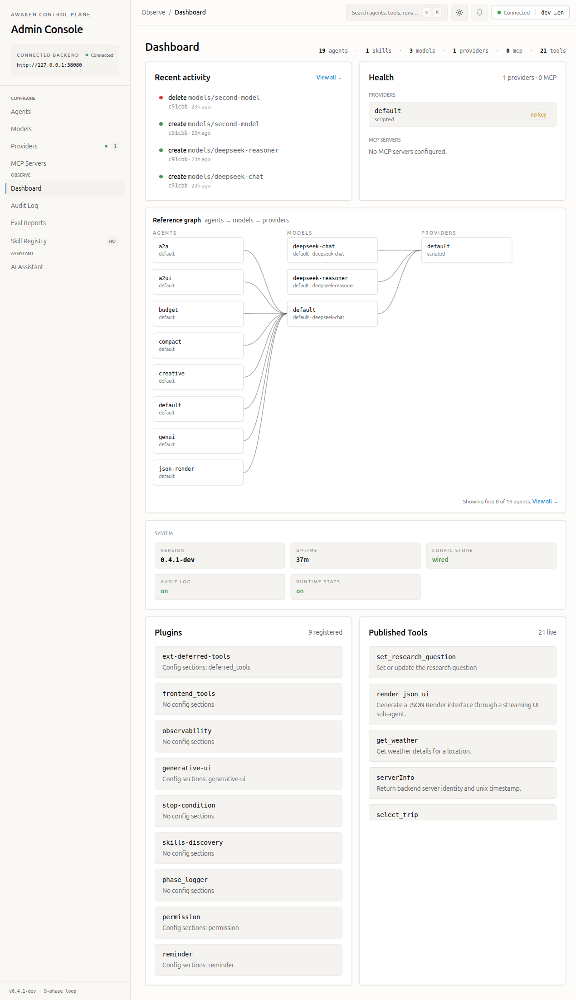
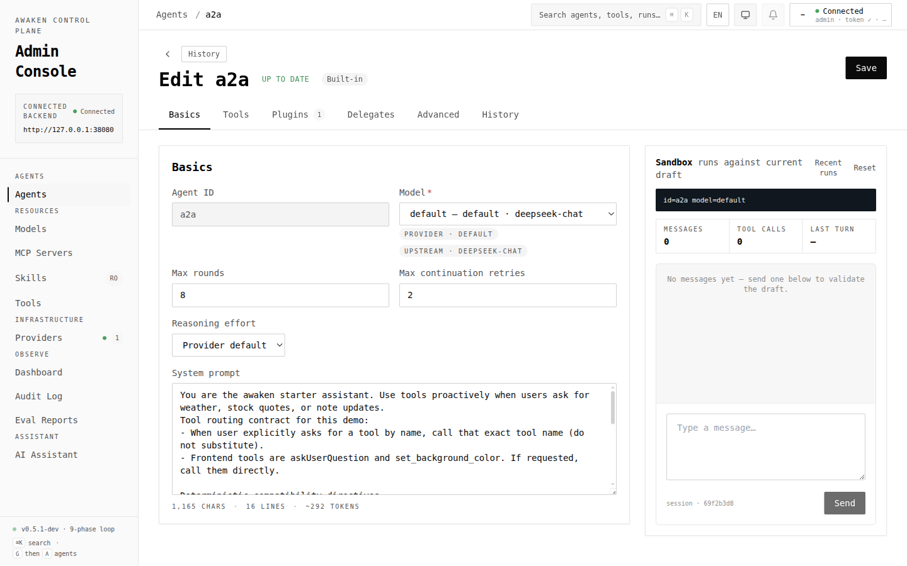
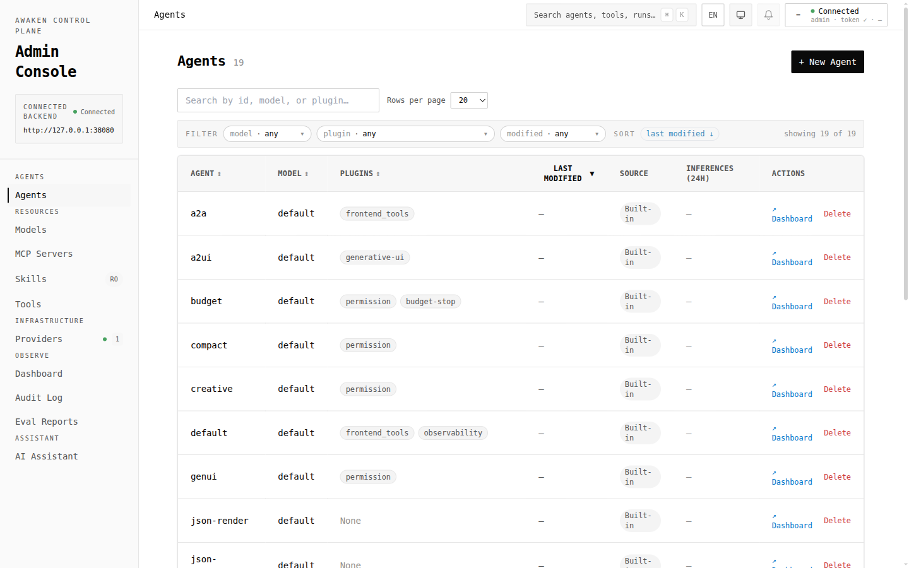
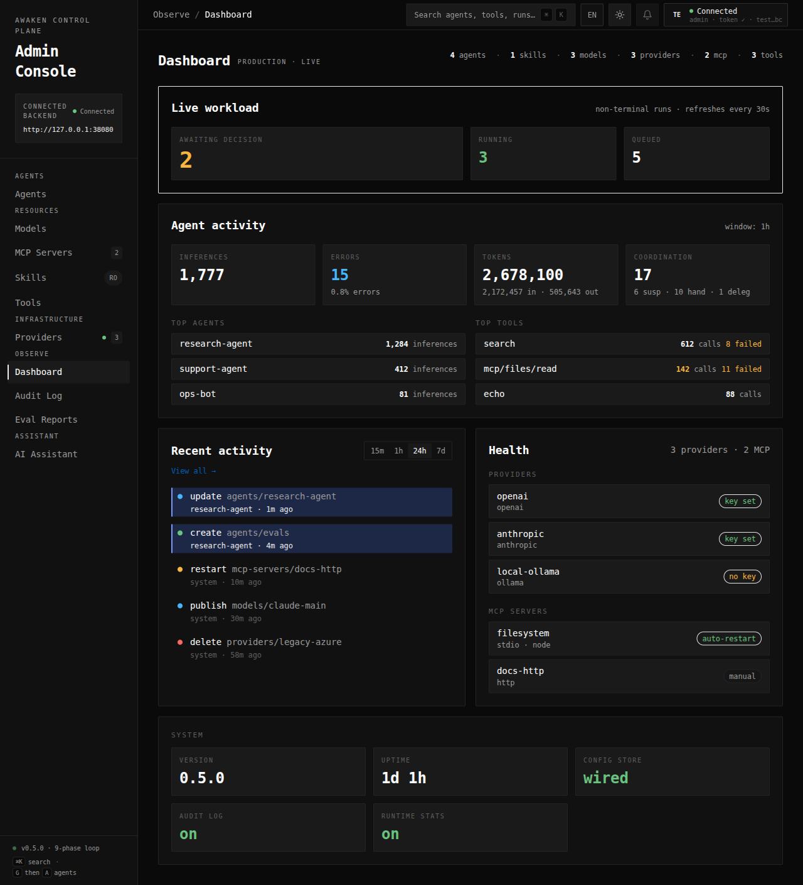
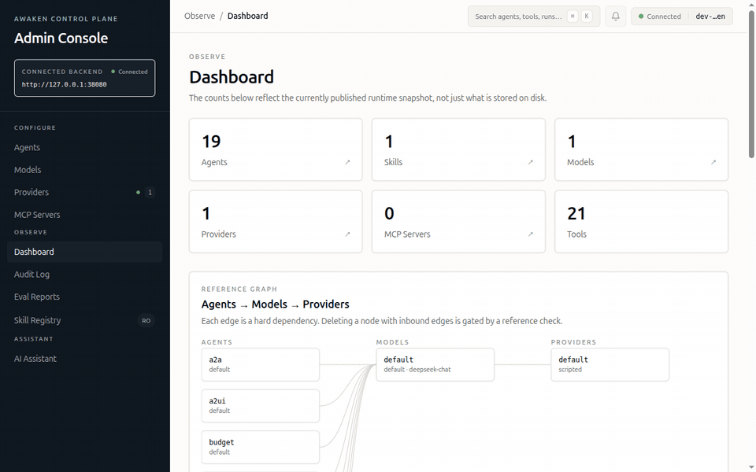

# Awaken

[English](./README.md) | [中文](./README.zh-CN.md)

[](https://github.com/AwakenWorks/awaken/actions/workflows/test.yml) [](https://crates.io/crates/awaken) [](https://crates.io/crates/awaken-agent) [](./CHANGELOG.md)  

A Rust agent runtime that serves AI SDK, CopilotKit, A2A, and MCP from the same backend, recovers from mid-stream LLM failures, and treats configuration as the control plane.

`awaken` is the canonical crate (transferred to this project from
[@brayniac](https://github.com/brayniac); see the acknowledgement below).
`awaken-agent` is a thin compatibility republish from when the project shipped
under that name. Import path is `awaken` either way. MSRV: Rust 1.93.

Docs: [GitHub Pages](https://awakenworks.github.io/awaken/) · [Chinese docs](https://awakenworks.github.io/awaken/zh-CN/) · [Changelog](./CHANGELOG.md)

<p align="center">
  
</p>

## What you get in 0.4

- **Multi-protocol from one backend.** A single runtime serves AI SDK v6, AG-UI / CopilotKit, A2A, and MCP. The same `/v1/runs` powers all of them.
- **Streaming LLM calls survive transient failures.** Mid-stream interruptions and idle stalls are detected and recovered through four explicit plans (continue text, replay completed tool calls, restart with a cancelled-tool hint, or whole restart). `Retry-After` is honored. A `StreamCheckpointStore` contract extends the same recovery across process restarts. ([details](./docs/book/src/how-to/recover-streaming-llms.md))
- **Threads have a parent-child lineage.** Sub-agent runs create child threads; deletion is explicit (`reject` / `detach` / `cascade`). Filters and cursors on `/v1/threads` make hierarchical UIs straightforward.
- **Secrets stay redacted.** `ProviderSpec.api_key`, admin and A2A bearer tokens are wrapped in `RedactedString` — `Debug`/`Display` print `***`, the buffer is zeroized on drop, and the JSON wire format is unchanged.
- **Configuration is the control plane.** Models, providers, prompts, reminders, permissions, and tool-loading policy live behind `/v1/config/*` and `/v1/capabilities`. Apply bursts can be debounced and provider executors are reused across unchanged specs.
- **Type-safe state and tools.** Typed `StateKey`s with merge strategies, generated JSON Schema for `TypedTool`, atomic batched commits after each phase. `unsafe_code = "forbid"` workspace-wide.

## Mental model

1. **Tools** — implement `Tool` directly, or `TypedTool` with `schemars`-generated JSON Schema.
2. **Agents** — system prompt, model binding, allowed tools. The LLM orchestrates through natural language; there is no DAG.
3. **State** — typed run/thread state plus persistent profile and shared state for cross-thread or cross-agent coordination.
4. **Plugins** — lifecycle hooks for permission, observability, context management, skills, MCP, generative UI.

The runtime drives 9 typed phases per round, including a pure `ToolGate` before tool execution. State mutations are batched and committed atomically.

## Quickstart

Prerequisites: Rust 1.93+ and an OpenAI-compatible API key.

```toml
[dependencies]
awaken = { version = "0.5.0" }
tokio = { version = "1.51.0", features = ["full"] }
async-trait = "0.1.89"
serde_json = "1.0.149"
```

```bash
export OPENAI_API_KEY=<your-key>
```

Copy this into `src/main.rs` and run `cargo run`:

```rust,no_run
use std::sync::Arc;
use serde_json::{json, Value};
use async_trait::async_trait;
use awaken::contract::tool::{Tool, ToolDescriptor, ToolResult, ToolOutput, ToolError, ToolCallContext};
use awaken::contract::message::Message;
use awaken::engine::GenaiExecutor;
use awaken::registry_spec::AgentSpec;
use awaken::registry::ModelBinding;
use awaken::{AgentRuntimeBuilder, RunRequest};

struct EchoTool;

#[async_trait]
impl Tool for EchoTool {
    fn descriptor(&self) -> ToolDescriptor {
        ToolDescriptor::new("echo", "Echo", "Echo input back to the caller")
            .with_parameters(json!({
                "type": "object",
                "properties": { "text": { "type": "string" } },
                "required": ["text"]
            }))
    }

    async fn execute(&self, args: Value, _ctx: &ToolCallContext) -> Result<ToolOutput, ToolError> {
        let text = args["text"].as_str().unwrap_or_default();
        Ok(ToolResult::success("echo", json!({ "echoed": text })).into())
    }
}

#[tokio::main]
async fn main() -> Result<(), Box<dyn std::error::Error>> {
    let agent_spec = AgentSpec::new("assistant")
        .with_model_id("gpt-4o-mini")
        .with_system_prompt("You are a helpful assistant. Use the echo tool when asked.")
        .with_max_rounds(5);

    let runtime = AgentRuntimeBuilder::new()
        .with_agent_spec(agent_spec)
        .with_tool("echo", Arc::new(EchoTool))
        .with_provider("openai", Arc::new(GenaiExecutor::new()))
        .with_model_binding("gpt-4o-mini", ModelBinding {
            provider_id: "openai".into(),
            upstream_model: "gpt-4o-mini".into(),
        })
        .build()?;

    let request = RunRequest::new(
        "thread-1",
        vec![Message::user("Say hello using the echo tool")],
    )
    .with_agent_id("assistant");

    // The quickstart only needs the final result. Use run(..., sink) when
    // streaming events to SSE, WebSocket, protocol adapters, or tests.
    let result = runtime.run_to_completion(request).await?;
    println!("response: {}", result.response);
    println!("termination: {:?}", result.termination);

    Ok(())
}
```

The quickstart path is covered without network access:

```bash
cargo test -p awaken --test readme_quickstart
```

Live provider validation is opt-in so CI does not depend on external model services:

```bash
OPENAI_API_KEY=<your-key> cargo test -p awaken --test readme_live_provider -- --ignored
```

## Serve over any protocol

Start the built-in server and connect from React, Next.js, or another agent — no code changes:

```rust,no_run
use awaken::prelude::*;
use awaken::stores::{InMemoryMailboxStore, InMemoryStore};
use std::sync::Arc;

let store = Arc::new(InMemoryStore::new());
let runtime = Arc::new(runtime);
let mailbox = Arc::new(Mailbox::new(
    runtime.clone(),
    Arc::new(InMemoryMailboxStore::new()),
    store.clone(),
    "default-consumer".into(),
    MailboxConfig::default(),
));

let state = AppState::new(
    runtime.clone(),
    mailbox,
    store,
    runtime.resolver_arc(),
    ServerConfig::default(),
);
serve(state).await?;
```

#### Frontend protocols

| Protocol | Endpoint | Frontend |
|---|---|---|
| AI SDK v6 | `POST /v1/ai-sdk/chat` | React `useChat()` |
| AG-UI | `POST /v1/ag-ui/run` | CopilotKit `<CopilotKit>` |
| A2A | `POST /v1/a2a/message:send` | Other agents |
| MCP | `POST /v1/mcp` | JSON-RPC 2.0 |

The optional admin console reads `/v1/capabilities` and writes through
`/v1/config/*` to manage agents, models, providers, MCP servers, and plugin
config sections. Plugins expose their schema via the same typed
`PluginConfigKey` used at runtime, so saving an agent's `permission`,
`reminder`, `generative-ui`, or `deferred_tools` section publishes a new
registry snapshot that takes effect on the next `/v1/runs` request.
OpenAI-compatible providers (including BigModel) use the `openai` adapter
with their own `base_url`; non-secret extras go in `ProviderSpec.adapter_options`.

| Tuning surface | Where it lives |
|---|---|
| Base prompt | `AgentSpec.system_prompt` |
| Model and provider routing | `AgentSpec.model_id` + `/v1/config/models` + `/v1/config/providers` |
| System reminders and prompt injection | `reminder` plugin section |
| Generative UI prompt guidance | `generative-ui` plugin section |
| Tool policy and context cost | `permission` and `deferred_tools` plugin sections |

**React + AI SDK v6:**

```typescript
import { useChat } from "@ai-sdk/react";
import { DefaultChatTransport } from "ai";

const { messages, sendMessage } = useChat({
  transport: new DefaultChatTransport({
    api: "http://localhost:3000/v1/ai-sdk/chat",
  }),
});
```

**Next.js + CopilotKit:**

```typescript
import { CopilotKit } from "@copilotkit/react-core";

<CopilotKit runtimeUrl="http://localhost:3000/v1/ag-ui/run">
  <YourApp />
</CopilotKit>
```

#### Managed configuration

Wire a `ConfigStore` into `AppState` to manage agents, models, providers, and MCP servers through `/v1/config/*`. Use the [configuration-driven tuning guide](https://awakenworks.github.io/awaken/how-to/configure-agent-behavior.html) to tune providers, model bindings, tools, and plugin sections. The Admin Console in [`apps/admin-console`](./apps/admin-console/) uses the same API and reads `VITE_BACKEND_URL` for the server base URL.

The console is a React 19 SPA with a "Lucid Control" design language — unified
warm-light surface across sidebar and main area, geometric state indicators,
real data only (no fake placeholders). One-click theme toggle in the topbar
flips the entire UI to dark mode (or follows system preference). Token system
is a vendored Style Dictionary v4 pipeline parity-checked against the Oversight
family.

<table>
  <tr>
    <td width="33%"><a href="./docs/assets/admin-console/01-dashboard.png"></a></td>
    <td width="33%"><a href="./docs/assets/admin-console/02-agent-editor.png"></a></td>
    <td width="33%"><a href="./docs/assets/admin-console/03-agents-list.png"></a></td>
  </tr>
  <tr>
    <td align="center"><sub><b>Dashboard</b><br/>Reference graph · Health · Activity · System</sub></td>
    <td align="center"><sub><b>Agent Editor</b><br/>Tabbed UI · Validate · Save & Publish · Live preview</sub></td>
    <td align="center"><sub><b>Agents</b><br/>Filter chips · Plugin pills · 503 friendly notice</sub></td>
  </tr>
  <tr>
    <td colspan="3"><a href="./docs/assets/admin-console/04-dark-dashboard.png"></a></td>
  </tr>
  <tr>
    <td colspan="3" align="center"><sub><b>Dark mode</b> · light/dark/system toggle persists per-browser via localStorage</sub></td>
  </tr>
</table>

**⌘K command palette** — search agents, tools, navigation, and actions from anywhere:



📺 Full surface tour: [Admin Console reference](./docs/book/src/reference/admin-console.md) · operator user manual: [Use the Admin Console](./docs/book/src/how-to/use-admin-console.md).

## Built-in plugins

The facade `full` feature pulls in the plugins below. Use
`default-features = false` to opt out. `awaken-ext-deferred-tools` is not
re-exported by the facade and is added as a direct dependency.

| Plugin | What it does | Feature flag |
|---|---|---|
| **Permission** | Allow/Deny/Ask rules with glob and regex matching on tool name and arguments. Deny beats Allow beats Ask; Ask suspends the run via the mailbox for HITL. | `permission` |
| **Reminder** | Injects system or conversation-level context messages when a tool call matches a configured pattern. | `reminder` |
| **Observability** | OpenTelemetry traces and metrics aligned with the GenAI Semantic Conventions; OTLP, file, and in-memory exports. | `observability` |
| **MCP** | Connects to external MCP servers and registers their tools as native Awaken tools. | `mcp` |
| **Skills** | Discovers skill packages and injects a catalog before inference so the LLM can activate skills on demand. | `skills` |
| **Generative UI** | Streams declarative UI components to frontends via A2UI, JSON Render, and OpenUI Lang integrations. | `generative-ui` |
| **Deferred Tools** | Hides large tool schemas behind a `ToolSearch` step, then re-defers tools that have been idle for a configurable number of turns using a discounted Beta usage model. | direct crate: `awaken-ext-deferred-tools` |

Custom tool interception goes through `ToolGateHook` via
`PluginRegistrar::register_tool_gate_hook()`. `BeforeToolExecute` is reserved
for execution-time hooks that only run when a tool is actually about to execute.

## When this fits

- You want a **Rust backend** for AI agents with compile-time guarantees.
- You need to serve **AI SDK, CopilotKit, A2A, and/or MCP** from a single backend.
- Tools need to **share state safely** during concurrent execution, and runs need **auditable history** with checkpoints and resume.
- You're comfortable registering your own tools and providers instead of relying on batteries-included defaults.

## When it doesn't

- You need **built-in file/shell/web tools** out of the box — consider OpenAI Agents SDK, Dify, or CrewAI.
- You want a **visual workflow builder** — consider Dify or LangGraph Studio.
- You want **Python** and rapid prototyping — consider LangGraph, AG2, or PydanticAI.
- You need an **LLM-managed memory** subsystem where the agent decides what to remember — consider Letta.

## Architecture

Awaken is split into three runtime layers. `awaken-contract` defines the shared contracts: agent specs, model/provider specs, tools, events, transport traits, and the typed state model. `awaken-runtime` resolves an `AgentSpec` into `ResolvedExecution`: local agents become a `ResolvedAgent` with an `ExecutionEnv` built from plugins, while endpoint-backed agents run through an `ExecutionBackend`. It also executes the phase loop and manages active runs plus external control such as cancellation and HITL decisions. `awaken-server` exposes that same runtime through HTTP routes, SSE replay, mailbox-backed background execution, and protocol adapters for AI SDK v6, AG-UI, A2A, and MCP.

Around those layers sit storage and extensions. `awaken-stores` provides memory, file, and PostgreSQL persistence for threads and runs; memory, file, and PostgreSQL config stores; memory and SQLite mailbox stores; and memory/file profile stores. `awaken-ext-*` crates extend the runtime at phase and tool boundaries.

```text
awaken                   Facade crate with feature flags
├─ awaken-contract       Contracts: specs, tools, events, transport, state model
├─ awaken-runtime        Resolver, phase engine, loop runner, runtime control
├─ awaken-server         Routes, mailbox, SSE transport, protocol adapters
├─ awaken-stores         Memory, file, PostgreSQL, and SQLite-backed stores
├─ awaken-tool-pattern   Glob/regex matching used by extensions
└─ awaken-ext-*          Optional runtime extensions
```

## Examples and learning paths

| Example | What it shows |
|---|---|
| [`live_test`](./crates/awaken/examples/live_test.rs) | Basic LLM integration |
| [`multi_turn`](./crates/awaken/examples/multi_turn.rs) | Multi-turn with persistent threads |
| [`tool_call_live`](./crates/awaken/examples/tool_call_live.rs) | Tool calling with calculator |
| [`ai-sdk-starter`](./examples/ai-sdk-starter/) | React + AI SDK v6 full-stack |
| [`copilotkit-starter`](./examples/copilotkit-starter/) | Next.js + CopilotKit full-stack |
| [`openui-chat`](./examples/openui-chat/) | OpenUI Lang chat frontend |
| [`admin-console`](./apps/admin-console/) | Config API management UI |

```bash
export OPENAI_API_KEY=<your-key>
cargo run --package awaken --example multi_turn

pnpm install && pnpm --filter awaken-ai-sdk-starter dev

# Terminal 1: starter backend for admin console
AWAKEN_STORAGE_DIR=./target/admin-sessions cargo run -p ai-sdk-starter-agent

# Terminal 2: admin console
pnpm install
pnpm --filter awaken-admin-console dev
```

| Goal | Start with | Then |
|---|---|---|
| Build your first agent | [Get Started](https://awakenworks.github.io/awaken/get-started.html) | [Build Agents](https://awakenworks.github.io/awaken/build-agents.html) |
| See a full-stack app | [AI SDK starter](./examples/ai-sdk-starter/) | [CopilotKit starter](./examples/copilotkit-starter/) |
| Manage runtime config | [Admin Console](./apps/admin-console/) | [Configure Agent Behavior](https://awakenworks.github.io/awaken/how-to/configure-agent-behavior.html) |
| Explore the API | [Reference docs](https://awakenworks.github.io/awaken/reference/overview.html) | `cargo doc --workspace --no-deps --open` |
| Understand the runtime | [Architecture](https://awakenworks.github.io/awaken/explanation/architecture.html) | [Run Lifecycle and Phases](https://awakenworks.github.io/awaken/explanation/run-lifecycle-and-phases.html) |
| Migrate from tirea | [Migration guide](https://awakenworks.github.io/awaken/appendix/migration-from-tirea.html) | |

## Contributing

See [CONTRIBUTING.md](./CONTRIBUTING.md) and [DEVELOPMENT.md](./DEVELOPMENT.md) for setup details.

[Good first issues](https://github.com/AwakenWorks/awaken/issues?q=is%3Aissue+is%3Aopen+label%3A%22good+first+issue%22) are a great entry point. Quick contribution flow: fork → create a branch → write tests → open a PR.

Areas where contributions are especially welcome:

- Additional mailbox, config, and storage backends beyond the built-in memory/file/PostgreSQL/SQLite options
- Built-in tool implementations (file read/write, web search)
- Token cost tracking and budget enforcement
- Model fallback/degradation chains

Join the conversation on [GitHub Discussions](https://github.com/AwakenWorks/awaken/discussions).

## Acknowledgement

The `awaken` crate name on crates.io was generously transferred from
[@brayniac](https://github.com/brayniac), who maintained an earlier crate
under the same name and offered to hand it over so this project could publish
canonically. Versions `0.1`–`0.3` of `awaken` on crates.io belong to that
earlier project; this codebase resumes the line that previously shipped as
`awaken-agent 0.2.x` and starts at `0.4.0` to skip past the prior versions.
Thank you.

Awaken is also a ground-up rewrite of [tirea](../../tree/tirea-0.5) and is not
backwards-compatible with it. The tirea 0.5 codebase remains archived on the
[`tirea-0.5`](../../tree/tirea-0.5) branch.

## License

Dual-licensed under [MIT](./LICENSE-MIT) or [Apache-2.0](./LICENSE-APACHE).
