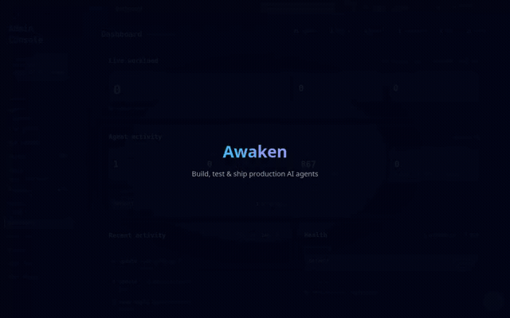

# Awaken

[English](./README.md) | [中文](./README.zh-CN.md)

[](https://github.com/AwakenWorks/awaken/actions/workflows/test.yml) [](https://crates.io/crates/awaken) [](https://crates.io/crates/awaken-agent) [](./CHANGELOG.md)  

Build agent capability in Rust. Tune prompts, models, permissions, skills, and eval loops live. Serve AI SDK, AG-UI, A2A, MCP, and ACP clients from one runtime without turning each agent into a fragile script.

Docs: [Awaken docs](https://awakenworks.github.io/awaken) · [中文文档](https://awakenworks.github.io/awaken/zh-cn) · [Changelog](./CHANGELOG.md). MSRV: Rust 1.93. The published crate is `awaken`; `awaken-agent` is a compatibility republish from when the project shipped under that name.

<p align="center">
  <br>
  <em>Real Gemini in the Admin Console: connect a model, describe an agent, tune it, and run a live eval.</em>
</p>

## 30-second version

Start the local server and Admin Console:

```sh
AWAKEN_HTTP_ADDR=127.0.0.1:38080 \
AWAKEN_ADMIN_API_BEARER_TOKEN=dev-token \
AWAKEN_STORAGE_DIR=./target/awaken-dev \
cargo run -p ai-sdk-starter-agent

pnpm --filter awaken-admin-console dev
```

Open `http://127.0.0.1:3002`, paste `dev-token`, configure a provider-backed model, then create or tune an agent. Without an API key, the starter backend uses a deterministic scripted executor so you can verify the server routes and console first.

The tune-first loop is:

```text
Validate draft -> Preview chat -> Save snapshot -> Run task -> Inspect trace -> Capture dataset/eval -> Adjust
```

## Why Awaken

- **Code stays stable.** Tools, typed state, providers, stores, and plugins live in Rust.
- **Behavior tunes live.** Prompts, model bindings, tool descriptions, permission rules, reminders, skills, delegates, and plugin sections change through managed config.
- **One backend serves many clients.** AI SDK v6, AG-UI / CopilotKit, A2A, MCP, and ACP are adapters over the same runtime event stream and run model.
- **Runs are operational objects.** Durable dispatch, HITL mailbox suspension, cancellation, trace capture, replay, datasets, eval runs, and audit restore are runtime/server contracts.
- **State and tools are typed.** `StateKey`, generated JSON Schema for `TypedTool`, pure tool gating, and atomic commits make concurrent tool work auditable.

## Tune-first workflow

Awaken treats agent behavior as managed resources, not scattered code edits. Server config writes are validated, published as registry snapshots, and auditable when stores are wired.

| Tune online | Managed by Awaken |
|---|---|
| Prompts, model bindings, reasoning effort, stop policies | Validate, preview, save, publish next-run registry snapshots |
| Tool descriptions, allow/exclude rules, permission gates, reminders | Typed schemas, policy validation, HITL suspension/resume |
| Providers, models, model pools, MCP servers, skills | Capability metadata, provider checks, failover pools, catalogs |
| Traces, datasets, eval runs, audit history | Replayable records, baseline diffs, restorable config revisions |

Tools are written once and stay stable. Models, agents, prompts, skills, delegates, and policy sections are tuned through `/v1/config/*` or the [Admin Console](https://awakenworks.github.io/awaken/how-to/use-admin-console/) — Validate → Save → preview-chat → adjust.

## Choose your mode

Awaken separates the **agent execution loop** from the **service control plane**.

| Mode | Start with | You own | Awaken provides |
|---|---|---|---|
| **Runtime library** | `awaken` / `awaken-runtime` | HTTP/UI/job scheduling, auth, config storage, concrete tools/providers/stores | Direct run APIs, streaming events, typed tools/state, cancellation, tool gating, HITL primitives |
| **Server control plane** | `awaken-server` + `awaken-stores` | Deployment, tenant/auth policy, registered tools/providers, store selection | HTTP/SSE, AI SDK/AG-UI/A2A/MCP/ACP adapters, mailbox orchestration, `/v1/config/*`, registry snapshots, Admin Console |

Runtime mode is in-process library use inside a standard async Rust program. It is not a `no_std` or Tokio-free embedded target. Server mode wraps the same runtime with protocols, durable dispatch, managed config, audit/restore, trace/eval storage, and the browser workflow.

## Quickstart A: server + Admin Console

Use this path when you want the tuning workflow first.

```sh
AWAKEN_HTTP_ADDR=127.0.0.1:38080 \
AWAKEN_ADMIN_API_BEARER_TOKEN=dev-token \
AWAKEN_STORAGE_DIR=./target/awaken-dev \
cargo run -p ai-sdk-starter-agent

pnpm install
pnpm --filter awaken-admin-console dev
```

Open `http://127.0.0.1:3002`, click the token pill, and paste `dev-token`. Configure a provider/model, create an agent, preview it, then copy the AI SDK or AG-UI route from the saved agent page.

Useful docs:

- [Get Started](https://awakenworks.github.io/awaken/get-started/)
- [Use the Admin Console](https://awakenworks.github.io/awaken/how-to/use-admin-console/)
- [Configure Agent Behavior](https://awakenworks.github.io/awaken/how-to/configure-agent-behavior/)
- [Capture a Dataset and Run an Eval](https://awakenworks.github.io/awaken/how-to/capture-a-dataset-and-run-an-eval/)

## Quickstart B: runtime library

Use this path when your Rust application owns the I/O boundary and calls the runtime directly.

Prerequisites: Rust 1.93+ and an OpenAI-compatible API key.

```toml
[dependencies]
awaken = { git = "https://github.com/AwakenWorks/awaken" }
tokio = { version = "1", features = ["full"] }
async-trait = "0.1"
serde_json = "1"
```

These snippets follow the current main-branch API. Use the [0.5 to 0.6 migration guide](https://awakenworks.github.io/awaken/how-to/migrate-to-0-6/) when upgrading from the published `0.5` line.

```bash
export OPENAI_API_KEY=<your-key>
```

`src/main.rs`:

```rust,no_run
use awaken::engine::GenaiExecutor;
use awaken::prelude::*;
use async_trait::async_trait;
use serde_json::json;
use std::sync::Arc;

struct EchoTool;

#[async_trait]
impl Tool for EchoTool {
    fn descriptor(&self) -> ToolDescriptor {
        ToolDescriptor::new("echo", "Echo", "Echo input back to the caller").with_parameters(json!({
            "type": "object",
            "properties": { "text": { "type": "string" } },
            "required": ["text"]
        }))
    }

    async fn execute(&self, args: JsonValue, _ctx: &ToolCallContext) -> Result<ToolOutput, ToolError> {
        let text = args["text"].as_str().unwrap_or_default();
        Ok(ToolResult::success("echo", json!({ "echoed": text })).into())
    }
}

#[tokio::main]
async fn main() -> Result<(), Box<dyn std::error::Error>> {
    let runtime = AgentRuntimeBuilder::new()
        .with_agent_spec(
            AgentSpec::new("assistant")
                .with_model_id("gpt-4o-mini")
                .with_system_prompt("You are helpful. Use the echo tool when asked.")
                .with_max_rounds(5),
        )
        .with_tool("echo", Arc::new(EchoTool))
        .with_provider("openai", Arc::new(GenaiExecutor::new()))
        .with_model(ModelSpec::new("gpt-4o-mini", "openai", "gpt-4o-mini"))
        .build()?;

    let request = RunActivation::new("thread-1", vec![Message::user("Say hello using the echo tool")])
        .with_agent_id("assistant");

    let result = runtime.run_to_completion(request).await?;
    println!("{}", result.response);
    Ok(())
}
```

Use `runtime.run(request, sink)` instead of `run_to_completion` when you need to stream events to SSE, WebSocket, protocol adapters, or tests. For a longer example, see [`crates/awaken/examples/multi_turn.rs`](./crates/awaken/examples/multi_turn.rs).

The quickstart path is covered without network access:

```bash
cargo test -p awaken --test readme_quickstart        # offline scripted provider
OPENAI_API_KEY=<key> cargo test -p awaken --test readme_live_provider -- --ignored  # live provider
```

## Protocols

| Protocol | Route / transport | Typical client |
|---|---|---|
| AI SDK v6 | `POST /v1/ai-sdk/chat` | React `useChat()` |
| AG-UI | `POST /v1/ag-ui/run` | CopilotKit `<CopilotKit>` |
| A2A | `POST /v1/a2a/message:send` | Other agents |
| MCP | `POST /v1/mcp` | JSON-RPC 2.0 clients |
| ACP | stdio via `serve_stdio` | Agent Client Protocol hosts |

Frontend guides: [AI SDK](https://awakenworks.github.io/awaken/how-to/integrate-ai-sdk-frontend/) · [CopilotKit / AG-UI](https://awakenworks.github.io/awaken/how-to/integrate-copilotkit-ag-ui/) · [HTTP SSE](https://awakenworks.github.io/awaken/how-to/expose-http-sse/).

## Extensions

The facade `full` feature pulls in the plugins below. Use `default-features = false` to opt out. `awaken-ext-deferred-tools` is a companion crate and is added as a direct dependency.

| Extension | What it does | Feature / crate |
|---|---|---|
| **Permission** | Allow/Deny/Ask rules on tool name and arguments; Ask suspends via mailbox for HITL. | `permission` |
| **Reminder** | Injects context messages when a tool call matches a configured pattern. | `reminder` |
| **Observability** | OpenTelemetry traces and metrics aligned with GenAI Semantic Conventions. | `observability` |
| **MCP** | Connects to external MCP servers and registers their tools as native Awaken tools. | `mcp` |
| **Skills** | Discovers skill packages and injects a catalog before inference. | `skills` |
| **Generative UI** | Streams declarative UI components via A2UI, JSON Render, and OpenUI Lang. | `generative-ui` |
| **Deferred Tools** | Hides large tool schemas behind `ToolSearch` and re-defers idle tools. | `awaken-ext-deferred-tools` |

Write your own with `ToolGateHook` or `BeforeToolExecute` — same trait signatures the built-ins use.

## Architecture

<p align="center">
  
</p>

```text
awaken                   Facade crate with feature flags
├─ awaken-runtime-contract Runtime contracts: specs, tools, events, state, commit coordinator
├─ awaken-server-contract  Server/store contracts: queries, scoped stores, mailbox/outbox, staged commits
├─ awaken-runtime        Resolver, phase engine, loop runner, runtime control
├─ awaken-server         HTTP routes, SSE replay, mailbox dispatch, protocol adapters
├─ awaken-stores         Thread + run + config + mailbox + profile stores
├─ awaken-tool-pattern   Glob/regex matching used by extensions
└─ awaken-ext-*          Optional extensions and companion plugins
```

For details, start with [Architecture](https://awakenworks.github.io/awaken/explanation/architecture/) and [Run Lifecycle and Phases](https://awakenworks.github.io/awaken/explanation/run-lifecycle-and-phases/).

## When this fits

- You want a **Rust backend** for AI agents with compile-time guarantees.
- You need to serve **AI SDK, CopilotKit, A2A, MCP, and/or ACP** from a single backend.
- Tools need to **share state safely** during concurrent execution, and runs need auditable history with checkpoints and resume.
- Operators need to tune prompts, models, permissions, skills, traces, datasets, and evals without changing code.

## When it does not

- You need **built-in file/shell/web tools** out of the box — consider OpenAI Agents SDK, Dify, or CrewAI.
- You want a **visual workflow builder** — consider Dify or LangGraph Studio.
- You want **Python** and rapid prototyping — consider LangGraph, AG2, or PydanticAI.
- You need an **LLM-managed memory** subsystem where the agent decides what to remember — consider Letta.

## Examples and learning paths

| Goal | Start with | Then |
|---|---|---|
| Build your first agent | [Get Started](https://awakenworks.github.io/awaken/get-started/) | [Build Agents](https://awakenworks.github.io/awaken/build-agents/) |
| Tune a saved agent | [Use the Admin Console](https://awakenworks.github.io/awaken/how-to/use-admin-console/) | [Configure Agent Behavior](https://awakenworks.github.io/awaken/how-to/configure-agent-behavior/) |
| See a full-stack app | [AI SDK starter](./examples/ai-sdk-starter/) | [CopilotKit starter](./examples/copilotkit-starter/) |
| Explore the API | [Reference docs](https://awakenworks.github.io/awaken/reference/overview/) | `cargo doc --workspace --no-deps --open` |
| Understand the runtime | [Architecture](https://awakenworks.github.io/awaken/explanation/architecture/) | [Run Lifecycle and Phases](https://awakenworks.github.io/awaken/explanation/run-lifecycle-and-phases/) |

Examples:

| Example | What it shows |
|---|---|
| [`live_test`](./crates/awaken/examples/live_test.rs) | Basic LLM integration |
| [`multi_turn`](./crates/awaken/examples/multi_turn.rs) | Multi-turn with persistent threads |
| [`tool_call_live`](./crates/awaken/examples/tool_call_live.rs) | Tool calling with calculator |
| [`ai-sdk-starter`](./examples/ai-sdk-starter/) | React + AI SDK v6 full-stack |
| [`copilotkit-starter`](./examples/copilotkit-starter/) | Next.js + CopilotKit full-stack |
| [`openui-chat`](./examples/openui-chat/) | OpenUI Lang chat frontend |
| [`admin-console`](./apps/admin-console/) | Config API management UI |

## Contributing

Setup in [CONTRIBUTING.md](./CONTRIBUTING.md) and [DEVELOPMENT.md](./DEVELOPMENT.md). [Good first issues](https://github.com/AwakenWorks/awaken/issues?q=is%3Aissue+is%3Aopen+label%3A%22good+first+issue%22) is the entry-point label. Conversation: [GitHub Discussions](https://github.com/AwakenWorks/awaken/discussions).

## Acknowledgement

The `awaken` crate name on crates.io was transferred from [@brayniac](https://github.com/brayniac), who maintained an earlier crate under the same name. Versions `0.1`–`0.3` of `awaken` on crates.io belong to that earlier project; this codebase resumes the line that previously shipped as `awaken-agent 0.2.x` and starts at `0.4.0` to skip past those versions. Thank you.

## License

Dual-licensed under [MIT](./LICENSE-MIT) or [Apache-2.0](./LICENSE-APACHE).
