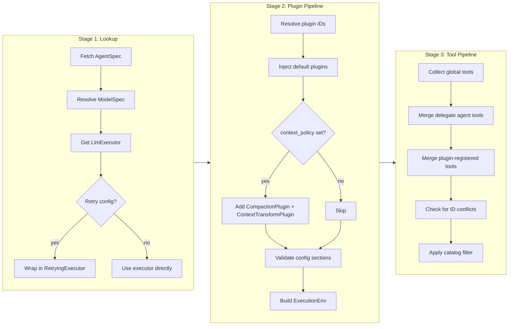

When `AgentRuntime` runs a request through `run_to_completion(request)` or `run(request, sink)`, the `agent_id` in the request is resolved through `ExecutionResolver` into a `ResolvedExecution`: either `Local(ResolvedAgent)` or `NonLocal(ResolvedBackendAgent)`. A local `ResolvedAgent` holds live references to an LLM executor, tools, plugins, and an execution environment. A non-local execution is backed by an `ExecutionBackend`, such as the built-in A2A backend. Resolution happens on every call; local agent environments are not shared between runs.

## Pipeline Overview

Local resolution is a pure function: `(RegistrySet, agent_id) -> ResolvedAgent`. It proceeds through three sequential stages:

Any failure at any stage produces a `ResolveError` and aborts. The pipeline never returns a partial result.

## Stage 1: Lookup

The first stage fetches the raw data from registries:

1. **AgentSpec** -- looked up from `AgentSpecRegistry` by `agent_id`. If direct local resolution is requested for a spec with `endpoint`, it fails with `RemoteAgentNotDirectlyRunnable`. `AgentRuntime` uses `resolve_execution()` for root runs, so endpoint-backed agents are resolved as `ResolvedExecution::NonLocal` when a backend factory exists.

2. **ModelSpec** -- the spec's `model_id` field (a model registry ID like `"default"`) is resolved through `ModelRegistry` into a `ModelSpec`, which carries the provider ID, upstream API model name (for example, provider `"openai"`, upstream model `"gpt-4o"`), plus optional intrinsic capabilities (context window, max output, modalities, knowledge cutoff) and pricing. The server-side config API persists `ModelSpec` directly; there is no separate spec-to-runtime conversion step.

3. **LlmExecutor** -- the provider ID from the resolved `ModelSpec` is looked up through `ProviderRegistry` to get a live `LlmExecutor` instance.

4. **Retry decoration** -- if the agent spec contains a `RetryConfigKey` section with `max_retries > 0`, the executor is wrapped in a `RetryingExecutor` decorator.

### Non-local execution

For endpoint-backed agents, `resolve_execution()` validates the configured
`RemoteEndpoint`, builds a `ResolvedBackendAgent`, and leaves execution to the
selected `ExecutionBackend`. The local model/provider/plugin/tool pipeline is
skipped for that root run because the remote backend owns those decisions.

## Stage 2: Plugin Pipeline

The second stage assembles the plugin chain and builds the execution environment.

### Plugin resolution

Plugins listed in `AgentSpec.plugin_ids` are resolved by ID from `PluginSource`. A missing plugin produces `ResolveError::PluginNotFound`.

### Default plugin injection

After resolving user-declared plugins, the pipeline injects runtime-required default plugins. These are always present regardless of agent configuration:

- **`LoopActionHandlersPlugin`** -- registers the core action handlers that the runtime loop uses to process tool calls, emit events, and manage step transitions. Without this plugin, the loop cannot function.

- **`MaxRoundsPlugin`** -- enforces the `max_rounds` stop condition configured on the agent spec. Injected with the spec's `max_rounds` value. Prevents runaway loops.

### Conditional plugins

These plugins are added only when `AgentSpec.context_policy` is set:

- **`CompactionPlugin`** -- manages context window compaction (summarization of old messages when the context grows too large). Created with the `CompactionConfigKey` section from the spec, falling back to defaults if absent.

- **`ContextTransformPlugin`** -- applies context window policy transforms (token counting, truncation, prompt caching) before each inference request. Created with the `context_policy` value.

### Building ExecutionEnv

After the plugin list is finalized, `ExecutionEnv::from_plugins()` calls each plugin's `register()` method with a `PluginRegistrar`. Plugins use the registrar to declare:

- Phase hooks (per-phase callbacks)
- Scheduled action handlers
- Effect handlers
- Request transforms
- State key registrations
- Tools

The result is an `ExecutionEnv` -- see [ExecutionEnv](#executionenv) below.

### Config validation

Plugins can declare `config_schemas()`, returning a list of `ConfigSchema` entries. Each entry associates a section key with a JSON Schema. During resolution, every declared schema is validated against the corresponding entry in `AgentSpec.sections`:

- **Section present** -- validated against the JSON Schema. Failure produces `ResolveError::InvalidPluginConfig`.
- **Section absent** -- allowed. Plugins are expected to use sensible defaults.
- **Section present but unclaimed** -- no plugin declared a schema for it. The pipeline logs a warning (possible typo in configuration).

## Stage 3: Tool Pipeline

The third stage collects tools from all sources and produces the final tool set.

### Tool sources

Tools are merged in this order:

1. **Global tools** -- all tools registered in `ToolRegistry` via the builder (e.g., `builder.with_tool("search", search_tool)`).

2. **Delegate agent tools** -- for each agent ID in `AgentSpec.delegates`, the pipeline creates an `AgentTool`. If the delegate has an `endpoint` (remote), the pipeline selects the configured `ExecutionBackend`. Today the built-in remote backend is A2A; local delegates still use a resolver-backed local execution. Delegate tools require the `a2a` feature flag; without it, delegates are silently ignored with a warning.

3. **Plugin-registered tools** -- tools declared by plugins during `register()`, stored in `ExecutionEnv.tools`.

### Conflict detection

If a plugin-registered tool has the same ID as a global tool, resolution fails with `ResolveError::ToolIdConflict`. This is intentional -- silent overwriting would be a source of hard-to-debug issues.

### Catalog filtering

The resolver applies the catalog filter after tool collection and before
the plugin pipeline. Matching rules:

1. Compute `allow_set` = literals in `allowed_tools` ∪ tools matching any
   pattern in `allowed_tool_patterns`.
2. Compute `exclude_set` = literals in `excluded_tools` ∪ tools matching
   any pattern in `excluded_tool_patterns`.
3. Surviving tools = `allow_set` − `exclude_set`.

The "deny wins" precedence makes `excluded_tool_patterns` an open-ended
safety net — `excluded_tool_patterns: ["dangerous-*"]` excludes future
tools that match the shape, not just present ones. Literal exclusion is
strictly point-in-time: it removes only the tool ids that are named.

The runtime emits three categories of warning at resolve time:

- **Unmatched pattern** -- a pattern in `*_tool_patterns` matched zero
  registered tools. Likely a typo or stale entry from a different runtime.
- **Permission-shaped catalog entry** -- an entry containing `(...)` was
  probably meant for `sections["permission"]`.
- **Orphan permission rule** -- a permission rule names a tool the catalog
  has already filtered out.

These warnings never block resolution; they are diagnostic only.

## ExecutionEnv

`ExecutionEnv` is the per-resolve product of the plugin pipeline. It is **not** global or shared -- each `resolve()` call builds a fresh one. Its contents:

| Field | Type | Purpose |
|---|---|---|
| `phase_hooks` | `HashMap<Phase, Vec<TaggedPhaseHook>>` | Hooks invoked at each phase boundary |
| `scheduled_action_handlers` | `HashMap<String, ScheduledActionHandlerArc>` | Named handlers for scheduled/deferred actions |
| `effect_handlers` | `HashMap<String, EffectHandlerArc>` | Named handlers for side effects |
| `request_transforms` | `Vec<TaggedRequestTransform>` | Transforms applied to inference requests before the LLM call |
| `key_registrations` | `Vec<KeyRegistration>` | State keys to install into the state store at run start |
| `tools` | `HashMap<String, Arc<dyn Tool>>` | Plugin-provided tools (merged into the main tool set in Stage 3) |
| `plugins` | `Vec<Arc<dyn Plugin>>` | Plugin references for lifecycle hooks (`on_activate`/`on_deactivate`) |

Each `TaggedPhaseHook` and `TaggedRequestTransform` carries its owning plugin ID for diagnostics and filtering.

## AgentRuntimeBuilder

The builder (`AgentRuntimeBuilder`) is the standard way to construct an `AgentRuntime`. It accumulates five registries:

| Registry | Builder method | Purpose |
|---|---|---|
| `MapAgentSpecRegistry` | `with_agent_spec()` / `with_agent_specs()` | Agent definitions |
| `MapToolRegistry` | `with_tool()` | Global tools |
| `MapModelRegistry` | `with_model()` | Model ID to `ModelSpec` (provider + upstream + capabilities + pricing) |
| `MapProviderRegistry` | `with_provider()` | LLM executor instances |
| `MapPluginSource` | `with_plugin()` | Plugin instances |

### Error handling

The builder uses **deferred error collection**. Each `with_*` call that detects a conflict (duplicate ID) pushes a `BuildError` onto an internal error list instead of returning `Result`. The first collected error surfaces when `build()` or `build_unchecked()` is called.

### Validation

`build()` performs a dry-run resolve for every registered agent spec after constructing the runtime. If any agent fails to resolve (missing model, missing provider, missing plugin), the error is collected and returned as `BuildError::ValidationFailed`. This catches configuration errors at startup rather than at first request.

`build_unchecked()` skips this validation. Use it only when you need lazy resolution or when agents will be added dynamically after construction.

### Remote agents (A2A)

When the `a2a` feature is enabled, the builder supports `with_remote_agents()` to register remote A2A endpoints. These are wrapped in a `CompositeAgentSpecRegistry` that combines local and remote agent sources. Remote agents are discovered asynchronously via `build_and_discover()`.

## See Also

- [Architecture](./architecture.md) -- system layers and request sequence
- [Run Lifecycle and Phases](./run-lifecycle-and-phases.md) -- what happens after resolution
- [Tool and Plugin Boundary](./tool-and-plugin-boundary.md) -- when to use tools vs plugins
- [Design Tradeoffs](./design-tradeoffs.md) -- rationale for key decisions
