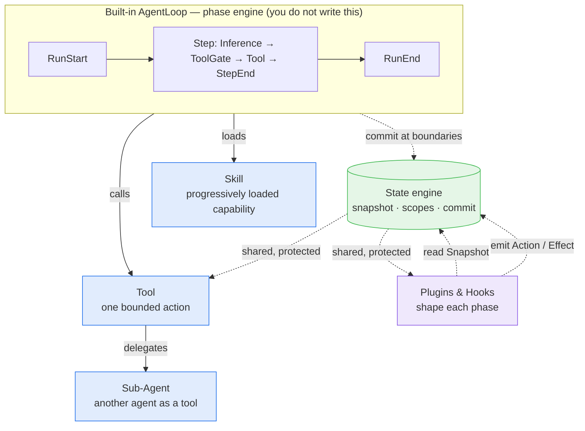

An Awaken agent is not a single object you write. It is a **built-in loop** that drives the **capabilities you give it** — tools, skills, and sub-agents — while **plugins and hooks** shape each turn by reading and writing one shared, protected **state**. This page connects those parts in one place; each section links to the page that goes deep.

## The big picture



The rest of this page walks the parts in the order they come together: the loop, the capabilities it drives, the plugins/hooks that shape it, and the state model that ties everything together.

## 1. The built-in AgentLoop

You do not implement the loop — the runtime owns it. Every run advances through a fixed phase sequence:

```text
RunStart -> [StepStart -> BeforeInference -> AfterInference
             -> ToolGate -> BeforeToolExecute -> AfterToolExecute -> StepEnd]* -> RunEnd
```

The step repeats until the model answers with no tool calls (`NaturalEnd`), a stop condition fires, a tool suspends for external input, the run is cancelled, or an error occurs. The loop is also the only thing that commits state and checks cancellation at each boundary — which is what makes everything below safe to compose.

→ Details: [Run Lifecycle and Phases](/awaken/explanation/run-lifecycle-and-phases/).

## 2. Capabilities you add

The loop is generic; you make an agent useful by giving it capabilities. There are three kinds, and they form a ladder from simplest to most powerful.

### Tool

A **tool** is one bounded action the model can call: it takes typed arguments, runs, and returns a `ToolResult`. Tools are the primary unit of capability — read a file, query an API, start work. A tool also decides whether to write state back, through the `ToolOutput.command` channel — part of the state model described below.

→ Build one: [Add a Tool](/awaken/how-to/add-a-tool/) · Contract: [Tool Trait](/awaken/reference/tool-trait/).

### Skill

A **skill** is a packaged, progressively-loaded capability — instructions plus the tools that go with them — that the agent pulls in only when relevant, instead of paying for everything in every prompt. Skills keep the context window small while still making large capability sets reachable.

→ Use them: [Use Skills Subsystem](/awaken/how-to/use-skills-subsystem/).

### Sub-Agent

A **sub-agent** is another whole agent exposed to the parent as a tool. The simplest form is **declarative delegation** (`AgentSpec.delegates`), which auto-builds an `AgentTool` per entry — no code. When you need typed parent ↔ child state, a custom status policy, or streaming, drop to the programmatic helper `run_child_agent` inside your own tool.

→ Choose the form: [Multi-Agent Patterns](/awaken/explanation/multi-agent-patterns/) · Programmatic: [Invoke a Sub-Agent from a Tool](/awaken/how-to/invoke-sub-agent-from-tool/).

## 3. Plugins and hooks: the shaping layer

Tools are what the model *can do*. **Plugins** are how you change what *happens around* each turn without touching the loop. A plugin registers **hooks** at phase boundaries (`BeforeInference`, `ToolGate`, `AfterToolExecute`, `StepEnd`, …). A hook receives a read-only `PhaseContext`/`Snapshot` and returns commands — it never mutates state in place.

This is the difference between the two extension points:

- A **tool** is a capability the model invokes by name.
- A **hook** is logic the runtime invokes at a fixed point in every turn — to inject context, gate a tool, override inference parameters, or end the run.

→ Boundary: [Tool and Plugin Boundary](/awaken/explanation/tool-and-plugin-boundary/) · Internals (hook ordering, convergence, ToolGate priority, effect handlers): [Plugin Internals](/awaken/explanation/plugin-internals/).

## Registration: how the parts get in

Tools, sub-agents, models, providers, and plugins do not attach to an agent directly — they are placed in the runtime's **registries**, and an agent is resolved against them *by id* at call time. The `AgentRuntimeBuilder` accumulates five registries:

| Registry | How things get in |
|---|---|
| Agents (`AgentSpec`) | `with_agent_spec` / `with_agent_specs` |
| Tools | `with_tool` — or a plugin's `register_tool`, or MCP auto-registration |
| Models | `with_model` |
| Providers | `with_provider` |
| Plugins | `with_plugin` |

In server mode the same registries are populated by **published config** instead of code, merged with any local entries. Either way, resolution is a pure function of `(registries, agent_id)` — nothing is callable until it is registered, which is why a tool and the agent that uses it must both exist in the registries first.

→ Details: [Agent Resolution](/awaken/explanation/agent-resolution/).

## 4. Context injection

The most common thing a hook does is **inject context** — add a message to the prompt for the next inference. A hook does not edit the prompt string; it schedules an `AddContextMessage` action with a typed `ContextMessage`. The runtime decides placement (system / session / conversation / suffix band), ordering, and throttling, and clears it on schedule.

Because injection is *keyed, ordered, and throttled by the loop*, two plugins can both inject without races or duplication. This is a direct payoff of the state model below.

→ Details: [State Management → Plugin context and commands](/awaken/explanation/state-management/#plugin-context-and-commands).

## 5. State, Action & Effect

Everything above — a tool writing back a result, a hook injecting context, a plugin scheduling work — flows through **one model**, not many ad-hoc paths:

1. **Snapshot** — hooks and tools read an immutable, point-in-time view of state.
2. **Action** — they return a `StateCommand`: a `MutationBatch` (`patch`), `scheduled_actions`, or `effects`.
3. **Commit** — the loop applies the batched actions atomically at the phase boundary, after all hooks for that phase converge.
4. **Effect** — terminal side effects (context writes, external calls) run through registered handlers.

One model for every mutation is what makes hook order irrelevant for correctness and gives a deterministic, replayable audit trail.

→ Model and the four state layers: [State Management](/awaken/explanation/state-management/) · Engine internals: [State and Snapshot Model](/awaken/explanation/state-and-snapshot-model/).

## 6. Protection, sharing, and flow validation

The state engine gives three properties that the parts above rely on:

- **Internal protection.** Hooks see only immutable snapshots and write to batches applied atomically — so concurrent hooks never observe partial state and execution order cannot corrupt it.
- **Sharing across tools and plugins.** State is addressed by typed `StateKey` with a declared scope (run / thread / shared / profile), so a value one tool writes can be read by another tool or plugin without passing it by hand.
- **Flow validation.** Because state is typed and read before every step, you can record where a workflow *is* and reject illegal transitions — turning "must do A before B" into a runtime-checked contract instead of a prompt suggestion.

→ Sharing and validation patterns: [State Management](/awaken/explanation/state-management/#state-based-flow-validation) · How-to: [Use Shared State](/awaken/how-to/use-shared-state/).

## How it fits together

A single turn, end to end: the **loop** enters a step → **hooks** read the snapshot and inject **context** → the model runs and may call a **tool**, **skill**, or **sub-agent** → a `ToolGate` hook may validate the call against current **state** → the tool runs and returns an **action** → the loop **commits** it atomically and checkpoints. Repeat until the run ends. You write tools, skills, and plugins; the loop and the state engine make them compose safely.

## See Also

- [Run Lifecycle and Phases](/awaken/explanation/run-lifecycle-and-phases/) — the loop in full
- [Tool and Plugin Boundary](/awaken/explanation/tool-and-plugin-boundary/) — which extension point to use
- [State Management](/awaken/explanation/state-management/) — the state/action/effect model and the four scopes
- [Plugin Internals](/awaken/explanation/plugin-internals/) — hooks, convergence, and effect handlers
- [Architecture](/awaken/explanation/architecture/) — the system and crate view around this core
