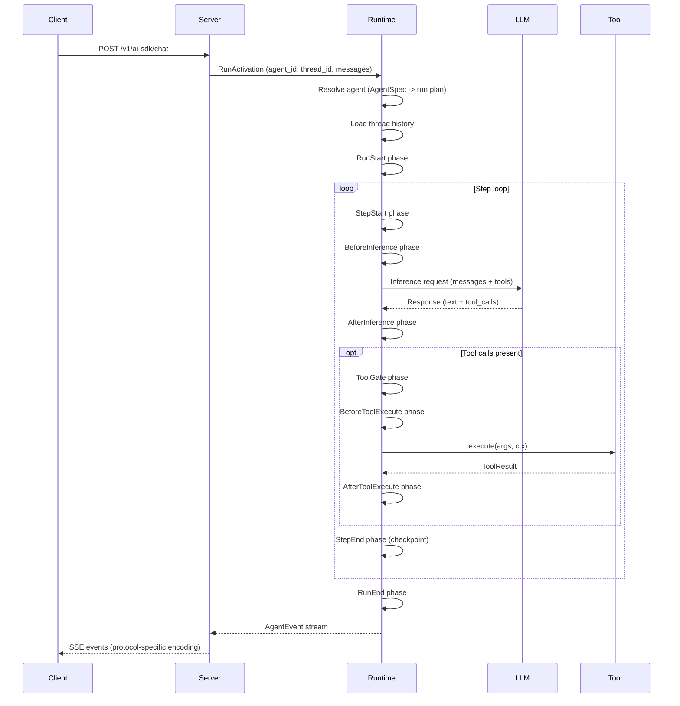

Awaken is organized around one runtime core plus three surrounding surfaces: contract types, server/storage adapters, and optional extensions. The important distinction is not just crate boundaries, but where decisions are made.

```text
In-process caller or Server integration plane
  HTTP routes / mailbox / protocol adapters / managed config
        |
        v
AgentRuntime execution core
  resolve AgentSpec -> resolved run plan
  build ExecutionEnv from plugins
  run the phase loop
  expose cancel / decision control for active runs
        |
        v
Stores + contract surfaces
  thread/run persistence, events, mailbox, profile/config storage
```

**Contract layer** -- `awaken-runtime-contract` defines runtime-facing vocabulary such as `AgentSpec`, `ModelSpec`, `ProviderSpec`, `Tool`, `AgentEvent`, `ThreadCommit`, and the typed state model. `awaken-server-contract` owns server/store vocabulary such as storage queries, scoped stores, mailbox/outbox contracts, and staged commit outcomes.

**Runtime core** -- `awaken-runtime` is the in-process execution core. It resolves agent IDs into a run plan backed by a local `ResolvedAgent` or a non-local `ResolvedBackendAgent` with an `ExecutionBackend`. Local runs build an `ExecutionEnv` from plugins and execute through the loop runner plus phase engine; non-local runs delegate execution to the backend. It currently targets standard Rust async applications with Tokio available; it is not a `no_std` or Tokio-free embedded-device runtime.

**Server and persistence surfaces** -- `awaken-server` is the service orchestration and control-plane layer. It owns HTTP routing, SSE replay, mailbox-backed background execution, protocol adapters, managed config APIs, and admin-console workflows, then invokes the runtime execution core. `awaken-stores` provides concrete persistence backends for thread/run data, runtime config, profile/shared state, and mailbox jobs. `awaken-ext-*` crates extend the runtime at phase and tool boundaries without changing the core loop.

## Runtime vs Server Responsibilities

| Area | Runtime development | Server development |
|---|---|---|
| Entry point | Rust calls into `AgentRuntime` directly. | HTTP, SSE, protocol adapters, mailbox workers, and admin routes call into `AgentRuntime`. |
| IO ownership | The calling application owns CLI/worker/web transport and request scheduling. | `awaken-server` owns request routing, streaming, mailbox dispatch, cancellation, resume, and protocol replay. |
| Configuration | Code builds registries or loads config before constructing the runtime. | `/v1/config/*` validates, persists, compiles, and publishes registry snapshots while the service stays up. |
| Agent creation | Code constructs `AgentSpec` or loads it from an app-owned source. | Online config publishes `AgentSpec` plus models/providers/plugin sections; the agent is callable by `agent_id` on the next run. |
| Operator surface | Application-specific. | Admin console, audit log, version restore, capabilities, and config validation routes. |

Server mode does not invent executable Rust code. It orchestrates configured
agents over the tools, plugins, providers, stores, and backend factories that
were registered in the runtime/server process.

## Request Sequence

The following diagram shows a representative request flowing through the system:



For endpoint-backed agents, the resolution step returns a non-local execution
and the selected backend owns the remote task lifecycle instead of entering the
local phase loop shown above.

## Phase-Driven Execution Loop

Every run proceeds through a fixed sequence of phases. Plugins register hooks that run at each phase boundary, giving them control over inference parameters, tool execution, state mutations, and termination logic.

```text
RunStart -> [StepStart -> BeforeInference -> AfterInference
             -> ToolGate -> BeforeToolExecute -> AfterToolExecute -> StepEnd]* -> RunEnd
```

The step loop repeats until one of these conditions fires:

- The LLM returns a response with no tool calls (`NaturalEnd`).
- A plugin or stop condition requests termination (`Stopped`, `BehaviorRequested`).
- A tool call suspends waiting for external input (`Suspended`).
- The run is cancelled externally (`Cancelled`).
- An error occurs (`Error`).

At each phase boundary, the loop checks the cancellation token and the run lifecycle state before proceeding.

## Repository Map

```text
awaken
├─ awaken-runtime-contract
│  ├─ registry specs + typed state model
│  ├─ tool / executor / event / lifecycle contracts
│  └─ runtime commit coordinator
├─ awaken-server-contract
│  ├─ storage query/page/filter contracts
│  ├─ scoped store + mailbox/outbox contracts
│  └─ staged commit outcomes
├─ awaken-runtime
│  ├─ builder + registries + resolve pipeline
│  ├─ AgentRuntime control plane
│  ├─ loop_runner + phase engine
│  ├─ execution / context / policies / profile
│  └─ runtime extensions (handoff, local A2A, background)
├─ awaken-server
│  ├─ routes + config API + mailbox + services
│  ├─ protocols: ai_sdk_v6 / ag_ui / a2a / mcp / acp-stdio
│  └─ transport: SSE relay / replay buffer / transcoder
├─ awaken-stores
└─ awaken-ext-*
```

## Design Intent

Three principles guide the architecture:

**Snapshot isolation** -- Phase hooks never see partially applied state. They read from an immutable snapshot and write to a `MutationBatch`. The batch is applied atomically after all hooks for a phase have converged. This eliminates data races between concurrent hooks and makes hook execution order irrelevant for correctness.

**Append-style persistence** -- Thread messages are append-only. State is checkpointed at step boundaries. This makes it possible to replay a run from any checkpoint and produces a deterministic audit trail.

**Transport independence** -- The runtime emits `AgentEvent` values through an `EventSink` trait. Protocol adapters (`AiSdkEncoder`, `AgUiEncoder`) transcode these events into wire formats. The runtime has no knowledge of HTTP, SSE, or any specific protocol. Adding a new protocol means implementing a new encoder -- the runtime does not change.

## See Also

- [Run Lifecycle and Phases](/awaken/explanation/run-lifecycle-and-phases/) -- phase execution model
- [State and Snapshot Model](/awaken/explanation/state-and-snapshot-model/) -- snapshot isolation details
- [Design Tradeoffs](/awaken/explanation/design-tradeoffs/) -- rationale for key architectural decisions
- [Tool and Plugin Boundary](/awaken/explanation/tool-and-plugin-boundary/) -- plugin vs tool design
