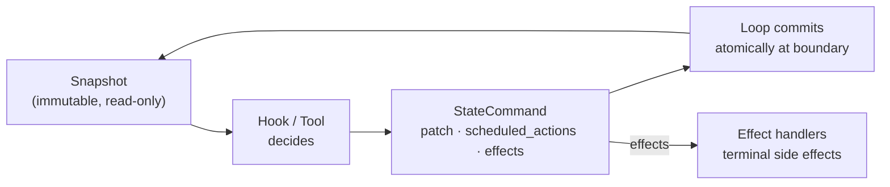

Awaken provides four layers of state management, each designed for a different combination of scope, access pattern, and lifecycle. This page explains when and how to use each layer.

> This page is the **"which layer do I use"** guide. For the engine internals
> behind these layers — the `StateKey` trait, snapshot isolation, merge
> strategies, and the mutation lifecycle — see
> [State and Snapshot Model](/awaken/explanation/state-and-snapshot-model/).

## Overview

| Layer | Trait | Scope | Access | Lifecycle | Primary Use Case |
|-------|-------|-------|--------|-----------|------------------|
| Run State | `StateKey` (`KeyScope::Run`) | Current run only | Sync (snapshot) | Cleared at run start | Transient counters, flags, step state |
| Thread State | `StateKey` (`KeyScope::Thread`) | Same thread, cross-run | Sync (snapshot) | Auto-exported/restored across runs | Tool call state, active agent, permissions |
| Shared State | `ProfileKey` + `StateScope` | Dynamic (global, parent thread, agent type, custom) | Async (`ProfileAccess`) | Persistent in `ProfileStore` | Cross-boundary sharing, global config |
| Profile State | `ProfileKey` + `key: &str` | Per-key (agent/system) | Async (`ProfileAccess`) | Persistent in `ProfileStore` | User/agent preferences, locale |

## Plugin context and commands

Plugins do not mutate state or prompts directly. A phase hook receives `PhaseContext`, which carries the active `AgentSpec`, `RunIdentity`, current messages, a frozen `Snapshot`, optional `ProfileAccess`, and phase-specific fields such as tool call data or LLM response. The hook returns a `StateCommand`.

`StateCommand` is the single command channel for plugin and tool side effects:

- `patch` updates registered `StateKey` values through `MutationBatch`.
- `scheduled_actions` asks runtime handlers to do runtime-owned work.
- `effects` dispatches terminal side effects to registered effect handlers.

For context injection, plugins schedule `AddContextMessage` with a `ContextMessage`. The runtime handler writes accepted messages to `ContextMessageStore`, updates `ContextThrottleState`, and the loop inserts messages into the system, session, conversation, or suffix-system band before inference. This is better than editing prompts in-place because context injection is keyed, ordered, throttled, and cleared by the loop.

## The State, Action & Effect loop

The four layers below are *what* you store. `StateCommand` is *how* every change happens. Tools and hooks never write state in place — they read a snapshot, return an action, and the loop commits it. Context injection, a tool result write-back, and a scheduled side effect are all the same cycle:



- **Snapshot** is a frozen, point-in-time view. Every hook in a phase reads the *same* snapshot, so they cannot observe each other's partial writes.
- **Action** is the returned `StateCommand`: `patch` (typed `MutationBatch`), `scheduled_actions` (runtime-owned work like `AddContextMessage`), and `effects` (terminal side effects).
- **Commit** is applied by the loop at the phase boundary, after all hooks for that phase converge — so hook execution order never affects the committed result.
- **Effect** handlers run the terminal side effects the actions requested.

One cycle for every mutation is what makes the layers below safe to share and the run deterministic to replay. Engine details (merge strategies, convergence, the `StateKey` trait) live in [State and Snapshot Model](/awaken/explanation/state-and-snapshot-model/).

## Run State

Run state is the most transient layer. It lives entirely in memory, is accessed synchronously through a `Snapshot`, and is cleared to its default value when a new run begins.

Writes happen through `MutationBatch`, which collects updates produced by phase hooks. When multiple hooks run in parallel, the runtime uses `MergeStrategy` to determine whether concurrent writes to the same key can be safely merged (`Commutative`) or must be serialized (`Exclusive`). This makes run state the only layer that participates in the transactional merge protocol.

Typical examples include `RunLifecycle` (tracking the current run phase), `PendingWorkKey` (counting outstanding async work), and `ContextThrottleState` (rate-limiting context injection).

### When to use

- Per-inference temporary state that does not need to survive beyond the current run
- State that must participate in parallel merge (`MutationBatch` with `MergeStrategy`)
- Counters, flags, and step-tracking metadata

### Example

```rust
struct StepCounter;
impl StateKey for StepCounter {
    const KEY: &'static str = "step_counter";
    type Value = usize;
    type Update = usize;
    fn apply(value: &mut Self::Value, update: Self::Update) {
        *value += update;
    }
}

// Register in plugin
r.register_key::<StepCounter>(StateKeyOptions::default())?;

// Read via snapshot
let count = ctx.snapshot.get::<StepCounter>().copied().unwrap_or(0);

// Write via MutationBatch
cmd.update::<StepCounter>(1);
```

## Thread State

Thread state shares the same access model as run state -- sync reads via `Snapshot`, transactional writes via `MutationBatch`, merge-safe through `MergeStrategy`. The difference is lifecycle: thread-scoped keys persist across runs on the same thread.

The runtime handles this transparently. At the end of a run, thread-scoped keys are exported (serialized). When the next run starts on the same thread, they are restored to their previous values instead of being reset to defaults. From the hook author's perspective, the key simply "remembers" its value between runs.

Typical examples include `ToolCallStates` (for resuming suspended tool calls across runs) and `ActiveAgentKey` (for persisting agent handoff state).

### When to use

- State that must survive across runs on the same thread
- State that needs sync access and transactional merge guarantees within each run
- State whose lifecycle should be managed automatically by the runtime

### Example

```rust
r.register_key::<ToolCallStates>(StateKeyOptions {
    scope: KeyScope::Thread,
    persistent: true,
    ..StateKeyOptions::default()
})?;
```

## Shared State

Shared state is a persistent, async layer built on the `ProfileStore` backend. It is designed for data that must cross thread and agent boundaries -- something neither run state nor thread state can do.

Shared state uses `ProfileKey` to bind a compile-time namespace to a value type, and a `key: &str` parameter to identify the runtime instance. Together, `(ProfileKey::KEY, key)` uniquely identifies a shared state entry. Different agents and threads can read and write the same entry if they use the same key string. The same `ProfileAccess` methods (`read`, `write`, `delete`) serve both shared and profile state — they all take `key: &str`.

Because shared state bypasses the snapshot/mutation-batch workflow, it does not participate in transactional merge. Concurrent writes follow last-write-wins semantics. Access is async through `ProfileAccess`, available in `PhaseContext`.

### StateScope -- convenience key builder

| Constructor | Key String | Scenario |
|-------------|-----------|----------|
| `StateScope::global()` | `"global"` | All agents share one instance |
| `StateScope::parent_thread(id)` | `"parent_thread::{id}"` | Parent and child agents share within a delegation tree |
| `StateScope::agent_type(name)` | `"agent_type::{name}"` | All instances of an agent type share |
| `StateScope::thread(id)` | `"thread::{id}"` | Thread-local persistent state |
| `StateScope::new(s)` | `"{s}"` | Arbitrary grouping (tenant, region, etc.) |

The key is a plain `&str` -- fully extensible without code changes. `StateScope` is an optional convenience; any raw string works.

### When to use

- State shared across thread boundaries
- State shared across agent boundaries
- Dynamic scoping that cannot be determined at compile time
- Data that serves as database-like indexed storage

### Example

```rust
use awaken_runtime_contract::ProfileKey;

struct TeamContextKey;
impl ProfileKey for TeamContextKey {
    const KEY: &'static str = "team_context";
    type Value = TeamData;
}

// In a hook -- share context with child agents
let scope = StateScope::parent_thread(&ctx.run_identity.parent_thread_id.unwrap());
let mut team = access.read::<TeamContextKey>(scope.as_str()).await?;
team.goals.push("new goal".into());
access.write::<TeamContextKey>(scope.as_str(), &team).await?;
```

## Profile State

Profile state is a persistent, async layer for per-entity preferences. Like shared state, it uses the `ProfileStore` backend and is accessed through `ProfileAccess`. The difference is the key convention: instead of a `StateScope` string, profile state typically uses an agent name or `"system"` as the key.

A `ProfileKey` binds a static namespace string to a value type. The key parameter identifies which agent or system entity the data belongs to.

### When to use

- Per-agent persistent preferences (locale, display name, custom settings)
- System-level configuration shared across all agents
- Data belonging to a specific agent identity rather than a dynamic group

### Example

```rust
struct Locale;
impl ProfileKey for Locale {
    const KEY: &'static str = "locale";
    type Value = String;
}

let locale = access.read::<Locale>("alice").await?;
access.write::<Locale>("system", &"en-US".into()).await?;
```

## Decision Guide

```text
Need state during a single run?
  +-- Yes, sync + transactional --> Run State (StateKey, KeyScope::Run)
  +-- No, needs to persist
       +-- Same thread only, sync + transactional --> Thread State (StateKey, KeyScope::Thread)
       +-- Cross-boundary, dynamic key --> Shared State (ProfileKey + StateScope)
       +-- Per-agent/user preference --> Profile State (ProfileKey + agent/system key)
```

## Comparison: Shared State vs Thread State

Both persist data across runs. The key differences:

| Aspect | Thread State | Shared State |
|--------|-------------|--------------|
| Access | Sync (snapshot) | Async (ProfileAccess) |
| Scope | Fixed to current thread | Dynamic (any string) |
| Merge safety | MutationBatch + strategy | Last-write-wins |
| Cross-boundary | No | Yes |
| Lifecycle | Auto export/restore | Always persistent |

Use **Thread State** when you need sync access and transactional guarantees within a run.
Use **Shared State** when you need cross-boundary sharing or dynamic scoping.

## State-based flow validation

Because state is typed and read from a snapshot *before* every step, you can use it to enforce that a fixed workflow runs in the right order — instead of hoping the model follows a prompt instruction. The pattern has three parts:

1. **Record the stage.** Keep the workflow position in a typed `StateKey` — for example an enum `Stage { Draft, Reviewed, Published }` on `KeyScope::Thread`. A tool advances it by emitting a `patch` in its `ToolOutput.command`.
2. **Validate the transition.** Make illegal moves unrepresentable at the merge point: the key's `apply` only accepts a legal next stage, so a stale or out-of-order update is rejected when the batch commits rather than corrupting state.
3. **Gate the capability.** Register a `ToolGate` hook that reads the current stage from the snapshot and denies a tool call that is not valid yet — e.g. `publish` is refused until the stage is `Reviewed`. The model sees a tool error and must take the required step first.

This turns "must review before publishing" into a runtime-checked contract enforced by the state engine and the loop, not by prompt wording. The same shape underlies the runtime's own guardrails, where `validate_for_persist` rejects illegal status combinations at every store-write boundary. For the `ToolGate` decision mechanics, see [Plugin Internals → ToolGate Decision Priority](/awaken/explanation/plugin-internals/#toolgate-decision-priority); for the `apply` merge contract, see [State and Snapshot Model](/awaken/explanation/state-and-snapshot-model/).

## See Also

- [State and Snapshot Model](/awaken/explanation/state-and-snapshot-model/) -- internal architecture
- [State Keys](/awaken/reference/state-keys/) -- API reference
- [Use Shared State](/awaken/how-to/use-shared-state/) -- practical how-to
