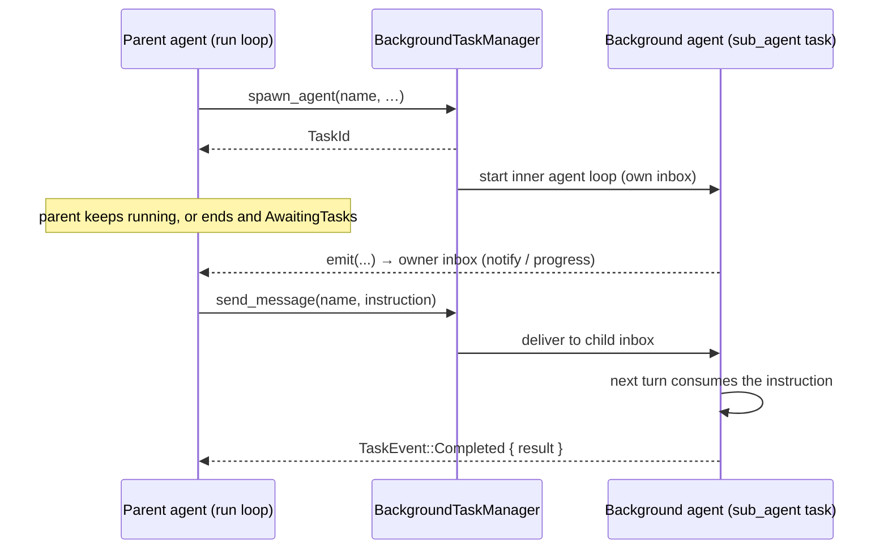
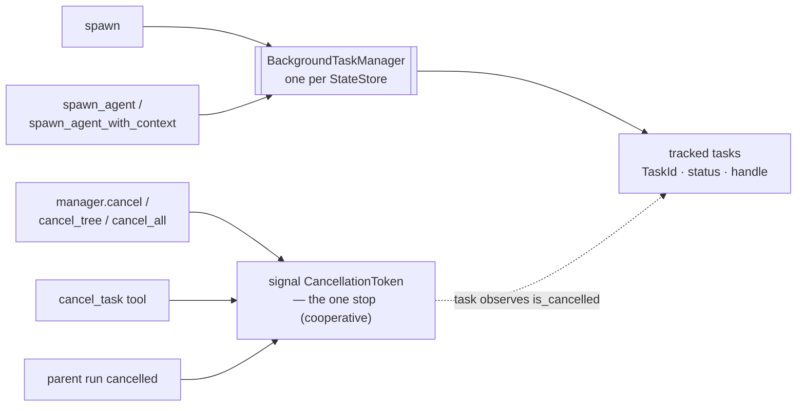

Use this when a tool must start work that should **not** block the current turn — an export, a crawl, a long poll — and let the agent keep going, then observe results, await completion, or cancel later.

## Purpose

A normal tool runs to completion inside one tool call. Background work is the opposite: the tool *spawns* a task, returns a handle immediately, and the task runs on its own until it finishes or is cancelled. This is better than hiding a long future inside `Tool::execute` because the task is tracked, survives across runs, reports progress through the agent's inbox, and can be cancelled by id.

Awaken exposes this through `BackgroundTaskManager`. You hold an `Arc<BackgroundTaskManager>`, call `spawn` from inside your tool, and register `BackgroundTaskPlugin` so the runtime tracks task metadata and gives the agent a `cancel_task` tool.

## When to use this

| Need | Use |
|---|---|
| Work that should finish before the tool returns a result | A plain [tool](/awaken/how-to/add-a-tool/) — no background task |
| A specialist run that returns one bounded result to the parent | [Invoke a Sub-Agent from a Tool](/awaken/how-to/invoke-sub-agent-from-tool/) |
| Long-running work the agent should fire and keep going past | A background task (this guide) |

## Prerequisites

- A working agent runtime (see [Build an Agent](/awaken/how-to/build-an-agent/))
- A `Tool` implementation (see [Add a Tool](/awaken/how-to/add-a-tool/))

```toml
[dependencies]
awaken = { git = "https://github.com/AwakenWorks/awaken" }
awaken-runtime = { git = "https://github.com/AwakenWorks/awaken" }
async-trait = "0.1"
tokio = { version = "1", features = ["full"] }
serde_json = "1"
```

The manager, plugin, and task types live in `awaken_runtime::extensions::background`; the `awaken` facade does not re-export them, so import directly from `awaken_runtime`.

## Steps

1. Define a tool that holds a shared `Arc<BackgroundTaskManager>`.

```rust
use std::sync::Arc;

use async_trait::async_trait;
use serde_json::{Value, json};

use awaken::contract::tool::{
    Tool, ToolCallContext, ToolDescriptor, ToolError, ToolOutput, ToolResult,
};
use awaken_runtime::extensions::background::{
    BackgroundTaskManager, TaskParentContext, TaskResult,
};

pub struct StartExportTool {
    pub manager: Arc<BackgroundTaskManager>,
}
```

2. Spawn the task inside `execute`. `spawn` reserves a stable `TaskId`, commits the task's metadata, and returns immediately — the closure runs on its own Tokio task.

```rust
#[async_trait]
impl Tool for StartExportTool {
    fn descriptor(&self) -> ToolDescriptor {
        ToolDescriptor::new("start_export", "start_export",
            "Start a background export and return its task id")
            .with_parameters(json!({
                "type": "object",
                "properties": { "dataset": { "type": "string" } },
                "required": ["dataset"]
            }))
    }

    async fn execute(&self, args: Value, ctx: &ToolCallContext)
        -> Result<ToolOutput, ToolError>
    {
        let dataset = args["dataset"].as_str()
            .ok_or_else(|| ToolError::InvalidArguments("dataset required".into()))?
            .to_string();

        // Record lineage so traces and cancellation can link the task to the
        // run and tool call that created it.
        let parent = TaskParentContext {
            run_id: Some(ctx.run_identity.run_id.clone()),
            call_id: Some(ctx.call_id.clone()),
            ..Default::default()
        };

        let task_id = self
            .manager
            .spawn(
                &ctx.run_identity.thread_id, // owner thread
                "export",                    // task_type (free-form label)
                Some("nightly-export"),      // optional unique name within the thread
                &format!("Export {dataset}"),
                parent,
                move |task| async move {
                    // The task's cancellation is wired to the parent run; check
                    // it between units of work and return early when cancelled.
                    match run_export(&dataset, &task).await {
                        Ok(rows) => {
                            task.emit("done", json!({ "rows": rows }));
                            TaskResult::Success(json!({ "rows": rows }))
                        }
                        Err(_) if task.is_cancelled() => TaskResult::Cancelled,
                        Err(e) => TaskResult::Failed(e.to_string()),
                    }
                },
            )
            .await
            .map_err(|e| ToolError::ExecutionFailed(e.to_string()))?;

        Ok(ToolResult::success("start_export", json!({ "task_id": task_id })).into())
    }
}
```

The closure receives a `TaskContext` (`task` above). It exposes:

- `task.is_cancelled()` / `task.cancelled().await` — cancellation is linked to the parent run. Poll `is_cancelled()` between units of work, or `await` `cancelled()` to park until killed.
- `task.emit(event_type, payload)` — push a custom event to the owner agent's inbox. The agent drains these at step boundaries (or while it is explicitly awaiting tasks), so progress surfaces without polling. Returns `false` if no inbox is bound or the agent has ended.
- `task.task_id` — the same `TaskId` returned to the caller.

Return one of three terminal results: `TaskResult::Success(Value)`, `TaskResult::Failed(String)`, or `TaskResult::Cancelled`. The manager records the matching `TaskStatus` and completion timestamp.

3. Wire the plugin and the tool into the builder, sharing **one** manager.

```rust
use awaken::{AgentRuntimeBuilder, AgentSpec};
use awaken_runtime::extensions::background::BackgroundTaskPlugin;

let manager = Arc::new(BackgroundTaskManager::new());

let runtime = AgentRuntimeBuilder::new()
    .with_plugin(
        "background-tasks",
        Arc::new(BackgroundTaskPlugin::new(manager.clone())),
    )
    .with_tool(
        "start_export",
        Arc::new(StartExportTool { manager: manager.clone() }),
    )
    // ... providers, models, agent spec ...
    .build()?;
```

`BackgroundTaskPlugin` registers the task view/metadata state keys, syncs task status into persisted state at run boundaries, and registers the built-in `cancel_task` tool. Installing the plugin also binds the manager to the runtime's `StateStore` so spawned tasks are tracked.

## Notify the agent during processing

A background task is not fire-and-forget: while it runs it can push notifications to the owning agent, and the agent handles them on its next step. Two kinds of events reach the agent's inbox:

- **Custom events you emit.** Call `task.emit(event_type, payload)` from inside the closure at any point — progress, an intermediate result, a request for attention. Each call sends a `TaskEvent::Custom { task_id, event_type, payload }`.
- **Terminal events the runtime emits for you.** When the closure returns, the manager automatically emits `TaskEvent::Completed { result }`, `TaskEvent::Failed { error }`, or `TaskEvent::Cancelled { task_id }` to the same inbox — you never emit these yourself; returning a `TaskResult` is enough.

How a notification becomes something the agent acts on:

```text
task.emit(...) ──► owner agent inbox
                        │
   step boundary  ──────┤  orchestrator drains the inbox
                        │  → converts each event into a conversation message
                        │  → continues the loop so the model sees and reacts
                        ▼
               next inference includes the task's notification
```

- The orchestrator **drains the inbox at every step boundary**, turns each queued event into a message appended to the conversation, and continues the loop — so the model processes notifications on its next inference with no polling code.
- If the agent already reached a **natural end** while a task is still running, the run enters an **`AwaitingTasks`** wait instead of finishing: it blocks on the inbox, and the first event that arrives wakes it, is drained, and resumes the loop. This is what lets `task.emit("ready", …)` pull a parked agent back into action.
- `emit` returns `false` when no inbox is bound or the agent has already ended. Treat custom events as best-effort progress and keep the authoritative outcome in the returned `TaskResult`, which the runtime delivers as the terminal event.

A task that reports progress as it goes, then a final result the agent can act on:

```rust
move |task| async move {
    let total = chunks.len();
    for (i, chunk) in chunks.into_iter().enumerate() {
        if task.is_cancelled() {
            return TaskResult::Cancelled;
        }
        upload(chunk).await;
        task.emit("progress", json!({ "done": i + 1, "total": total }));
    }
    // No terminal emit needed — returning Success delivers TaskEvent::Completed.
    TaskResult::Success(json!({ "uploaded": total }))
}
```

## Control the task from the agent

- **Cancellation.** The plugin auto-registers the `cancel_task` tool (`CancelTaskTool`), so the model can cancel by `TaskId`. Cancelling the parent run also cancels its tasks; the closure observes this through `task.is_cancelled()` / `task.cancelled().await`.
- **Send instructions back (reverse direction).** When a task must *receive* messages after it starts, register [`SendMessageTool`](/awaken/explanation/multi-agent-patterns/) (sharing the same manager); it routes a message to the task's inbox via `BackgroundTaskManager::send_task_inbox_message`. Spawn such a task with `spawn_agent` / `spawn_agent_with_context` so it gets its own inbox to consume those messages.

## A background agent is a background task

A **background agent** is not a different mechanism — it is a background task whose closure runs an agent loop. It shares everything above (tracking, status, cancellation, the notification flow) and adds one thing: **its own inbox**, so it is addressable by `name` and can *receive* messages mid-run, not just send them. Spawn it with `spawn_agent` instead of `spawn`:

| | `spawn` (background task) | `spawn_agent` (background agent) |
|---|---|---|
| Closure receives | `TaskContext` — `emit`, cancellation | `CancellationToken`, `InboxSender`, `InboxReceiver` (its own inbox) |
| Recorded `task_type` | your free-form label | `"sub_agent"` |
| Direction | task → agent (notify only) | task ↔ agent (notify **and** receive) |
| Use when | opaque long-running work | the work is itself a multi-turn agent loop that may need late input |

```rust
let task_id = self
    .manager
    .spawn_agent(
        &ctx.run_identity.thread_id,
        Some("researcher"),      // name → address for send_message
        "Long-running research agent",
        parent,
        |cancel, to_parent, mut from_parent| async move {
            // `from_parent` is this agent's own inbox; `to_parent` notifies the owner.
            // Drive an inner agent loop here, consuming follow-up messages until done.
            run_inner_agent(cancel, to_parent, &mut from_parent).await
        },
    )
    .await
    .map_err(|e| ToolError::ExecutionFailed(e.to_string()))?;
```

Because it has both directions, a background agent is a live, two-way participant for as long as it runs:



This is the right tool when the long-running work needs multiple turns, late data, or steering after the parent has already moved on — see [Multi-Agent Patterns → background agents](/awaken/explanation/multi-agent-patterns/). For one bounded, synchronous result instead, use [Invoke a Sub-Agent from a Tool](/awaken/how-to/invoke-sub-agent-from-tool/).

## One manager: many ways to start, one way to stop

Every background task — plain or agent — lives in a single `BackgroundTaskManager` (one per `StateStore`). The manager is the only thing that tracks tasks, holds their handles, and commits their metadata, so the runtime always has one authoritative view of what is running.

**Creation has several entry points**, one per task shape — but all register into the same manager and return a tracked `TaskId`:

- `spawn` — an opaque background task.
- `spawn_agent` / `spawn_agent_with_context` — a background agent with its own inbox.

**Stopping has exactly one.** There is no force-kill; stopping is always *cooperative cancellation*. The manager's `cancel(id)`, `cancel_tree(id)`, and `cancel_all(thread)`, the agent's `cancel_task` tool, and parent-run cancellation are different *scopes and triggers* that all converge on a single action — signalling the task's `CancellationToken`. The task actually stops only when its closure observes that signal via `is_cancelled()` / `cancelled().await`, which is why a task that never checks cancellation cannot be stopped.



The many-in / one-out shape is what keeps the model tractable: creation is varied because task shapes differ, but there is a single, auditable way for a task to end early.

## What to avoid

- **Do not install more than one `BackgroundTaskPlugin` per `StateStore`.** The single-manager invariant is what keeps `bg_{n}` task ids unique; `install_plugin` rejects a second install of the same plugin, and a manager binds to at most one store.
- **Do not give the tool a different manager than the plugin.** Both must share the same `Arc<BackgroundTaskManager>`, or spawned tasks will not be tracked by the runtime that owns the agent.
- **Do not ignore cancellation.** A task that never checks `task.is_cancelled()` cannot be stopped by `cancel_task` or by parent-run cancellation. Poll `is_cancelled()` or `await` `cancelled()`.
- **Do not assume `emit` always delivers.** It returns `false` when no inbox is bound or the agent has ended; treat the inbox as best-effort progress, and put the authoritative outcome in the `TaskResult`.
- **Do not block the spawn closure on a non-cancellable future.** Spawned work runs on its own Tokio task, but a future that never yields on cancellation will outlive the run.

## See Also

- [Invoke a Sub-Agent from a Tool](/awaken/how-to/invoke-sub-agent-from-tool/) — when a tool needs one bounded child result instead of fire-and-forget work
- [Multi-Agent Patterns](/awaken/explanation/multi-agent-patterns/) — choosing background tasks vs delegation vs handoff vs messaging
- [Add a Tool](/awaken/how-to/add-a-tool/) — the underlying `Tool` trait and builder registration
- [Report Tool Progress](/awaken/how-to/report-tool-progress/) — streaming progress from a tool that runs inline
