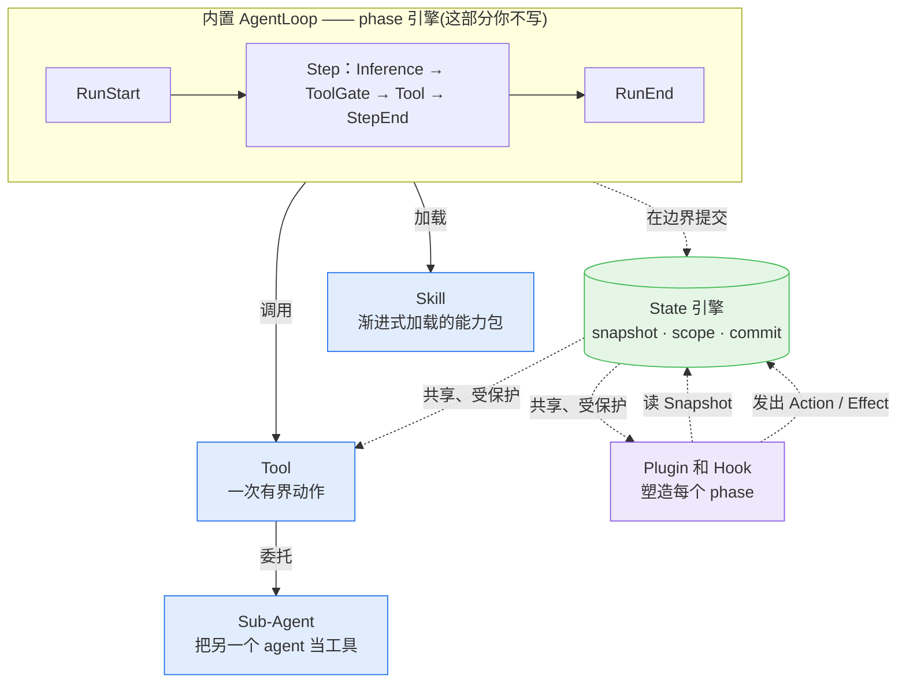

Awaken 的 agent 不是你写的某一个对象。它是一个**内置 loop**,驱动**你赋予它的能力**——tool、skill、sub-agent——同时由 **plugin 和 hook** 通过读写同一份共享、受保护的 **state** 来塑造每一轮。本页把这些部件放在一处串起来;每节都链到深入讲解的页面。

## 全局图



下文按这些部件组合到一起的顺序逐一展开:loop、它驱动的能力、塑造它的 plugin/hook,以及把一切串起来的 state 模型。

## 1. 内置 AgentLoop

loop 不用你实现——runtime 拥有它。每个 run 都沿固定的 phase 序列推进:

```text
RunStart -> [StepStart -> BeforeInference -> AfterInference
             -> ToolGate -> BeforeToolExecute -> AfterToolExecute -> StepEnd]* -> RunEnd
```

step 会一直重复,直到:模型返回了不带 tool call 的回复(`NaturalEnd`)、某个 stop 条件触发、某个 tool 挂起等待外部输入、run 被取消,或发生错误。loop 也是唯一在每个边界提交 state、检查 cancellation 的角色——正是这一点让下面的所有部件能安全组合。

→ 细节:[Run 生命周期与 Phases](/awaken/zh-cn/explanation/run-lifecycle-and-phases/)。

## 2. 你赋予的能力

loop 是通用的;你通过给它能力来让 agent 变得有用。能力有三种,从最简单到最强大形成一个阶梯。

### Tool

**tool** 是模型可以调用的一次有界动作:接收类型化参数、执行、返回一个 `ToolResult`。tool 是能力的基本单元——读文件、查 API、启动工作。tool 还通过 `ToolOutput.command` 通道决定要不要把 state 写回——这是下文 state 模型的一部分。

→ 实现:[新增工具](/awaken/zh-cn/how-to/add-a-tool/) · 契约:[Tool Trait](/awaken/zh-cn/reference/tool-trait/)。

### Skill

**skill** 是一个打包的、渐进式加载的能力——指令加上配套的 tool——agent 只在相关时才拉进来,而不是每个 prompt 都为全部能力付出代价。skill 让 context window 保持精简,同时仍能触达庞大的能力集。

→ 使用:[使用 Skills 子系统](/awaken/zh-cn/how-to/use-skills-subsystem/)。

### Sub-Agent

**sub-agent** 是把另一个完整 agent 以工具形式暴露给父 agent。最简单的形式是**声明式委托**(`AgentSpec.delegates`),它为每个条目自动构建一个 `AgentTool`——无需写代码。当你需要类型化的父 ↔ 子 state、自定义状态策略或流式时,再下沉到在自己工具里调用 `run_child_agent`。

→ 选择形式:[多智能体模式](/awaken/zh-cn/explanation/multi-agent-patterns/) · 编程式:[在工具里调用 Sub-Agent](/awaken/zh-cn/how-to/invoke-sub-agent-from-tool/)。

## 3. Plugin 与 Hook:塑造层

tool 决定模型*能做什么*。**plugin** 则是在不碰 loop 的前提下,改变每一轮*周围发生什么*的方式。plugin 在 phase 边界(`BeforeInference`、`ToolGate`、`AfterToolExecute`、`StepEnd`……)注册 **hook**。hook 接收只读的 `PhaseContext`/`Snapshot` 并返回命令——它从不就地修改 state。

两个扩展点的区别:

- **tool** 是模型按名字调用的能力。
- **hook** 是 runtime 在每一轮固定时点调用的逻辑——用于注入上下文、对 tool 把关、覆盖推理参数,或结束 run。

→ 边界:[Tool 与 Plugin 的边界](/awaken/zh-cn/explanation/tool-and-plugin-boundary/) · 内部机制(hook 排序、收敛、ToolGate 优先级、effect handler):[插件系统内部机制](/awaken/zh-cn/explanation/plugin-internals/)。

## 注册:各部件如何进入 runtime

tool、sub-agent、model、provider、plugin 都不直接挂到某个 agent 上——它们被放进 runtime 的**注册表(registry)**,agent 在调用时按 *id* 对照这些表解析出来。`AgentRuntimeBuilder` 累积五张注册表:

| 注册表 | 如何放进去 |
|---|---|
| Agents(`AgentSpec`) | `with_agent_spec` / `with_agent_specs` |
| Tools | `with_tool` —— 或插件的 `register_tool`,或 MCP 自动注册 |
| Models | `with_model` |
| Providers | `with_provider` |
| Plugins | `with_plugin` |

server 模式下,同样这几张表改由**发布的配置**填充,并与本地条目合并。无论哪种方式,解析都是 `(registries, agent_id)` 的纯函数——没注册就不可调用,这也是为什么一个 tool 和用它的 agent 必须都先存在于注册表里。

→ 细节:[智能体解析](/awaken/zh-cn/explanation/agent-resolution/)。

## 4. Context 注入

hook 最常做的事就是**注入上下文**——为下一次推理往 prompt 里加一条消息。hook 不编辑 prompt 字符串;它调度一个带类型化 `ContextMessage` 的 `AddContextMessage` action。runtime 决定放置位置(system / session / conversation / suffix band)、顺序和节流,并按计划清理。

正因为注入是*由 loop 按 key 编排、排序、节流*的,两个 plugin 可以同时注入而不产生竞争或重复。这正是下面 state 模型带来的直接收益。

→ 细节:[状态管理 → 插件上下文与命令](/awaken/zh-cn/explanation/state-management/#插件上下文与命令)。

## 5. State、Action、Effect

上面的一切——tool 写回结果、hook 注入上下文、plugin 调度工作——都走**同一套模型**,而不是各搞各的:

1. **Snapshot** —— hook 和 tool 读取一个不可变的、时间点固定的 state 视图。
2. **Action** —— 它们返回一个 `StateCommand`:`MutationBatch`(`patch`)、`scheduled_actions` 或 `effects`。
3. **Commit** —— loop 在 phase 边界、等该 phase 所有 hook 收敛后,原子地应用这批 action。
4. **Effect** —— 终态副作用(上下文写入、外部调用)经由注册的 handler 执行。

"每一次修改都走同一套模型",正是让 hook 顺序对正确性无关、并提供确定可重放审计轨迹的原因。

→ 模型与四层 state:[状态管理](/awaken/zh-cn/explanation/state-management/) · 引擎内部:[状态与快照模型](/awaken/zh-cn/explanation/state-and-snapshot-model/)。

## 6. 保护、共享与流程校验

state 引擎提供上面各部件所依赖的三个特性:

- **内部保护。** hook 只看到不可变 snapshot、只写入会被原子应用的 batch——所以并发 hook 永远看不到半应用的 state,执行顺序也无法破坏它。
- **跨 tool 与 plugin 共享。** state 由带声明 scope(run / thread / shared / profile)的类型化 `StateKey` 寻址,所以一个 tool 写入的值,另一个 tool 或 plugin 不用手工传递就能读到。
- **流程校验。** 因为 state 是类型化的、且在每个 step 前都会被读取,你可以记录某个工作流*走到哪了*,并拒绝非法转移——把"必须先 A 再 B"从 prompt 建议变成运行时可校验的契约。

→ 共享与校验模式:[状态管理](/awaken/zh-cn/explanation/state-management/#基于-state-的流程校验) · How-to:[使用 Shared State](/awaken/zh-cn/how-to/use-shared-state/)。

## 串起来看

一个完整的 turn,从头到尾:**loop** 进入一个 step → **hook** 读 snapshot 并注入**上下文** → 模型运行,可能调用一个 **tool**、**skill** 或 **sub-agent** → `ToolGate` hook 可能对照当前 **state** 校验该调用 → tool 执行并返回一个 **action** → loop 原子**提交**并 checkpoint。如此重复直到 run 结束。你写 tool、skill 和 plugin;loop 与 state 引擎让它们安全组合。

## 参见

- [Run 生命周期与 Phases](/awaken/zh-cn/explanation/run-lifecycle-and-phases/) —— 完整的 loop
- [Tool 与 Plugin 的边界](/awaken/zh-cn/explanation/tool-and-plugin-boundary/) —— 该用哪个扩展点
- [状态管理](/awaken/zh-cn/explanation/state-management/) —— state/action/effect 模型与四层 scope
- [插件系统内部机制](/awaken/zh-cn/explanation/plugin-internals/) —— hook、收敛与 effect handler
- [架构](/awaken/zh-cn/explanation/architecture/) —— 围绕这个核心的系统与 crate 视图
