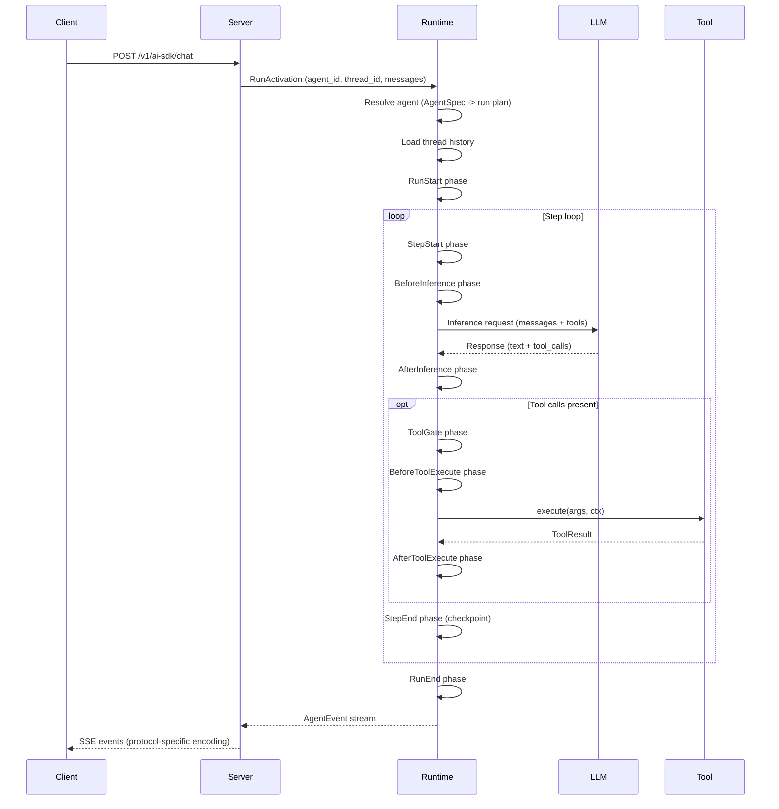

Awaken 围绕一个运行时核心及三个外围层面组织：契约类型、服务器/存储适配器以及可选扩展。真正重要的不是 crate 的边界，而是决策在哪里做出。

```text
进程内调用方或 Server integration plane
  HTTP 路由 / mailbox / 协议适配器 / 托管配置
        |
        v
AgentRuntime execution core
  解析 AgentSpec -> resolved run plan
  从插件构建 ExecutionEnv
  执行 phase loop
  暴露 cancel / decision 等活跃 run 的控制面
        |
        v
Stores + contract surfaces
  thread/run 持久化、event、mailbox、profile/config storage
```

**契约层** -- `awaken-runtime-contract` 定义 runtime-facing 词汇：`AgentSpec`、`ModelSpec`、`ProviderSpec`、`Tool`、`AgentEvent`、`ThreadCommit` 和类型化状态模型。`awaken-server-contract` 定义 server/store 词汇：storage query、scoped store、mailbox/outbox contract 和 staged commit outcome。

**运行时核心** -- `awaken-runtime` 是进程内执行核心。它将 agent ID 解析成 run plan：本地 `ResolvedAgent`，或由 `ExecutionBackend` 承载的非本地 `ResolvedBackendAgent`。本地 run 从插件构建 `ExecutionEnv` 并通过循环运行器和阶段引擎执行；非本地 run 会把执行委托给 backend。当前目标是有 Tokio 可用的标准 Rust async 应用，不是 `no_std` 或无 Tokio 的嵌入式设备 runtime。

**服务器与持久化表面** -- `awaken-server` 是服务编排和控制面层。它负责 HTTP routing、SSE replay、mailbox 后台执行、协议适配器、托管配置 API 和管理控制台工作流，然后调用 runtime execution core。`awaken-stores` 提供 thread/run 数据、runtime config、profile/shared state 和 mailbox job 的具体持久化后端。`awaken-ext-*` crate 在阶段和工具边界扩展运行时行为，而不改动核心循环。

## Runtime 与 Server 职责边界

| 维度 | Runtime 开发 | Server 开发 |
|---|---|---|
| 入口 | Rust 代码直接调用 `AgentRuntime`。 | HTTP、SSE、协议适配器、mailbox worker 和 admin routes 调用 `AgentRuntime`。 |
| IO 归属 | 调用方应用自己拥有 CLI/worker/web transport 和请求调度。 | `awaken-server` 负责 request routing、streaming、mailbox dispatch、cancel、resume 和 protocol replay。 |
| 配置 | 代码构建 registry，或在构造 runtime 前加载应用自己的配置。 | `/v1/config/*` 在服务运行中校验、持久化、编译并发布 registry snapshot。 |
| Agent 创建 | 代码构造 `AgentSpec`，或从应用自己的来源加载。 | 在线配置发布 `AgentSpec` 以及 model/provider/plugin section；下一个 run 可以直接按 `agent_id` 调用。 |
| 运维表面 | 由应用自定义。 | 管理控制台、audit log、version restore、capabilities 和 config validation routes。 |

Server 模式不会凭空生成可执行 Rust 代码。它是在 runtime/server 进程中已注册的
tools、plugins、providers、stores 和 backend factories 之上，编排配置化 agent。

## 请求时序

下图展示一个典型请求在系统中的流转过程：



对于 endpoint-backed agent，解析步骤会返回非本地执行，选中的 backend 会拥有远端任务生命周期，而不是进入上图中的本地 phase loop。

## 阶段驱动的执行循环

每次 run 都经历固定的阶段序列。插件注册在各阶段边界运行的钩子，从而控制推理参数、工具执行、状态变更和终止逻辑。

```text
RunStart -> [StepStart -> BeforeInference -> AfterInference
             -> ToolGate -> BeforeToolExecute -> AfterToolExecute -> StepEnd]* -> RunEnd
```

步骤循环持续执行，直到以下任一条件触发：

- LLM 返回不含工具调用的响应（`NaturalEnd`）。
- 插件或停止条件请求终止（`Stopped`、`BehaviorRequested`）。
- 工具调用挂起等待外部输入（`Suspended`）。
- run 被外部取消（`Cancelled`）。
- 发生错误（`Error`）。

在每个阶段边界，循环在继续执行前会检查取消令牌和 run 的生命周期状态。

## 仓库结构

```text
awaken
├─ awaken-runtime-contract
│  ├─ registry specs + typed state model
│  ├─ tool / executor / event / lifecycle contracts
│  └─ runtime commit coordinator
├─ awaken-server-contract
│  ├─ storage query/page/filter contracts
│  ├─ scoped store + mailbox/outbox contracts
│  └─ staged commit outcomes
├─ awaken-runtime
│  ├─ builder + registries + resolve pipeline
│  ├─ AgentRuntime control plane
│  ├─ loop_runner + phase engine
│  ├─ execution / context / policies / profile
│  └─ runtime extensions (handoff, local A2A, background)
├─ awaken-server
│  ├─ routes + config API + mailbox + services
│  ├─ protocols: ai_sdk_v6 / ag_ui / a2a / mcp / acp-stdio
│  └─ transport: SSE relay / replay buffer / transcoder
├─ awaken-stores
└─ awaken-ext-*
```

## 设计意图

三项原则指导整体架构：

**快照隔离** -- 阶段钩子永远看不到部分应用的状态。它们从不可变快照中读取，并向 `MutationBatch` 写入。在一个阶段的所有钩子收敛后，批次被原子性地提交。这消除了并发钩子之间的数据竞争，使钩子的执行顺序对正确性无关紧要。

**追加式持久化** -- Thread 消息仅追加，不修改。状态在步骤边界做检查点。这使得从任意检查点重放 run 成为可能，并产生确定性的审计轨迹。

**传输无关性** -- 运行时通过 `EventSink` trait 发出 `AgentEvent` 值。协议适配器（`AiSdkEncoder`、`AgUiEncoder`）将这些事件转码为具体的传输格式。运行时对 HTTP、SSE 或任何具体协议一无所知。添加新协议意味着实现一个新的编码器——运行时本身无需改变。

## 另见

- [Run 生命周期与阶段](/awaken/zh-cn/explanation/run-lifecycle-and-phases/) -- 阶段执行模型
- [状态与快照模型](/awaken/zh-cn/explanation/state-and-snapshot-model/) -- 快照隔离详解
- [设计权衡](/awaken/zh-cn/explanation/design-tradeoffs/) -- 关键架构决策的理由
- [工具与插件边界](/awaken/zh-cn/explanation/tool-and-plugin-boundary/) -- 插件与工具的设计边界
