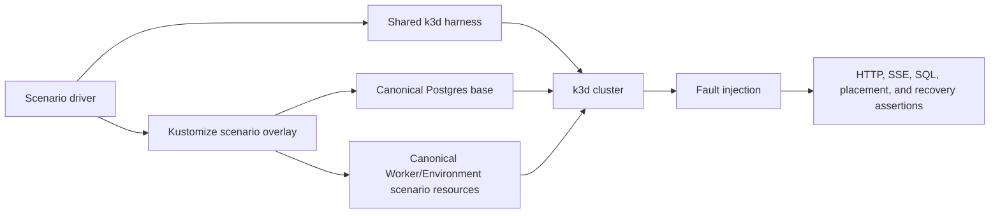

# K3D Distributed Test Topologies

This directory is the deployment-fixture owner for Awaken's real-cluster tests.
The fixtures deliberately separate reusable infrastructure from scenario
behavior so a topology cannot drift through copied Kubernetes resources or
copied cluster setup scripts.

## Static Structure

| Location | Sole responsibility |
|---|---|
| `bases/postgres/` | Ephemeral Postgres Service, readiness contract, test credentials, and storage policy |
| `bases/durable-brain/` | Deterministic Postgres-backed brain Service and Deployment, typed scenario inputs, and unique dispatch ownership |
| `product-backend/` | Private all-in-one product backend with durable state, no public Service/Ingress, and an ingress allowlist for Awaken Design backends |
| `distributed-control/` | ADR-0071 production Control/Coordinator/Worker composition, four owner databases on a primary/streaming-standby fixture, authenticated boundaries, and a single public edge |
| `failover/`, `scaling/`, `cold-start/`, `nats-wake/`, `worker-failover/` | Placement, replica counts, dependencies, and fault behavior layered over the Postgres and durable-brain bases |
| `e2e/k3d/harness.sh` | Tool admission, cluster lifecycle, Cargo executable resolution, single-platform image import, CoreDNS refresh, and collision-free IPv4 port forwarding |
| `e2e/k3d/*_e2e.sh` | Scenario triggers, fault timing, and terminal assertions only |

Kustomize resolves every overlay before Kubernetes creates an object. In
particular, the microservices brain starts with its final durable configuration;
there is no unpatched Ready replica that can receive a request.

## Dynamic Flow



The harness always imports a single-platform application image together with
the cluster's exact Pause and CoreDNS images. Scenario scripts may add
dependencies such as Postgres or NATS, but they must not reimplement import,
cluster creation, executable discovery, port selection, or cleanup.

The product backend uses the Kubernetes sandbox tier and Coordinator's durable
Environment build jobs. Build and import the production sandbox base into every
k3d node as `awaken-sandbox:local`; its non-`latest` tag defaults to
`IfNotPresent`, so Session Pods consume the exact node-local image without a
Registry pull:

```bash
deploy/images/sandbox/build.sh awaken-sandbox:local
. e2e/k3d/harness.sh
k3d_import_images awaken-product awaken-sandbox:local
```

Package-bearing Environments still require a Registry for the immutable derived
images built by the Kubernetes BuildKit Jobs. Create and attach that Registry
when constructing a package-enabled cluster:

```bash
k3d registry create awaken-registry.localhost --port 5111
# The shared harness accepts the fourth registry coordinate and passes it once
# to `k3d cluster create --registry-use`.
. e2e/k3d/harness.sh
k3d_create_cluster awaken-product 1 2 k3d-awaken-registry.localhost:5111

# Mirror the rootless builder as well as derived Environment images. This keeps
# package materialization independent of Docker Hub availability on every node.
docker tag moby/buildkit:v0.30.0-rootless \
  localhost:5111/system/buildkit:v0.30.0-rootless
docker push localhost:5111/system/buildkit:v0.30.0-rootless
```

The all-in-one Pod never runs or mounts a Docker daemon. It submits bounded,
rootless BuildKit Jobs through namespace-scoped RBAC; those Jobs push immutable
derived Environment images to the same Registry. Session creation waits inside
Awaken for the exact digest, and Session Pods receive that digest instead of
installing packages at startup. Set `k8s_buildkit_image` to the cluster-visible
mirror reference; omitting it retains `moby/buildkit:v0.30.0-rootless` for
backward compatibility.

## Verification Rules

| Rule | Cause | Required effect |
|---|---|---|
| K1 | Valid cluster name, node count, and eviction threshold | One validated cluster create operation with the same policy on every node role |
| K2 | Invalid or option-shaped cluster input | Rejection before any cluster deletion or creation |
| K3 | Duplicate image coordinate | One archive and one import entry for that image |
| K4 | Worker execution topology | Coordinator selects one eligible Worker; that Worker realizes one Session Environment and its sole Hand |
| K5 | Worker or coordinator failure | Durable truth survives; a valid peer reclaims or resumes without duplicate commit |
| K6 | ADR-0071 split-role topology | One public endpoint drives configuration through terminal response; database-less Workers realize exact pins; Pod/node/Provider/Coordinator/Worker/database faults recover from durable truth without duplicate terminal output |

Run the pure harness rules with:

```bash
bash e2e/k3d/harness.sh --self-test
bash e2e/k3d/product_backend_contract_test.sh
```

Run a real topology with its driver, for example:

```bash
bash e2e/k3d/worker_failover_e2e.sh
bash e2e/k3d/distributed_control_e2e.sh
```

Set `ADR71_KEEP_FAILED_CLUSTER=1` only while diagnosing a failure; the default
always deletes the dedicated `awaken-adr71` cluster and disposable role binaries.
For a test-script-only rerun, `ADR71_REUSE_IMAGE=1` skips host compilation and
requires an existing `awaken-roles:latest`; the suite prints and imports that
immutable digest, while the default continues to build from the current tree.

The scenario driver is the test entry point. Applying a base directly is useful
for inspection, but it does not constitute end-to-end verification.

`distributed_control_e2e.sh` is the canonical black-box acceptance suite for
ADR-0071 and P2-B. The test client knows only `svc/awaken-api`; Kubernetes and
SQL access are used exclusively for fault injection and ownership evidence.
Its ten stages cover build/deploy, the complete configuration-to-application
path, the complete request-to-response path, Worker process isolation,
Coordinator-total-outage recovery, Pod and in-flight Worker failure, K3D node
loss, PostgreSQL standby promotion, and concurrent pressure. Model inference is
the only deterministic edge fixture; all application roles are shipped
composition roots and both Workers are the production `awaken worker` CLI.
Replicated stateless roles and Workers use a 15-second `not-ready`/`unreachable`
`NoExecute` tolerance in this overlay. A dead node is therefore removed from
Service routing and its workloads become replaceable within the test's bounded
recovery window; the PostgreSQL pair is excluded and follows the separately
fenced WAL-replay-and-promotion path.
The suite also scales the K3S CoreDNS Deployment to two hostname-spread replicas
before application admission. Service discovery therefore remains available
when the node-chaos stage removes either DNS placement; the topology is rejected
up front unless both replicas are Ready on distinct nodes.

The four logical owner databases share one disposable PostgreSQL primary and
streaming standby to keep this topology affordable. Database names, role
configuration, Worker environment inspection, and socket inspection enforce
the same ownership boundaries required when owners use separate database
servers.

In that fixture, Control receives only `control` and `credentials` plus the
transitional Environment binding in `runtime`; Coordinator receives `runtime`
and the co-located Resources component's `resources`; Workers receive no
database URL or seal key. The two role-specific migration Jobs use the same
configuration and therefore migrate only schemas their target role can acquire.
Coordinator calls Control's audit, secret-free credential-selection, and
webhook-delivery ports through the dedicated bearer-authenticated boundary;
this token grants no database connection.

`worker_failover_e2e.sh` is retained as a lower-level durable-ingress diagnostic,
not a second P2-B acceptance path: it assigns one run per thread through the
scenario host and isolates lease reclaim/commit fencing. The distributed-control
suite alone owns the public product flow, production CLI Worker, materialization,
service ownership, and full chaos/load claim.
