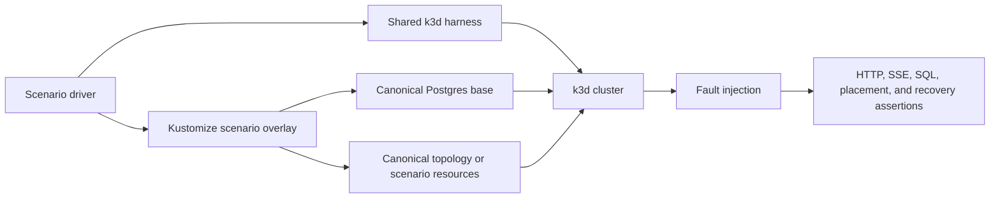

# K3D Distributed Test Topologies

This directory is the deployment-fixture owner for Awaken's real-cluster tests.
The fixtures deliberately separate reusable infrastructure from scenario
behavior so a topology cannot drift through copied Kubernetes resources or
copied cluster setup scripts.

## Static Structure

| Location | Sole responsibility |
|---|---|
| `bases/postgres/` | Ephemeral Postgres Service, readiness contract, test credentials, and storage policy |
| `bases/durable-brain/` | Deterministic Postgres-backed brain Service and Deployment, typed scenario inputs, and unique dispatch ownership |
| `bases/topology-direct/` | Direct brain-to-hand Services and Deployments, including the canonical `awaken-sandbox hand` command |
| `microservices/` | Postgres plus the Direct topology, with a focused durable-brain patch applied before object creation |
| `distributed-control/` | ADR-0071 production Control and Coordinator composition, four component databases, authenticated registration and launch boundaries, and database-less Worker placement |
| `failover/`, `scaling/`, `cold-start/`, `nats-wake/`, `worker-failover/` | Placement, replica counts, dependencies, and fault behavior layered over the Postgres and durable-brain bases |
| `topology-reverse.yaml`, `topology-relay.yaml` | Distinct network topologies that cannot reuse the Direct deployment contract |
| `e2e/k3d/harness.sh` | Tool admission, cluster lifecycle, Cargo executable resolution, single-platform image import, CoreDNS refresh, and collision-free IPv4 port forwarding |
| `e2e/k3d/*_e2e.sh` | Scenario triggers, fault timing, and terminal assertions only |

Kustomize resolves every overlay before Kubernetes creates an object. In
particular, the microservices brain starts with its final durable configuration;
there is no unpatched Ready replica that can receive a request.

## Dynamic Flow



The harness always imports a single-platform application image together with
the cluster's exact Pause and CoreDNS images. Scenario scripts may add
dependencies such as Postgres or NATS, but they must not reimplement import,
cluster creation, executable discovery, port selection, or cleanup.

## Verification Rules

| Rule | Cause | Required effect |
|---|---|---|
| K1 | Valid cluster name, node count, and eviction threshold | One validated cluster create operation with the same policy on every node role |
| K2 | Invalid or option-shaped cluster input | Rejection before any cluster deletion or creation |
| K3 | Duplicate image coordinate | One archive and one import entry for that image |
| K4 | Microservices overlay | Exactly one Postgres, brain, and hand Deployment; the brain is durable before first creation |
| K5 | Worker or coordinator failure | Durable truth survives; a valid peer reclaims or resumes without duplicate commit |
| K6 | ADR-0071 split-role topology | Production Control and Coordinator cross authenticated registration and launch boundaries; database-less Workers execute on separate nodes; component data remains isolated; an authority outage is retryable and both authority roles recover durable truth after restart |

Run the pure harness rules with:

```bash
bash e2e/k3d/harness.sh --self-test
```

Run a real topology with its driver, for example:

```bash
bash e2e/k3d/microservices_e2e.sh
bash e2e/k3d/worker_failover_e2e.sh
bash e2e/k3d/distributed_control_e2e.sh
```

The scenario driver is the test entry point. Applying a base directly is useful
for inspection, but it does not constitute end-to-end verification.

`distributed_control_e2e.sh` is the executable evidence for the two ADR-0071
flows. It uses the shipped Control and Coordinator composition roots and the
canonical remote Worker lifecycle. Only model inference is replaced by a
deterministic scenario-edge adapter. Its four logical databases share one
disposable Postgres server to keep the test lightweight; database names and
role configuration enforce the same ownership boundaries required when those
databases are deployed as separate services.
