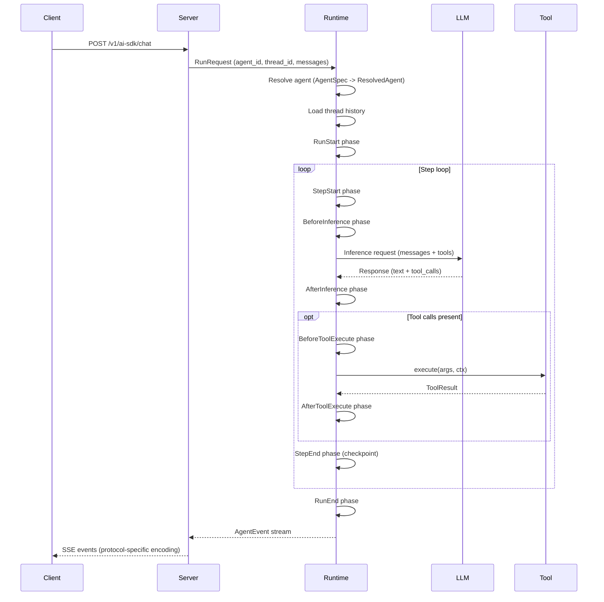

# Architecture

Awaken is organized in three layers. Each layer has a single responsibility and communicates through defined contracts.

```text
+-------------------------------------------------------+
|  Application Layer                                     |
|  Register tools, define agents, call run_stream        |
+-------------------------------------------------------+
                         |
                         v
+-------------------------------------------------------+
|  AgentRuntime                                          |
|  Resolve agents, execute phases, emit events           |
+-------------------------------------------------------+
                         |
                         v
+-------------------------------------------------------+
|  Thread + State Engine                                 |
|  Thread history, snapshot isolation, state keys        |
+-------------------------------------------------------+
```

**Application layer** -- user code that registers tools, defines `AgentSpec` entries, configures plugins, and starts the runtime. This layer does not touch execution internals.

**AgentRuntime** -- the orchestration layer. It resolves agent IDs to fully wired configurations (`ResolvedAgent`), manages active runs (one per thread), and provides external control via `RunHandle` (cancel, send decisions). The runtime delegates execution to the loop runner.

**Thread + State Engine** -- the persistence and state isolation layer. Thread history is append-only. All state access uses snapshot isolation: phase hooks see an immutable `Snapshot`, collect mutations in a `MutationBatch`, and apply them atomically after phase convergence.

## Request Sequence

The following diagram shows a representative request flowing through the system:



## Phase-Driven Execution Loop

Every run proceeds through a fixed sequence of phases. Plugins register hooks that run at each phase boundary, giving them control over inference parameters, tool execution, state mutations, and termination logic.

```text
RunStart -> [StepStart -> BeforeInference -> AfterInference
             -> BeforeToolExecute -> AfterToolExecute -> StepEnd]* -> RunEnd
```

The step loop repeats until one of these conditions fires:

- The LLM returns a response with no tool calls (`NaturalEnd`).
- A plugin or stop condition requests termination (`Stopped`, `BehaviorRequested`).
- A tool call suspends waiting for external input (`Suspended`).
- The run is cancelled externally (`Cancelled`).
- An error occurs (`Error`).

At each phase boundary, the loop checks the cancellation token and the run lifecycle state before proceeding.

## Design Intent

Three principles guide the architecture:

**Snapshot isolation** -- Phase hooks never see partially applied state. They read from an immutable snapshot and write to a `MutationBatch`. The batch is applied atomically after all hooks for a phase have converged. This eliminates data races between concurrent hooks and makes hook execution order irrelevant for correctness.

**Append-style persistence** -- Thread messages are append-only. State is checkpointed at step boundaries. This makes it possible to replay a run from any checkpoint and produces a deterministic audit trail.

**Transport independence** -- The runtime emits `AgentEvent` values through an `EventSink` trait. Protocol adapters (`AiSdkEncoder`, `AgUiEncoder`) transcode these events into wire formats. The runtime has no knowledge of HTTP, SSE, or any specific protocol. Adding a new protocol means implementing a new encoder -- the runtime does not change.

## See Also

- [Run Lifecycle and Phases](./run-lifecycle-and-phases.md) -- phase execution model
- [State and Snapshot Model](./state-and-snapshot-model.md) -- snapshot isolation details
- [Design Tradeoffs](./design-tradeoffs.md) -- rationale for key architectural decisions
- [Tool and Plugin Boundary](./tool-and-plugin-boundary.md) -- plugin vs tool design
