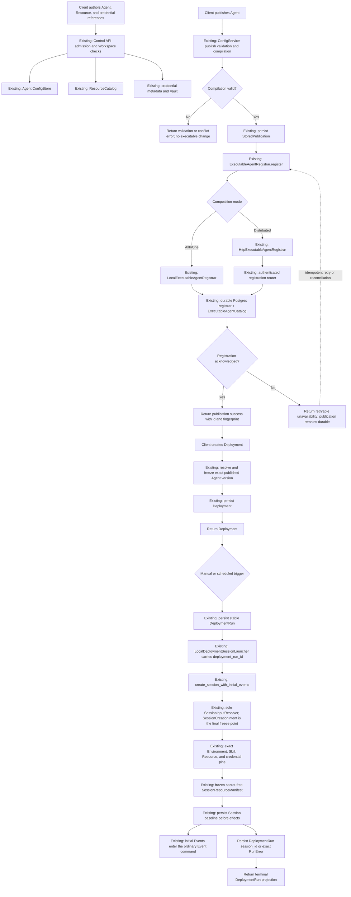
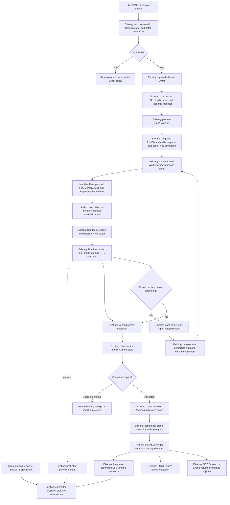

# Configuration-To-Application And Request-To-Response Flows

This document is the single end-to-end narrative for the service split. It owns
two paths:

1. configuration to an executable application Session;
2. one Session request to its committed HTTP and SSE response.

Focused documents own their details and are linked rather than repeated:

- [publication lifecycle](config-publication-lifecycle.md);
- [Managed Deployment scheduling](managed-deployments.md);
- [Resource lifecycle](resources-memory-files-skills.md);
- [credential custody](credentials-and-vaults.md);
- [remote Worker protocol](remote-worker-protocol.md);
- [runtime commit and projection](commit-fact-projection-taxonomy.md).

The governing decision is
[ADR-0071](../adr/0071-distributed-service-boundaries-and-executable-agent-registration.md).

## Legend And Objective

- **Existing**: the current authoritative mechanism is reused.
- **Modified**: an existing owner or port changes composition or contract shape.
- **New boundary**: a local or network adapter is added without adding a domain
  model or general-purpose framework.
- **External**: infrastructure outside Awaken's data authority.

The target keeps one domain path in both deployment modes:

```text
AllInOne:     application port -> local adapter -> existing authority
Distributed:  application port -> network adapter -> same authority
```

## Static Service And Data Ownership

| Concern | Authoritative owner | Worker access |
|---|---|---|
| Agent drafts, revisions, publication history | Control | carried as a registered immutable snapshot; no Control database access |
| Agent Resource-reference authoring revisions | Control | exact resolved references in the Session manifest |
| Environment definitions, immutable revisions, and exact sandbox-policy references | Control | frozen `EnvironmentSnapshot`; no Environment database access |
| Sandbox execution policy versions | Control | exact body resolved into the executable Environment registration |
| Resource lifecycle metadata/catalog | Resources | exact resolved values plus per-kind clients |
| credential metadata, policy, and encrypted material | Control / Vault | exact claim-fenced materialization only |
| executable Agent and Environment projections | Coordinator | exact registered facts used for new Session admission |
| Deployment, DeploymentRun, Session, WorkQueue, and dispatch state | Coordinator | secret-free dispatch envelope; launch is a local Session application call |
| Session baseline and frozen Resource manifest | Coordinator | secret-free dispatch envelope |
| dispatch, Run commit, and completion | Coordinator | authenticated claim, commit, and settle APIs |
| File bytes | Resources / File aggregate | `FileContentSource` |
| Memory content, history, and CAS versions | Resources / MemoryStore aggregate | `MemorySnapshotSource` and `MemoryWritebackClient` |
| Skill bundles | Resources / Skill aggregate | `SkillBundleSource` |
| Git repository contents | external Git provider | `RepositoryRealizer` with an ephemeral credential |
| mounts, working trees, processes, and plaintext | Worker / Sandbox, ephemeral | local only |

File, Memory, custom-Skill, and Repository execution use dedicated claim-fenced
network adapters. The Worker opens no Control, Coordinator, File, Memory, Skill,
or Resource Catalog database. Its standard capability manifest is derived from
the installed adapters rather than from a marker composition value.

An owner in this table is a component boundary, not necessarily a dedicated
process. AllInOne co-locates every component. The current distributed
Coordinator process co-deploys the canonical Resources component and its File,
Memory, Skill, and Repository-verification handlers, but delegates only through
the named Resources ports. Credential selection instead crosses the authenticated
Control application boundary. Separating a provider later changes composition
and routing; it does not introduce another domain service or data model.

The crate-level static boundary is explicit:

| Component | Layer/owner | Responsibility |
|---|---|---|
| `awaken-session-application` | Coordinator application / Session | private application collaborators; exact Environment selection; repository/environment-binding consistency; one create/recovery WorkQueue projection command; lifecycle fence |
| `awaken-protocol-managed::ManagedState` | Coordinator interface / Managed wire | explicit calls into `SessionApplication`, DTO projections, public ids, event/SSE delivery; no implicit dereference or Session repository ownership |
| `awaken-runtime-host::SharedHost` | Shared host infrastructure / Runtime | one protocol-neutral execution/session substrate composed from injected ports/adapters |
| `awaken-run-ingress-http` | Coordinator interface / durable operations | HTTP translation into neutral Host durable-control methods |
| `awaken-worker-runtime` | Worker infrastructure / Worker transport | authenticated registration/lifecycle and Session-control clients |

The dynamic path is correspondingly single-track:

```text
Managed HTTP -> ManagedState wire projection -> SessionApplication
             -> exact Environment + Session repository / SharedHost ports
             -> committed Session -> one idempotent WorkQueue projection -> wire/SSE projection

Worker claim -> awaken-worker-runtime client -> Coordinator authenticated interface
             -> SessionApplication / SharedHost -> claim-fenced commit and settle
```

## Database And Migration Ownership

The deployable unit is a bounded-context migration bundle, not a physical
database and not an individual table. A production deployment may place several
bundles owned by the same service in one PostgreSQL database; each prefix keeps
its own ledger. A service must never open another service's database. AllInOne
may co-locate the same canonical bundles, but it does not gain a fifth schema or
another implementation.

Every prefix owns `<prefix>_schema_migrations` and
`<prefix>_schema_migrations_meta` in addition to the business tables below. The
ledger records bundle id, dense positive version, and checksum. IAM has four
subdomain bundle ids over the `iam` prefix and one IAM ledger; the other rows use
one bundle id per aggregate-safe scope.

| Service owner | Bundle id / prefix | Business tables (indexes, triggers, and PostgreSQL sequences omitted) |
|---|---|---|
| Control | `iam.identity`, `iam.authz`, `iam.entitlement`, `iam.audit` / `iam` | `iam_accounts`, `iam_external_identities`, `iam_sessions`, `iam_login_flows`, `iam_api_tokens`, `iam_oauth_clients`, `iam_grants`, `iam_role_bindings`, `iam_resource_edges`, `iam_orgs`, `iam_groups`, `iam_roles`, `iam_fence`, `iam_authorization_profiles`, `iam_authorization_profile_heads`, `iam_workspace_org_edges`, `iam_plans`, `iam_subscriptions`, `iam_audit_events` |
| Control | `awaken.catalog` / `catalog` | `catalog_provider`, `catalog_protocol_endpoint`, `catalog_offering`, `catalog_model_attributes` |
| Control | `awaken.credential` / `credential` | `credential_source`, `credential_secret`, `credential_pool`, `credential_creation_intent` |
| Control | `awaken.admin` / `admin` | `admin_inference_profile`, `admin_agent_resource`, `admin_webhook` |
| Control | `awaken.config` / `config` | `config_agent`, `config_publication`, `config_management_audit`, `config_management_effect`, `config_agent_revision` |
| Control | `awaken.environment_definition` / `environment_definition` | `environment_definition_environment`, `environment_definition_revision`, `environment_definition_command`, `environment_definition_registration_outbox` |
| Control | `awaken.control_data_subject` / `control_data_subject` | `control_data_subject_subject`, `control_data_subject_erasure_job` |
| Control | `awaken.env_registry` / `env_registry` | `env_registry_env`, `env_registry_create_command`, `env_registry_revision` |
| Control | `awaken.sandbox_execution_policy` / `sandbox_execution_policy` | `sandbox_execution_policy_version`, `sandbox_execution_policy_current` |
| Coordinator | `awaken.managed_session` / `managed` | `managed_session`, `managed_lifecycle_outbox`, `managed_memory_extraction`, `managed_session_idempotency`, `managed_session_tombstone`, `managed_dream`, `managed_deployment`, `managed_deployment_run`, `managed_deployment_claim`, `managed_dream_policy` |
| Coordinator | `awaken.environment_image_build` / `environment_image_build` | `environment_image_build_job` |
| Coordinator | `awaken.work_queue` / `work_queue` | `work_queue_item` |
| Coordinator | `awaken.worker_registry` / `worker_registry` | `worker_registry_worker` |
| Coordinator | `awaken.executable_agent_catalog` / `executable_agent` | `executable_agent_command` with monotonic `command_sequence` |
| Coordinator | `awaken.executable_environment_catalog` / `executable_environment` | `executable_environment_command` with monotonic `command_sequence` |
| Coordinator | `awaken.run_dispatch` / `runtime` | `runtime_dispatch`, `runtime_pending`, `runtime_outbox`, `runtime_dispatch_completion`, `runtime_stream_checkpoint`, `runtime_dispatch_operation` |
| Coordinator | `awaken.runtime_commit`, `awaken.runtime_commit_pg` / `runtime` | `runtime_commit`, `runtime_message`, `runtime_state_command`, `runtime_event`, `runtime_run_record`, `runtime_waiting`, `runtime_thread_version`, `runtime_commit_receipt`; PostgreSQL also owns `runtime_commit_seq` |
| Coordinator | `awaken.coordinator_data_capture` / `coordinator_data_capture` | `coordinator_data_capture_captured`, `coordinator_data_capture_fence` |
| Resources | `awaken.resource_catalog` / `resource_catalog` | `resource_catalog_entry` |
| Resources | `awaken.resource_lifecycle` / `resource_lifecycle` | `resource_lifecycle_purge_intents`, `resource_lifecycle_references`, `resource_lifecycle_reclamation_fences` |
| Resources | `awaken.file_store` / `file_store` | `file_store_blob`, `file_store_file` |
| Resources | `awaken.memory_store` / `memory_store` | `memory_store_memories`, `memory_store_counters`, `memory_store_versions` |
| Resources | `awaken.skill_store` / `skill_store` | `skill_store_aggregate` |
| Worker | none | none; Worker has only ephemeral execution/cache state and receives no authority database setting |

Environment Registry and sandbox-policy persistence are Control stores. The
Environment aggregate owns its exact policy reference; the policy store owns
only immutable versions. `awaken-environment-application` owns the sole
`EnvironmentApplication` definition command path and publishes exact revisions
through `ExecutableEnvironmentRegistrar`.
Coordinator owns only the executable command log, WorkQueue, image-build, and
Session realization state. AllInOne replaces the registration transport with a
local adapter while retaining the same two authorities.

The two privacy rows are active, independently versioned authorities. Control
opens `data_subject_db`; one `DataSubjectApplication` owns User Profile,
consent/enrollment, revision-fenced aggregate updates, accountability, and
revision-fenced durable erasure checkpoints. Managed User Profile and Control consent routes
both call that same application. Control exposes only an authenticated consent
read port to Coordinator.
Coordinator opens `captured_content_db`, installs that exact adapter as the
Runtime `CaptureSink`, and exposes an authenticated erasure command back to
Control. The Coordinator erasure application also includes the configured
portable ACP session-blob adapter. Both adapters persist a subject fence and a
stable deletion receipt: a late write cannot resurrect erased content, and an
ambiguous HTTP retry returns the original count. Competing Control replicas may
replay an idempotent target effect, but checkpoint CAS gives one logical winner,
so completed targets and counts cannot regress or double. The SQL capture fence and
content delete commit atomically. AllInOne injects the same ports locally; it has
no in-memory compatibility plane.

Schema execution is deterministic:

```text
database migrate
  -> select the role's immutable migration manifest
  -> acquire only those component stores
  -> Coordinator additionally applies dispatch + worker-registry + commit bundles
  -> ledger lock + exact ledger-state read
  -> absent: execute unconditional versioned SQL, record checksum, commit
  -> current: verify checksum and perform no DDL
  -> partial/drift/unknown version: fail; never probe-and-skip an object

server process start
  -> connect_existing
  -> verify exact ledger
  -> serve, or fail closed without DDL
```

| Role | Migration manifest |
|---|---|
| `control` | Control, including Environment and sandbox policy, + Control Data Subject |
| `coordinator` | Coordinator + Coordinator Captured Content + co-deployed Resources + executable-Agent and executable-Environment projections |
| `worker` | empty; no database connection |
| `all-in-one` | Control + Control Data Subject + Coordinator + Coordinator Captured Content + Resources; executable projections are local adapters, not second durable schemas |

Conditional schema commands (`IF NOT EXISTS`, `IF EXISTS`, `CREATE OR REPLACE`),
conflict-ignore data migration, raw startup DDL, and unversioned `.sql` files are
rejected by the repository fitness check. Since this repository is still
`1.0.0-dev`, this consolidation intentionally rebases unreleased histories;
developers must recreate pre-change local databases. After the first stable
release, an applied migration is immutable and every change appends a new
version—never edits or renumbers history.

## Static Fact Publication

Agent and Environment use the same ownership pattern without sharing an
aggregate or repository:

```text
Control command
  -> validate and commit an immutable revision/publication
  -> register the exact executable fact
  -> Coordinator command log
  -> rebuildable current + exact-revision projection
  -> new Session admission freezes the selected fact
```

Environment transitions are:

| Trigger | Control effect | Coordinator effect | Failure/recovery |
|---|---|---|---|
| create | idempotent command creates revision 1 | register current; ensure one healthcheck work item | if registration is unavailable, revision 1 remains authoritative and reconciliation retries the same command |
| update or policy bind | atomically append the next Environment revision; the exact policy reference advances with it | register exact revision and move current monotonically | a same revision with different facts conflicts; older exact revisions remain readable |
| archive or public delete | append one terminal archived revision; never erase history | withdraw current and remove Environment work | retry is idempotent; new Session admission fails while exact history remains auditable |
| Control restart | read built-in `env_local` plus every persisted revision | replay registrations and terminal withdrawals | no alternate seed/write path is used in production |

The Control store commit is the static source of truth. A boundary failure after
that commit is reported as unavailable, never compensated by deleting or rolling
back the definition. This is the same recovery rule used by Agent publication.
One Control-owned supervisor rereads both authorities concurrently after startup
or a wake signal. It becomes ready only after both registrations succeed; a
failure leaves the process live but unready and schedules bounded exponential
retry. Ready, pending-domain, consecutive-failure, and lag gauges expose the
state without creating another work repository.

In an active-active Coordinator deployment, one request middleware compares both
durable command-log high-water marks before Session/Deployment writes that may
admit Runtime work. An unchanged cursor loads no commands; an advanced cursor
loads only its ordered tail. A missing tail or cursor regression triggers full
replay into a replacement projection. Any failure rejects admission before a
Session changes.

## Flow One: Configuration To Application



### Publication and registration

The publication compiler, revision fence, `StoredPublication`, and
`ExecutableAgentSnapshot` are reused. The former Config Service-owned catalog
write has been removed. Control now calls one registrar; the AllInOne adapter
and distributed HTTP adapter reach the same Coordinator catalog state machine.
The PostgreSQL adapter persists the existing commands before applying that
state machine and replays them on restart. Control and Coordinator select those
adapters from role-aware configuration; Worker cannot receive their token or an
authority database binding.

Registration identity is `(workspace_id, agent_id, source_revision)` with the
snapshot fingerprint as the conflict check. The same registration may be
retried. An older exact revision may be retained but cannot move the current
pointer backwards.

### Deployment and Session creation

The existing `DeploymentSessionLauncher` is the local application seam between
Coordinator-owned Deployment and Session. Its request carries
`deployment_run_id`, the durable business identity. A repeated launch returns
the original Session id. The former remote client/router/token were deleted with
the duplicate Control-side Deployment aggregate.

Session creation performs all validation before external realization, persists
the creation intent and frozen baseline first, and sends create-time initial
Events through the same command as later public Events.

### Terminal outcomes

| Failure point | Durable truth | Caller outcome |
|---|---|---|
| authoring or compilation rejection | existing config revision only | validation/conflict response |
| registration unavailable | `StoredPublication` remains durable | retryable service-unavailable response |
| duplicate registration | one Coordinator projection | existing success |
| Deployment validation failure | no partial Deployment mutation | public validation response |
| Session launch transport retry | one DeploymentRun and at most one Session | original success or exact failure |
| Session creation rejection | DeploymentRun stores exact `RunError` | terminal DeploymentRun response |
| failure after Session creation | Session/Run truth | DeploymentRun remains linked to the Session |

## Flow Two: Request To Complete Response



### Dispatch envelope

The durable request carries existing immutable data:

- the exact `ExecutableAgentSnapshot` or its authoritative dispatch projection;
- `RunActivation` and the execution scope;
- the frozen `SessionResourceManifest`;
- the frozen Environment/runtime projection;
- exact credential references and placement requirements;
- trace context.

It never carries plaintext credentials, host paths, database handles, live
registries, authorization grants, or Sandbox handles.

### Per-kind materialization

| Resource kind | Boundary | Required semantics |
|---|---|---|
| File | `FileContentSource` | exact Workspace/File identity under the live dispatch claim, authoritative logical-to-content resolution, digest validation, read-only materialization, no write-back |
| Memory | `MemorySnapshotSource`, `MemoryMounter`, `MemoryWritebackClient` | exact config, mutable content, CAS conflict handling, recovery-safe write-back |
| Repository | `RepositoryRealizer` | exact config and credential pin, clone/fetch into Session working tree |
| Skill | `SkillBundleSource` | exact immutable bundle and capability version, no generic Resource lifecycle |
| Credential | `CredentialMaterialResolver` through a Worker-private projection or brokered adapter | exact id, revision, access, target use, Workspace, holder, and live claim |

These are network adapters over existing authority ports. They do not create a
universal Resource domain or allow Worker database access.

For File inputs, the local and distributed paths now use the same
`FileContentSource` port. `StoreFileContentSource` resolves the public `FileId`
through the authoritative `FileCatalog` and reads its immutable blob. A remote
Worker uses `HttpFileContentSource`; the handler holds the exact claim guard,
checks the dispatch execution scope and frozen manifest, and then delegates to
that same store adapter. The returned digest is verified again on the Worker
before the existing binary-safe read-only mount is staged. The private blob key
is never accepted as caller authority.

For Memory inputs, copy materialization, crash recovery, and Recall use the
canonical atomic `snapshot_heads` operation. A distributed Worker carries a
process-local `materialization_reference` beside—not instead of—the logical
`MemoryStoreId`. `HttpMemorySnapshotSource` and `HttpMemoryWritebackClient`
decode that reference only inside the Worker boundary. The server holds the live
claim guard while proving the frozen Workspace, config version, access ceiling,
and current Resource lifecycle before delegating to `MemoryRepository`. Writable
copy teardown uses the existing CAS update and delete-if-match algorithm; a
read-only binding cannot issue a mutation.

For custom Skills, publication freezes kind, id, version, and bundle hash in the
Session manifest. Local realization uses `StoreSkillBundleSource`; a distributed
Worker uses `HttpSkillBundleSource`. The Coordinator authenticates the current
Worker incarnation, holds the claim epoch, and proves the exact binding and
Workspace are frozen before reading `SkillStore`. Both sides recompute and
verify the bundle digest. Built-in Anthropic Skills remain immutable runtime
content and do not use the Resource network boundary.

For Repository inputs, the frozen `RepositoryConfigVersion`, exact credential
pin, and existing `RepositoryRealizer` remain authoritative. A local execution
uses `CatalogRepositoryBindingVerifier`; a distributed Worker uses
`HttpRepositoryBindingVerifier` before clone/use. The Coordinator holds the live
claim and proves Workspace, Repository id, and config version against the frozen
dispatch manifest before delegating to `ResourceBindingValidator`. No Git bytes
or plaintext credential pass through this verification endpoint.

### Commit and response authority

The Worker commits under its exact claim epoch. Coordinator rejects a stale
owner, returns a durable receipt for an identical logical operation, and settles
the dispatch only after the committed boundary is known.

The public result has two surfaces:

1. `POST /v1/sessions/{id}/events` returns the admitted Event receipts after the
   processing command reaches its boundary;
2. SSE or `GET /events` returns projected Agent messages, tool activity, errors,
   and the terminal Session state.

Preview frames are best effort. Committed messages and terminal events are the
response authority, so reconnecting clients backfill the snapshot and do not
depend on Worker memory.

## Config Graph Model

Control owns the mutable graph of Agent, model, tool, plugin, Environment, and
credential facts plus Agent references to Resources and Skills. Resources owns
the referenced definitions and content. Publication and Session admission resolve
the selected graph into exact executable snapshots and a secret-free resource
manifest; neither embeds repositories or live provider objects.

`AgentId` alone is not executable identity. Session and Run behavior is pinned by
the exact snapshot, source revision, and fingerprint selected before execution.

## Changed Surface Summary

### Reused unchanged

- config revision checks, compilation, and `StoredPublication`;
- `ExecutableAgentSnapshot` and fingerprint validation;
- `DeploymentSessionLauncher` as the sole application port;
- Session creation, `SessionInputResolver`, and `SessionResourceManifest`;
- exact `CredentialMaterialResolver` semantics;
- `ScopedConfigRegistry` management-audit state and the Session lifecycle outbox;
- the existing `ResourceCatalog` implementation, now exposed by Resources;
- per-kind File, Memory, Skill, and Repository ports;
- existing Environment stores and WorkQueue state machines, now behind distinct
  Control definition and Coordinator execution contracts;
- authenticated Worker registration, claim, recovery, commit, and settle;
- committed-event projection and HTTP/SSE response behavior.

### Modified (implemented)

- publication calls a registrar rather than a process-local catalog write;
- executable catalog reads move to one Coordinator-owned projection;
- startup publication recovery reuses registration;
- Runtime Host Resource-reference, snapshot, Session-view, and Hand reads no
  longer depend on Config Service;
- disable/archive emits a monotonic withdrawal while exact history remains
  addressable;
- registration availability/storage failures return HTTP 503 after durable
  publication persistence;
- Deployment, DeploymentRun, scheduler, and Session launch now share one
  Coordinator-owned application composition;
- Environment definition/policy routes and persistence are Control-owned;
  Coordinator mounts only executable projection reads and WorkQueue routes;
- Environment revisions retain exact history, archive is terminal logical denial,
  and the obsolete policy-store Environment binding table is removed;
- process stores are role-owned groups: split Coordinator acquires no Control
  store or seal key, and split Control acquires no Session or Resources content
  store;
- split Coordinator model discovery projects current executable-Agent
  registrations instead of reading Control Catalog/Credential stores;
- Session binding, management audit, and webhook delivery consume narrow Control
  ports; AllInOne supplies local adapters and split Coordinator supplies one
  authenticated HTTP adapter;
- `ResourceComponent` exposes the authoritative `ResourceCatalog` beside its
  existing File, Memory, Skill, repository-verification, and lifecycle ports;
- HTTP File commands and Runtime artifact harvesting call one
  `FileApplicationService`; the former Host-side command implementation is gone;
- one `ResourcesApplication` derives File and purge application ports from one
  `ResourceComponent`, and one Resources router mounts every public family.

### New boundary code (implemented)

- `ExecutableAgentRegistrar`, its command/outcome/error values, and withdrawal;
- `ExecutableAgentCatalog` and `LocalExecutableAgentRegistrar`;
- `HttpExecutableAgentRegistrar` and the authenticated registration router;
- `PostgresExecutableAgentRegistrar` and its scoped command-log schema;
- `awaken-environment-contract` as the Control-owned static aggregate contract;
- `ExecutableEnvironmentRegistrar`, local/HTTP/PostgreSQL adapters, exact
  command-log projection, withdrawal, and reconciliation;
- `awaken-resource-application` as the canonical File, MemoryStore, and lifecycle
  application layer over existing repositories;
- split-role registration composition, token-file loading, catalog migration,
  and Worker database rejection;
- stable DeploymentRun-to-Session identity/fingerprint replay through the local
  application port;
- `AgentResourceReferenceSource` as a narrow read port;
- `WorkerCredentialFileResolver` as the exact Worker-private
  `CredentialMaterialResolver` adapter for `WorkerReference` and
  recipient-bound projected `ControlPlaneReference` material; Worker role
  composition removes the Control seal key, authority stores, and implicit
  durable Host stores;
- `worker_request_credential_file` and `worker_trust_credentials_file` as the
  role-owned projected inputs to the existing signed Worker transport; one
  authenticator instance protects dispatch, File, Memory, Skill, Repository,
  and claimed-commit routes;
- `HttpFileContentSource`, `HttpMemorySnapshotSource`,
  `HttpMemoryWritebackClient`, `HttpSkillBundleSource`, and
  `HttpRepositoryBindingVerifier`, paired with their authenticated,
  claim-fenced handlers;
- atomic Memory and Skill snapshot operations reused by both local and remote
  adapters instead of reconstructing a snapshot through parallel read paths;
- role-specific provider composition and the service-data-ownership fitness
  check in `scripts/ci/check_crate_boundaries.py`;
- authenticated Control application router/client for audit, secret-free
  credential selection, and lifecycle-fact delivery; the adapter is transport
  only and preserves the existing state machines.

No new Agent, Deployment, Session, Resource, Credential, Run, or response domain
model is introduced.

## Verification Matrix

Implementation tests derive from these cause/effect rules. Test comments must
cite the rule they cover.

| Rule | Causes | Effects |
|---|---|---|
| E1 | new publication; Coordinator available | durable publication and one executable registration; publish success |
| E2 | publication retry or startup reconciliation | no duplicate projection; same current pointer |
| E3 | same registration identity; different fingerprint | conflict; prior current remains authoritative |
| E4 | duplicate Deployment launch after timeout | one Session id for one DeploymentRun |
| E5 | invalid Session Resource batch | no Session activation or partial Resource effect |
| E6 | valid claim and exact Resource/Credential pins | materialize, execute, commit, settle, and respond |
| E7 | stale claim during credential use, commit, or write-back | all protected effects reject; higher epoch may recover |
| E8 | Worker crash before settle | reclaim and resume from committed truth without duplicate output |
| E9 | preview loss or client reconnect | committed snapshot backfills the complete terminal response |
| E10 | Memory CAS conflict | no silent overwrite; typed conflict/recovery outcome |
| E11 | a peer Coordinator commits while this replica has a warm Session cache | refresh from the committed transcript and project each Runtime message id once |
| E12 | Coordinator authority disappears or rejects the Worker incarnation | stop claim admission, drain, terminate, and restart as a fresh registered incarnation |
| E13 | public write has no idempotency identity and its response is ambiguous | do not auto-replay; reconcile/read until routing is stable, then require one explicit write decision |
| E14 | split Coordinator config includes a Control DB or seal key; split Control includes Session DB | reject before store or key acquisition |
| E15 | Control service bearer is missing or wrong | reject before audit, credential, or webhook authority is invoked |
| E16 | Control service is unavailable during lifecycle delivery | keep the existing Coordinator outbox fact pending and retry its stable identity |
| E17 | Environment definition/policy mutation commits but registration is unavailable | retain the exact Control revision, return unavailable, and reconcile through the same registrar |
| E18 | Environment archive/delete is retried | preserve terminal Control history, withdraw Coordinator current idempotently, and deny new Sessions |
| E19 | File upload/artifact command is retried with the same scoped key | return one logical File while immutable bytes may be content-deduplicated |
| E20 | logical Resource deletion or purge scheduling is retried | persist one deterministic purge intent; physical reclaim remains reference-fenced and idempotent |
| E21 | another Coordinator replica accepted an Agent or Environment registration | compare durable high-water marks and incrementally advance both projections before Session/Deployment admission |
| E22 | incremental projection tail is missing/out of order, or durable high-water is behind the local cursor | atomically full-replay the owning command log; fail admission closed if replay fails |
| E23 | Control starts while either registration boundary is unavailable | remain live but unready, report pending/failure/lag metrics, and retry both authoritative recoveries with bounded backoff until ready |
| E24 | configuration requests a standalone Resources role without an independent scaling or credential-isolation topology | reject the role and keep the canonical Resources component co-deployed; create no extra migration or application path |

The concrete multi-process topology, cluster lifecycle, and fault-injection
entry points are owned by the
[K3D distributed test topology guide](../../deploy/k3d/README.md). Kustomize
overlays reuse one Postgres fixture and one Direct brain/hand fixture so these
verification rules cannot pass through a stale parallel deployment path.
The dedicated ADR-0071 overlay crosses both canonical flows through the shipped
Control and Coordinator composition roots, a database-less Worker, authenticated
registration and Control-application adapters, isolated component databases, an unavailable
Coordinator, and forced authority-role restarts. Adapter and repository tests
remain the owners of rule combinations that do not require a real cluster.

The overlay now runs two instances of the shipped `awaken-worker` artifact. Each
instance receives only its Worker identity, signed-request credential, Runtime
configuration, sandbox/cache paths, and narrow Credential/File/Memory/Skill
boundary clients. The test proves that no authority database or Control seal
configuration reaches the Worker, no Worker opens the PostgreSQL port, and one
Native run realizes exact Credential, File, Memory, and Skill pins. It also
removes the complete Coordinator tier, observes both old Worker incarnations
fail closed, and requires Kubernetes to replace them before execution resumes.
These process-level checks complete P2-B; crate checks remain defense in depth,
not the acceptance claim by themselves.

## Guardrails

G1, G2, G3, G4, G5, G6, G8, G9, G10, G13, G18, G23, G28, G29,
G37, G38, G42, and G43 in [INVARIANTS](../INVARIANTS.md).
