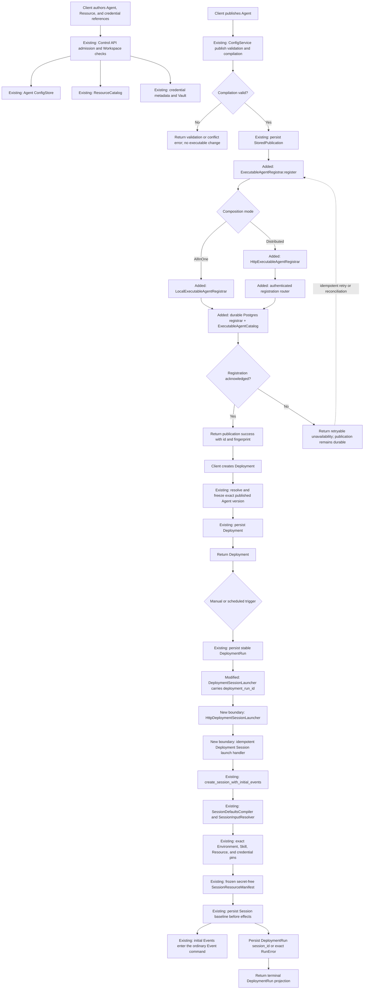
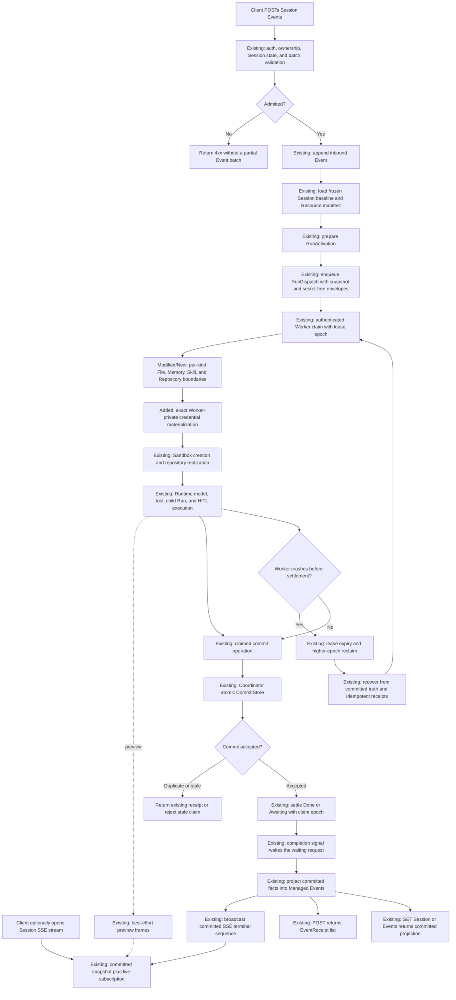

# Configuration-To-Application And Request-To-Response Flows

This document is the single end-to-end narrative for the service split. It owns
two paths:

1. configuration to an executable application Session;
2. one Session request to its committed HTTP and SSE response.

Focused documents own their details and are linked rather than repeated:

- [publication lifecycle](config-publication-lifecycle.md);
- [Managed Deployment scheduling](managed-deployments.md);
- [Resource lifecycle](resources-memory-files-skills.md);
- [credential custody](credentials-and-vaults.md);
- [remote Worker protocol](remote-worker-protocol.md);
- [runtime commit and projection](commit-fact-projection-taxonomy.md).

The governing decision is
[ADR-0071](../adr/0071-distributed-service-boundaries-and-executable-agent-registration.md).

## Legend And Objective

- **Existing**: the current authoritative mechanism is reused.
- **Modified**: an existing owner or port changes composition or contract shape.
- **New boundary**: a local or network adapter is added without adding a domain
  model or general-purpose framework.
- **External**: infrastructure outside Awaken's data authority.

The target keeps one domain path in both deployment modes:

```text
AllInOne:     application port -> local adapter -> existing authority
Distributed:  application port -> network adapter -> same authority
```

## Static Service And Data Ownership

| Concern | Authoritative owner | Worker access |
|---|---|---|
| Agent drafts, revisions, publication history | Control | carried as a registered immutable snapshot; no Control database access |
| Resource definitions and immutable config versions | Control / Resource Catalog | exact resolved values in the Session manifest plus per-kind clients |
| credential metadata, policy, and encrypted material | Control / Vault | exact claim-fenced materialization only |
| executable Agent catalog | Coordinator | exact snapshot carried by dispatch or resolved through Coordinator |
| Deployment and DeploymentRun | Control | none; launch crosses the Session port |
| Session baseline and frozen Resource manifest | Coordinator | secret-free dispatch envelope |
| dispatch, Run commit, and completion | Coordinator | authenticated claim, commit, and settle APIs |
| File bytes | File data plane | `FileContentSource` |
| Memory content, history, and CAS versions | Memory data plane | `MemorySnapshotSource` and `MemoryWritebackClient` |
| Skill bundles | Skill data plane | `SkillBundleSource` |
| Git repository contents | external Git provider | `RepositoryRealizer` with an ephemeral credential |
| mounts, working trees, processes, and plaintext | Worker / Sandbox, ephemeral | local only |

File, Memory, custom-Skill, and Repository execution use dedicated claim-fenced
network adapters. The Worker opens no Control, Coordinator, File, Memory, Skill,
or Resource Catalog database. Its standard capability manifest is derived from
the installed adapters rather than from a marker composition value.

An owner in this table is a component boundary, not necessarily a dedicated
process. AllInOne co-locates every component. A distributed Coordinator process
may co-locate the File, Memory, Skill, Repository-verification, and credential
projection handlers, but each handler still delegates only to its named owner
port. Separating one of those providers later changes composition and routing;
it does not introduce another domain service or data model.

## Flow One: Configuration To Application



### Publication and registration

The publication compiler, revision fence, `StoredPublication`, and
`ExecutableAgentSnapshot` are reused. The former Config Service-owned catalog
write has been removed. Control now calls one registrar; the AllInOne adapter
and distributed HTTP adapter reach the same Coordinator catalog state machine.
The PostgreSQL adapter persists the existing commands before applying that
state machine and replays them on restart. Control and Coordinator select those
adapters from role-aware configuration; Worker cannot receive their token or an
authority database binding.

Registration identity is `(workspace_id, agent_id, source_revision)` with the
snapshot fingerprint as the conflict check. The same registration may be
retried. An older exact revision may be retained but cannot move the current
pointer backwards.

### Deployment and Session creation

The existing `DeploymentSessionLauncher` is reused rather than shadowed by a
second remote-only abstraction. Its request gains `deployment_run_id`, the
existing durable business identity. Local and remote adapters reach the same
canonical Session command. A repeated launch returns the original Session id.

Session creation performs all validation before external realization, persists
the creation intent and frozen baseline first, and sends create-time initial
Events through the same command as later public Events.

### Terminal outcomes

| Failure point | Durable truth | Caller outcome |
|---|---|---|
| authoring or compilation rejection | existing config revision only | validation/conflict response |
| registration unavailable | `StoredPublication` remains durable | retryable service-unavailable response |
| duplicate registration | one Coordinator projection | existing success |
| Deployment validation failure | no partial Deployment mutation | public validation response |
| Session launch transport retry | one DeploymentRun and at most one Session | original success or exact failure |
| Session creation rejection | DeploymentRun stores exact `RunError` | terminal DeploymentRun response |
| failure after Session creation | Session/Run truth | DeploymentRun remains linked to the Session |

## Flow Two: Request To Complete Response



### Dispatch envelope

The durable request carries existing immutable data:

- the exact `ExecutableAgentSnapshot` or its authoritative dispatch projection;
- `RunActivation` and the execution scope;
- the frozen `SessionResourceManifest`;
- the frozen Environment/runtime projection;
- exact credential references and placement requirements;
- trace context.

It never carries plaintext credentials, host paths, database handles, live
registries, authorization grants, or Sandbox handles.

### Per-kind materialization

| Resource kind | Boundary | Required semantics |
|---|---|---|
| File | `FileContentSource` | exact Workspace/File identity under the live dispatch claim, authoritative logical-to-content resolution, digest validation, read-only materialization, no write-back |
| Memory | `MemorySnapshotSource`, `MemoryMounter`, `MemoryWritebackClient` | exact config, mutable content, CAS conflict handling, recovery-safe write-back |
| Repository | `RepositoryRealizer` | exact config and credential pin, clone/fetch into Session working tree |
| Skill | `SkillBundleSource` | exact immutable bundle and capability version, no generic Resource lifecycle |
| Credential | `CredentialMaterialResolver` through a Worker-private projection or brokered adapter | exact id, revision, access, target use, Workspace, holder, and live claim |

These are network adapters over existing authority ports. They do not create a
universal Resource domain or allow Worker database access.

For File inputs, the local and distributed paths now use the same
`FileContentSource` port. `StoreFileContentSource` resolves the public `FileId`
through the authoritative `FileCatalog` and reads its immutable blob. A remote
Worker uses `HttpFileContentSource`; the handler holds the exact claim guard,
checks the dispatch execution scope and frozen manifest, and then delegates to
that same store adapter. The returned digest is verified again on the Worker
before the existing binary-safe read-only mount is staged. The private blob key
is never accepted as caller authority.

For Memory inputs, copy materialization, crash recovery, and Recall use the
canonical atomic `snapshot_heads` operation. A distributed Worker carries a
process-local `materialization_reference` beside—not instead of—the logical
`MemoryStoreId`. `HttpMemorySnapshotSource` and `HttpMemoryWritebackClient`
decode that reference only inside the Worker boundary. The server holds the live
claim guard while proving the frozen Workspace, config version, access ceiling,
and current Resource lifecycle before delegating to `MemoryRepository`. Writable
copy teardown uses the existing CAS update and delete-if-match algorithm; a
read-only binding cannot issue a mutation.

For custom Skills, publication freezes kind, id, version, and bundle hash in the
Session manifest. Local realization uses `StoreSkillBundleSource`; a distributed
Worker uses `HttpSkillBundleSource`. The Coordinator authenticates the current
Worker incarnation, holds the claim epoch, and proves the exact binding and
Workspace are frozen before reading `SkillStore`. Both sides recompute and
verify the bundle digest. Built-in Anthropic Skills remain immutable runtime
content and do not use the Resource network boundary.

For Repository inputs, the frozen `RepositoryConfigVersion`, exact credential
pin, and existing `RepositoryRealizer` remain authoritative. A local execution
uses `CatalogRepositoryBindingVerifier`; a distributed Worker uses
`HttpRepositoryBindingVerifier` before clone/use. The Coordinator holds the live
claim and proves Workspace, Repository id, and config version against the frozen
dispatch manifest before delegating to `ResourceBindingValidator`. No Git bytes
or plaintext credential pass through this verification endpoint.

### Commit and response authority

The Worker commits under its exact claim epoch. Coordinator rejects a stale
owner, returns a durable receipt for an identical logical operation, and settles
the dispatch only after the committed boundary is known.

The public result has two surfaces:

1. `POST /v1/sessions/{id}/events` returns the admitted Event receipts after the
   processing command reaches its boundary;
2. SSE or `GET /events` returns projected Agent messages, tool activity, errors,
   and the terminal Session state.

Preview frames are best effort. Committed messages and terminal events are the
response authority, so reconnecting clients backfill the snapshot and do not
depend on Worker memory.

## Config Graph Model

Control owns the mutable graph of Agent, model, tool, plugin, Skill, Resource,
Environment, and credential references. Publication resolves the selected graph
into one `ExecutableAgentSnapshot`. The snapshot carries resolved, secret-free
execution data; it does not embed configuration repositories or live provider
objects.

`AgentId` alone is not executable identity. Session and Run behavior is pinned by
the exact snapshot, source revision, and fingerprint selected before execution.

## Changed Surface Summary

### Reused unchanged

- config revision checks, compilation, and `StoredPublication`;
- `ExecutableAgentSnapshot` and fingerprint validation;
- `DeploymentSessionLauncher` as the sole application port;
- Session creation, `SessionInputResolver`, and `SessionResourceManifest`;
- exact `CredentialMaterialResolver` semantics;
- per-kind File, Memory, Skill, and Repository ports;
- authenticated Worker registration, claim, recovery, commit, and settle;
- committed-event projection and HTTP/SSE response behavior.

### Modified (implemented)

- publication calls a registrar rather than a process-local catalog write;
- executable catalog reads move to one Coordinator-owned projection;
- startup publication recovery reuses registration;
- Runtime Host Resource-reference, snapshot, Session-view, and Hand reads no
  longer depend on Config Service;
- disable/archive emits a monotonic withdrawal while exact history remains
  addressable;
- registration availability/storage failures return HTTP 503 after durable
  publication persistence.

### New boundary code (implemented)

- `ExecutableAgentRegistrar`, its command/outcome/error values, and withdrawal;
- `ExecutableAgentCatalog` and `LocalExecutableAgentRegistrar`;
- `HttpExecutableAgentRegistrar` and the authenticated registration router;
- `PostgresExecutableAgentRegistrar` and its scoped command-log schema;
- split-role registration composition, token-file loading, catalog migration,
  and Worker database rejection;
- `HttpDeploymentSessionLauncher` and authenticated
  `deployment_session_launch_router` over the existing launch port;
- stable DeploymentRun-to-Session identity/fingerprint replay and separate
  launch token-file composition;
- `AgentResourceReferenceSource` as a narrow read port;
- `WorkerCredentialFileResolver` as the exact Worker-private
  `CredentialMaterialResolver` adapter for `WorkerReference` and
  recipient-bound projected `ControlPlaneReference` material; Worker role
  composition removes the Control seal key, authority stores, and implicit
  durable Host stores;
- `worker_request_credential_file` and `worker_trust_credentials_file` as the
  role-owned projected inputs to the existing signed Worker transport; one
  authenticator instance protects dispatch, File, Memory, Skill, Repository,
  and claimed-commit routes;
- `HttpFileContentSource`, `HttpMemorySnapshotSource`,
  `HttpMemoryWritebackClient`, `HttpSkillBundleSource`, and
  `HttpRepositoryBindingVerifier`, paired with their authenticated,
  claim-fenced handlers;
- atomic Memory and Skill snapshot operations reused by both local and remote
  adapters instead of reconstructing a snapshot through parallel read paths;
- role-specific provider composition and the service-data-ownership fitness
  check in `scripts/ci/check_crate_boundaries.py`.

No new Agent, Deployment, Session, Resource, Credential, Run, or response domain
model is introduced.

## Verification Matrix

Implementation tests derive from these cause/effect rules. Test comments must
cite the rule they cover.

| Rule | Causes | Effects |
|---|---|---|
| E1 | new publication; Coordinator available | durable publication and one executable registration; publish success |
| E2 | publication retry or startup reconciliation | no duplicate projection; same current pointer |
| E3 | same registration identity; different fingerprint | conflict; prior current remains authoritative |
| E4 | duplicate Deployment launch after timeout | one Session id for one DeploymentRun |
| E5 | invalid Session Resource batch | no Session activation or partial Resource effect |
| E6 | valid claim and exact Resource/Credential pins | materialize, execute, commit, settle, and respond |
| E7 | stale claim during credential use, commit, or write-back | all protected effects reject; higher epoch may recover |
| E8 | Worker crash before settle | reclaim and resume from committed truth without duplicate output |
| E9 | preview loss or client reconnect | committed snapshot backfills the complete terminal response |
| E10 | Memory CAS conflict | no silent overwrite; typed conflict/recovery outcome |

The concrete multi-process topology, cluster lifecycle, and fault-injection
entry points are owned by the
[K3D distributed test topology guide](../../deploy/k3d/README.md). Kustomize
overlays reuse one Postgres fixture and one Direct brain/hand fixture so these
verification rules cannot pass through a stale parallel deployment path.
The dedicated ADR-0071 overlay crosses both canonical flows through the shipped
Control and Coordinator composition roots, a database-less Worker, authenticated
registration and launch adapters, isolated component databases, an unavailable
Coordinator, and forced authority-role restarts. Adapter and repository tests
remain the owners of rule combinations that do not require a real cluster.

The overlay's deterministic Host-executor Worker is built through the canonical
`WorkerNodeBuilder`, but it is not the `awaken worker` CLI process. The production
CLI process is covered by `credential_materialization_worker_e2e.ts`, including
zero authority configuration and exact recipient-bound projection. P2-B is not
fully accepted until the cluster overlay runs the CLI Worker and one process-level
scenario combines Credential plus File/Memory/Skill realization while proving
zero authority connection attempts.

## Guardrails

G1, G2, G3, G4, G5, G6, G8, G9, G10, G13, G18, G23, G28, G29,
G37, G38, G42, and G43 in [INVARIANTS](../INVARIANTS.md).
