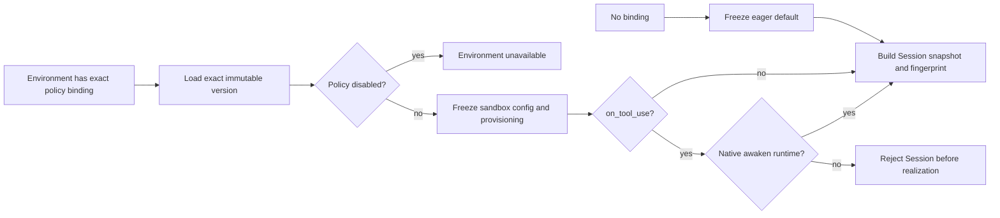

# Environment sandbox provisioning: cause-effect model

This slice freezes *when* a sandbox is created as part of the exact,
versioned `SandboxExecutionPolicy` bound to an Environment. It does not add an
Awaken-only field to Anthropic's Environment config union.

## Cause graph

## Decision table

| Case | Exact binding | Policy state | Provisioning | Runtime | Effect |
|---|---:|---|---|---|---|
| C1 | no | n/a | default | any | Freeze `eager` |
| C2 | yes | active | `eager` | ACP | Freeze exact version and accept |
| C3 | yes | active | `on_tool_use` | implicit Native | Freeze exact version and accept |
| C4 | yes | active | `on_tool_use` | explicit `awaken` | Freeze exact version and accept |
| C5 | yes | active | `on_tool_use` | ACP | Reject before realization |
| C6 | yes | active | `on_tool_use` | unknown | Reject closed before realization |
| C7 | yes | disabled | any | any | Environment unavailable |
| C8 | yes | newer version exists, old bound | differs | Native | Freeze bound version, never current |

## Test projection

- Contract serialization proves omitted provisioning remains backward-compatible
  `eager` and `on_tool_use` round-trips.
- Environment snapshot tests prove C1 and C8 and that provisioning contributes to
  the immutable snapshot fingerprint.
- Session runtime decision-table tests prove C2-C6.
- Existing disabled-policy and exact-binding store tests retain C7 and the binding
  half of C8.
