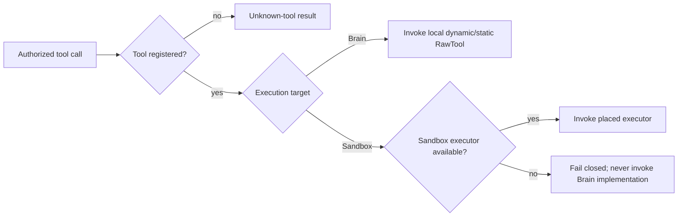

# Per-tool Brain and Sandbox routing: cause-effect model

## Cause graph

The target belongs to the tool implementation, not the run. `RawTool` defaults
to `Brain`, preserving MCP, Skills, plugins and orchestration tools without
requiring every extension to understand Hand placement. Executable filesystem,
shell and web Hand tools explicitly declare `Sandbox`.

## Decision table

| Case | Registered | Target | Sandbox executor | Effect |
|---|---:|---|---:|---|
| C1 | no | n/a | no | Model-visible unknown-tool error |
| C2 | yes | Brain | no | Invoke Brain tool |
| C3 | yes | Brain | yes | Invoke Brain tool; bypass Sandbox |
| C4 | yes | Sandbox | yes | Invoke Sandbox executor only |
| C5 | yes | Sandbox | no | Fail closed; Brain implementation untouched |
| C6 | yes | Sandbox | executor recovery-capable | Recovery uses executor capability |
| C7 | yes | Brain | executor recovery-capable | Recovery uses tool capability |

## Test projection

- Runtime integration tests cover C1-C5 with invocation counters and committed
  model-visible results.
- Recovery decision tests cover C6-C7.
- Built-in descriptor tests prove every executable Hand and web tool declares
  `Sandbox`; MCP and Skill `RawTool`s retain the `Brain` default.
