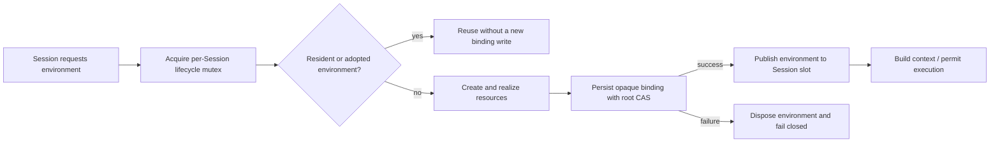

# Immediate Session environment binding: cause-effect model

## Cause graph

## Decision table

| Case | Existing environment | Concurrent creator | Binding CAS | Effect |
|---|---:|---:|---|---|
| C1 | yes | no | n/a | Reuse; no new persistence |
| C2 | no | no | success | Persist before publish, then use |
| C3 | no | yes | success | Lifecycle mutex creates and persists exactly once |
| C4 | no | no | failure | Dispose and expose nothing |
| C5 | no | no | conflict then success | Reload and retry only the binding mutation |
| C6 | no | no | repeated conflict | Fail closed after bounded retries |
| C7 | binding already equal | any | n/a | Idempotent success |

## Test projection

- Host concurrency tests prove C2-C4 and observe that the Session slot is empty
  while the persistence callback runs.
- Repository adapter decision-table tests prove C5-C7 against the root revision
  CAS rather than an independent side store.
- Existing retained/adopted environment tests cover C1.
