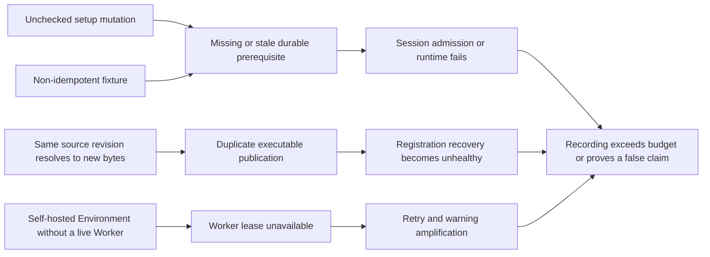

# Recording root-cause and causal-test matrix

This matrix is the release record for failures found by real recording. A chapter is not fixed until the root invariant, sibling search, prevention test, and real all-in-one rerun are all closed.

| Root cause | Invariant | Sibling audit | Causal/negative tests | Repair |
| --- | --- | --- | --- | --- |
| Setup writes were allowed to fail without acknowledgement | Every state-changing precondition must return an accepted receipt before the story advances | All recording POST/PUT/DELETE calls, beta headers, Skill/MCP/Memory references | Contract rejects unchecked mutations; each real chapter aborts with status and body | Shared fail-closed control-plane helpers |
| Stable fixture ids used create-only or fixed revision writes | Repeating a chapter either reuses identical content or advances the current CAS revision | Skills, Agent resources, provider connections, policies, Sessions | Repeat the same chapter; Skill conflict must identify the reusable id; Resource update must use current+1 | `createOrReuseSkill` and `putAgentResources` |
| One Agent source revision admitted different publication fingerprints | `(scope, agent, source_revision)` has at most one durable fingerprint for new writes | Default registry seam, SQLite transaction, PostgreSQL transaction, startup reconciliation | First fingerprint applies; different second fingerprint conflicts; legacy duplicates converge to one registration | Atomic store fences plus legacy recovery |
| A self-hosted Environment was selected without a live registered Worker | A recording may claim execution only on a placement whose readiness evidence exists | Overview, Deployment, Session control, Codex ACP, Worker registry/placement | all-in-one overview uses platform-managed placement; ACP story remains explicitly dependency-gated | Use cloud placement for all-in-one; keep self-hosted only for real Worker stories |
| Transient resolution failure rotated through pool tasks at the poll frequency | Repeated transient failure is governed by one pool-wide exponential backoff; exactly one recovery probe crosses each outage window | Dispatch pool store errors, Worker lease expiry, terminal reconciliation, pool concurrency | Backoff sequence/cap table; multiple drains admit one probe; flaky store recovers; shutdown interrupts every waiter | Shared process-pool error gate |
| UI lifecycle wording/control changed while a flow retained the old selector | Recording interactions follow the current visible contract and confirm destructive/control actions | Session interrupt/Stop run, archive, Agent publish modal | Contract forbids stale `Interrupt` selector; real running Session produces a `user.interrupt` receipt | Use `Stop run` plus confirmation on an actually running Session |
| Browser response listener assumed one exact workspace URL shape | Durable Event history, not an adapter URL string, is the authority for accepted control | Flat and workspace-addressed Managed routes, UI receipt, Session event readback | Stop a running Session, require visible receipt, then read persisted `user.interrupt` | Remove URL-shaped response listener and assert durable history |
| Synthetic provider used a random port with a stable idempotency key | Replaying fixture setup must resolve to a live endpoint with the same identity | Provider Connection replay, recorder restart, failed-run rerun | Stable fixture port plus versioned idempotency key; rerun the same overview chapter | Bind the synthetic provider to a stable local port |
| Evidence highlight created a new stacking context over later controls | Recording chrome is presentation-only and must never affect product hit-testing | Large Agent editor panels, sticky tabs, modals, focused cards | Contract forbids focus z-index; every action has a 15s bound; rerun chapters that focus before clicking | Outline without stacking changes and clear focus before actions |
| The global timer rejected while the underlying flow Promise kept running | A timed-out flow must still terminate through the normal diagnostic-artifact path | Playwright close errors, request failures, screenshot and failed MP4 publication | Contract requires a terminal rejection handler before browser close; force a bounded action failure and retain the failed recording | Bound Playwright actions and consume the late flow rejection before teardown |
| The synthetic Anthropic fixture held a request, then returned non-stream JSON | A provider fixture must obey its configured dialect for the entire response lifecycle | Overview and Session-control in-flight runs, retry behavior, Stop-run enablement | Require Anthropic SSE content type and legal stream prefix; observe concurrent run requests before any UI assertion can fail | Stream a valid response prefix and hold it open until the operator interrupt cancels it |
| Console treated the final event, rather than the final lifecycle event, as run authority | Agent/tool/span output after `session.status_running` must not make an active run look idle | Session header control, status property, Transcript indicator, reload and reschedule paths | Running → agent output → outcome span remains active; idle/error/terminated ends it; rescheduled remains active | Reverse-scan committed lifecycle boundaries and use that projection for Session controls/status |
| An SSE comment was used to keep an Anthropic stream alive | Provider keepalive frames must be valid for both SSE transport and the configured provider dialect | Long-running fixture, provider timeout, retry exhaustion, Session control enablement | Contract requires Anthropic `ping` frames and rejects comment-only keepalive | Emit protocol-defined `ping` events while the controlled run is open |
| Recording started work through an out-of-band request, so Console had no local in-flight authority before lifecycle replay | Operator controls must react immediately to work started from the visible composer while durable lifecycle catches up | Session composer, Stop-run button, live Transcript, reload/replay fallback | Overview and Session-control stories submit through the UI; Session controls combine send-pending, live lifecycle, and snapshot state | Propagate Transcript run state to the Session header and drive the real composer in recordings |
| The recording page was created before deterministic control-plane setup | Setup latency and a blank canvas must never consume story runtime or appear in the release | Provider connection, Skill/Agent/Environment/Session preparation, all chapter budgets | Contract requires optional preparation before `newPage`; visible capture remains bounded independently of setup | Run setup through the authenticated context, then create the recorded page |
| Recording waited on a lagging Session snapshot after the visible composer had already started work | Control proof must follow committed admission and the UI's active-run authority, then end on a durable interrupt receipt | Managed snapshot, committed Events, local send-pending state, Stop-run control | Require committed `user.message`, enabled Stop, and persisted `user.interrupt` in that order | Replace snapshot polling with admission-to-control-to-receipt evidence |
| The opener repeated detailed Tool, Skill, Memory, and state-policy tours owned by later chapters | The opener owns the Agent → Environment → Session → Event contract and must leave specialized proofs to their chapters | Overview plus all dedicated capability stories | Story review preserves series coverage while every retained beat advances the customer outcome | Remove duplicated feature-tour beats instead of lowering video quality or padding the story |
| Session-control flows located a consequential confirmation as a generic dialog | Automation must follow the component's accessible role; destructive confirmations remain `alertdialog` | Stop run, archive, publish, and other shared confirmations | Contract requires `alertdialog` and rejects the stale generic role in control stories | Use the shared confirmation's actual accessibility contract |
| Overview checkpoint read the obsolete `skills[].id` authoring shape | Readback assertions must use the canonical published Skill binding `{type, skill_id, version}` | Agent config readback and all recording checkpoints | Sibling search rejects the stale field and matches the exact custom binding | Assert `skill_id` without weakening the publication proof |
| Resource provenance requested a read-only file after the recorder explicitly downgraded all-in-one to the unsandboxed local tier | Placement requirements must be satisfiable by the Worker manifest before a story claims a runtime effect | Every recording Resource access mode, Environment sandbox, and Worker capability gate | Namespace all-in-one must advertise enforced read-only support and the Session must reach a Resource realization receipt; local tier remains ineligible | Record on the production-default Namespace/Seatbelt tier and fail preflight on a weaker Worker manifest |
| The direct Managed API chapter omitted the required protocol-version header | Every Managed Agents request carries the route's explicit beta contract; helper use cannot silently default the version | Session create/read/event writes in every recording flow | The direct-wire story is pinned to `MANAGED_HEADERS` on create and read; a missing header remains a real 400 negative contract | Pass the protocol header at every public-wire call and statically reject an unversioned story |
| Session-control clicked Archive but never confirmed the consequential action | A lifecycle story advances only after the confirmation contract and committed archive receipt both complete | Stop run, archive, publish, revoke, and every shared `alertdialog` action | The control flow must confirm both Stop and Archive; API readback requires `archived_at`, and a later write must return 409 | Follow the accessible `alertdialog` through confirmation before asserting the archived UI state |
| Archive verification matched both the persistent status pill and transient success toast | Durable state, not a notification side effect, is the visual authority for lifecycle completion | Archive, publish, revoke, and every action that emits both status and toast | The archive checkpoint targets the exact status pill while API readback and rejected write prove enforcement | Scope visual assertions to the persistent component instead of weakening locator strictness |
| Supplemental Session and Deployment readbacks relied on an implicit Managed protocol version | Every direct public-wire request pins its protocol family; UI client defaults do not authorize recorder shortcuts | Skill, Deployment, lifecycle, and Codex Session reads plus managed Environment creation | Static sibling audit requires `MANAGED_HEADERS` on every direct Session read; real missing-header responses remain 400 | Import and pass the one Managed header constant across the full recording family |
| Browser actions and support-module checkpoints resolved different backend environment variables | One recording has exactly one all-in-one authority for UI actions, setup mutations, and effect readback | Every control-plane helper and every flow running on a non-default port | Contract pins both harness and helpers to `BACKEND_URL`; Access proof on 38081 must allow then deny the same key rather than reading the no-login host on 38080 | Make `BACKEND_URL` the shared authority and retain the old variable only as a fallback |
| Access recording inherited stale labels and verified credentials through a request context carrying the local-admin cookie | A credential proof must use only the credential under test and follow the current visible lifecycle contract | Service-key issue/use/revoke, application tokens, every privileged browser session used for negative auth tests | Create with current Service principal/Create key controls; confirm revoke; a cookie-free Node request is 200 before and 401/403 after | Remove service credentials from browser storage and isolate the tested bearer from the admin session |
| A2A UI advertised a global delegate-card lookup route that the product never implemented | Every visible connection action maps to an owned API; outbound delegate configuration remains Agent-owned | A2A surface, page intent, Assistant help, recording copy, Agent Collaboration | Contract rejects `A2A_DELEGATE_ID` and `/v1/delegates/`; rendered JSON must byte-for-format match the real well-known response | Inspect this deployment's public Agent Card and explain the separate outbound Collaboration boundary |
| Live recording hard-coded a historical DeepSeek alias that the connected directory no longer offered | Provider readiness is necessary but insufficient: the exact selected model must be an active offering before authoring or publication | Provider Connection, every live-model Agent, publish review, model test | Contract rejects `deepseek-chat`; connection helper reads the catalog and fails with the exact discovered set; rerun every live-model chapter | Default to the current low-latency offering and verify exact provider/model identity after every connection |
| Recorder tried to reset Agent drafts through an HTTP DELETE route the config service does not own | Repeatability must use an API-supported lifecycle; setup helpers cannot invent destructive commands | Every create-in-UI and AI-authored Agent story, fixed fixture ids, cleanup helpers | Contract forbids the unsupported helper in affected flows and requires run-scoped ids; rerun after preserved failed drafts exist | Give each fresh-draft story a run-scoped Agent id and preserve prior evidence |
| Provider selection correctly preferred credential reuse, while the walkthrough unconditionally addressed the hidden new-key field | Automation must explicitly choose the authentication branch it demonstrates | Every descriptor with reusable credentials, first run, rerun, secret-field visibility | Model-setup contract requires the visible New API key action; rerun with an existing active credential | Select New API key before typing the write-only value; never expose it in checkpoints or artifacts |
| Secret inputs rendered a visual label without an accessible control association | Every visible form label names the exact keyboard and assistive-technology control it describes | Provider keys, stored-secret replacement, every shared SecretField consumer | Source contract requires `htmlFor` and matching input `id`; the real Provider Connection flow must locate the field by label | Render the write-only editor with an explicit React-generated label/input identity |
| Adding a Memory Store enabled the extension but did not select its required binding | An enabled Memory extension always names one currently mounted Memory binding; runtime never guesses | First store, multiple stores, selected-store removal, no-store transition, publish and Try | Cause/effect tests pin the first store, preserve a valid selection, reselect after removal, and clear the final stale id | Reconcile `plugin_config.memory.binding_id` atomically with every Resource edit |
| A policy story bound a fictional MCP URL, so Session preparation failed before the permission gate could execute | A chapter's unrelated setup cannot preempt the runtime effect it claims | Direct MCP bindings, deferred overrides, Session preparation, dedicated MCP export chapter | Tools story asserts no unresolved MCP binding; MCP connectivity remains owned by its real export chapter | Keep the dynamic override demonstration but remove the fictional runtime dependency |
| Agent-list automation retained the retired Draft with AI label | Recorded actions and narration follow the current user-visible information architecture | Agent list, Assistant launcher, AI authoring, localized labels | The AI Authoring chapter targets Ask Assistant and completes through the live assistant | Use the current Assistant entry point and preserve human review/publish closure |
| All-in-one registered Worker omitted the Control-created Admin Assistant executors | A co-located Assistant tool declaration and its process-local executable are installed in the same Runtime Host; distributed Workers receive no Control-owned closure | Admin capability read, Agent/Environment draft and patch tools, all-in-one Worker composition, restart supervision | Worker runtime must execute the exact requested admin tool; UI draft card requires a successful paired tool result and API readback | Carry Admin executors through ProcessAssembly into only the embedded Worker and reject pending, failed, or unknown-tool calls as drafts |
| Skill proof asserted a retired field label instead of the current catalog-backed Skill control | Checkpoints name the current visible concept and pair UI proof with canonical API readback | Skill selector, version display, published binding, runtime Skill tool-use | Flow locates the Skill selector by its current label and still requires exact stored id plus runtime activation | Align the selector with Skill while retaining exact identity/effect assertions |
| Deployment setup sent an obsolete `runtime` field in the closed Environment config union | Recording fixtures use the same typed Environment contract as the Console and public API | Every Environment create/update, cloud networking, self-hosted placement | Contract/static sibling audit rejects `config.runtime`; real Managed create must accept the official cloud config | Use `type: cloud` with explicit unrestricted networking |
| Frontend adapters were called with the privileged Console context but without their required application credential | Browser/application routes accept only short-lived, protocol/operation/Session-bound application access | AI SDK run/history, AG-UI run/history, agent/path identity, token expiry | Contract requires one token bound to an existing frozen Managed Session and both exact protocols/operations; real 401 remains fail-closed | Mint a narrow application token and send it on every adapter request |
| Model Test auto-sent a generic turn while the walkthrough submitted a second fixed prompt | One test action owns one visible request/response closure; hidden competing work cannot consume latency or change the claimed answer | Model modal open, automatic turn, composer state, response selector, chapter budget | Contract requires the product's single auto-message to be `MODEL READY` and forbids a second recorder submission; real response must appear in the modal | Make the built-in Model Test own the fixed prompt and use the discovered low-latency DeepSeek offering |
| A successful Worker heartbeat then waited without bound for derived Session-realization renewal | Registry authority is renewed on schedule independently of every shorter-lived Session projection; an expired projection fails closed without fencing the Worker | Worker heartbeat, realization renewal, pending Resource sessions, long model calls, warmup reconciliation | Unit/component tests cover heartbeat response decoupling; the all-in-one soak must stay dispatch-ready beyond the prior expiry window while real chapters execute | Bound post-heartbeat realization renewal to 3 seconds, retain existing projection deadlines on failure, and continue registry heartbeats |
| One Worker heartbeat HTTP call could wait without a response deadline | A heartbeat that cannot obtain a prompt receipt revokes that incarnation and returns control to the all-in-one supervisor | Worker control transport, registry lease, terminal cleanup, host suspend, local supervision | Heartbeat is bounded to 8 seconds; terminal Control calls are bounded to 5 seconds; all-in-one registers a fresh generation with capped backoff | Skip missed-tick bursts, fail closed on timeout, and supervise a new embedded Worker without dropping Control or Console |
| Permission proof renamed the very `bash` tool it later instructed the model to call | A runtime-effect prompt uses the model-visible tool identity while policy still evaluates the canonical identity | Static aliases, MCP aliases, permission patterns, transcript tool labels, model system prompt | Checkpoint requires the presentation override on a non-target tool and a canonical `bash` deny event | Demonstrate presentation on `read` while keeping `bash` visible for the destructive-request denial proof |
| Memory flow looked for the Sandbox Preview's legacy `⬡ agent` copy inside the reusable Transcript component | Recording checkpoints target semantic component state, not presentation copy borrowed from another surface | Session detail Transcript, model test, Sandbox Preview, localized author labels | Transcript proof requires an assistant-role article plus durable Memory readback; Sandbox-only checks remain scoped to Sandbox | Locate the shared ChatMessage by `data-role=assistant` and keep the exact stored/recall effects as authority |
| AI authoring entered the current Assistant surface but retained its retired single-purpose composer placeholder | Recorder locators follow the current general-purpose Console Assistant contract | Agent list launcher, Assistant page, Agent-detail assistant, English and Chinese copy | Both authoring flows require the current bilingual placeholder and contract forbids the retired wording | Target the current accomplishment-oriented composer without weakening the authored-config checkpoints |
| Skill readback expected the authoring shorthand after publication normalized it to the canonical binding | Checkpoints assert canonical stored/publication shapes while UI may accept ergonomic aliases | String/id shorthand, custom latest binding, versioned binding, publication fingerprint, runtime Skill activation | API assertion requires `{type: custom, skill_id, version: latest}` and runtime still requires the `Skill` tool-use effect | Keep the friendly selector but assert the normalized durable contract |
| Skill-bound Agent asked the model to use a delivered Skill without naming the discovery and activation mechanism | A concise user goal succeeds because the Agent configuration teaches the model the stable `list_skills` then `Skill` protocol | Skill delivery, dynamic descriptors, discovery, activation, exact response, real-model variance | Runtime event log must contain `Skill` activation and the visible answer must be exactly `SKILL READY` | Put the reusable activation protocol in the Agent system prompt; keep the user's recorded request goal-only |
| Deployment Run receipt was treated as synchronous Agent completion | Trigger acceptance and Agent completion are separate committed effects; the chapter closes only after both | Run receipt, Session creation, user kickoff event, agent output, terminal error | Poll durable Session events until `agent.message`; fail immediately on `session.error`; retain a 60s effect budget | Upgrade the checkpoint to a runtime checkpoint over committed history |
| AI SDK and AG-UI stream text across protocol-native delta frames | Semantic text is the ordered concatenation of committed stream deltas, not an accidental raw substring | AI SDK UI Message Stream, AG-UI SSE, reasoning frames, text frames, history projections | Parse every JSON `data:` frame and concatenate text-bearing fields before asserting the exact response | Verify protocol-native events and reconstructed text, then verify shared durable history |
| Published Agent snapshots remained immutable but Resource-derived Skill descriptors were added only to generated direct-session snapshots | A frozen Skill bundle's descriptor and executable must enter the same Session-scoped runtime contribution, without mutating the publication | Instruction-only and filesystem Skills, exact claim-fetched bundles, no-Skill Sessions, descriptor/executor drift, MCP dynamic tools | Published Skill request must expose both `list_skills` and `Skill`; missing descriptor or executor fails closed; filesystem materialization and empty selection retain their existing negative coverage | Project the verified pair through a bounded Session Skill plugin; direct embedded Sessions keep their generated-snapshot path |
| A suspended host resumed after the Worker registry lease expired, while the browser surfaced the rejected claimed commit as only `network error` | An expired incarnation never commits; all-in-one supervision replaces it, and user-facing execution errors preserve the server cause | Registry heartbeat, dispatch claim, claimed commit, browser stream error, host suspend/resume | Lease-expiry tests fence the old owner and bounded supervisor backoff registers a new one; real recording must run on the new incarnation | Keep fail-closed fencing and improve the adapter error projection separately from the Skill tool-face fix |
| Memory extraction renewed its intent from a stale pre-inference revision after credential realization independently advanced the Session aggregate | A long-running projection heartbeat reloads the latest committed claim before CAS renewal; concurrent after-commit projections cannot exhaust its retry budget | Memory extraction, credential realization receipts, archive cleanup, all other durable intent controllers that perform slow external I/O | Concurrent revision advance plus heartbeat must renew the same generation from current authority; the real chapter must persist the extracted fact and recall it in a new Session | Reload and CAS-retry the current claimed intent before each heartbeat instead of renewing the stale local snapshot |
| `origin/main` pinned all IAM crates to a rewritten, unreachable commit; the nearest live IAM commit still named an older Foundation migration revision | Every Git dependency is reachable and one repository contributes exactly one effective revision to a process graph | All six IAM crates, IAM's transitive migration core, Cargo.lock replacement semantics, Foundation contract packages | Dependency-source self-test rejects two effective revisions but accepts an exact replaced input; CLI compilation must show only the unified Foundation revision | Move all IAM crates to one reachable exact commit and precisely replace its stale migration edge with the workspace's Foundation revision |
| Live Provider discovery ran after Playwright created the recorded page, so external catalog latency became dead footage and left the UI apparently paused on Quickstart | Deterministic external setup finishes before the video epoch; the release timeline contains only the visible product story and its runtime effects | Every DeepSeek-backed chapter, Provider credential reuse, catalog refresh, page creation order, hard flow timer | Static contract requires `configureLiveModel` only in each flow's pre-record `prepare`; real chapters remove setup waits while retaining all evidence needed to close the story | Move all live Provider synchronization to the harness's existing preparation seam before `newPage()` |
| The State Machine chapter asserted a transient `Agent working` label that disappeared when the model advanced quickly, while the failed-run cleanup and synchronous encoder had no independent hard deadline | Durable tool-use and matching tool-result events are the authority; every external, browser, story, close, encode, and probe phase has a named deadline and terminal diagnostic | All live-model preparation, Playwright actions, context/video close, FFmpeg, FFprobe, fast and slow model responses | Contract rejects transient activity copy, requires an exact committed `write` tool-use/result pair carrying the configured blocked reason, named phase logs, exit 124 process watchdog, and child-process timeouts | Read the matching Session Events after the visible tool card appears and enforce layered timeouts without imposing an editorial duration ceiling |
| A Worker resumed after its registry TTL and renewed the same generation after dispatch and Session ownership could already be reclaimed | Expiry is an irreversible authority boundary; a late heartbeat cannot revive the old generation | Memory, SQLite, and PostgreSQL registry adapters share the transition kernel; all-in-one supervision and Session recovery consume the result | Heartbeat at the exact expiry boundary is rejected without mutation; heartbeat immediately before expiry renews normally; a fresh-data real chapter must acquire and complete new Session Work | Return stale-incarnation at expiry so the Worker drains and the all-in-one supervisor registers a fresh generation |
| State Machine repeated the full live Assistant authoring story, and external model latency exceeded the complete chapter budget | Each chapter owns one closed-loop claim; AI draft generation belongs to AI Authoring, while State Machine owns review, publication, and runtime enforcement | 05 AI Authoring, 06 State Machine, all other specialized capability chapters | 05 retains live Assistant plus approval; 06 prepares a deterministic reviewable draft and still requires real publication, live-model challenge, committed admission, and runtime denial | Remove duplicated authoring latency without reducing the runtime evidence or video quality gate |
| Registered-Worker Run settlement retired the outer Session Work item even though the Managed Session remained idle or awaiting | Session Work is a Session-lifetime residency fence; subordinate Run settlement only re-verifies and renews it | Run commit/settlement, realization renewal, awaiting approval, idle continuation, terminal Session, Worker deregistration | Signed real-HTTP test requires settle to add one exact-owner acquisition, retain the owner, and perform no release; deregistration remains the exact release edge; a fresh-data recording must renew after its first Run | Replace settle-time retirement with exact-owner renewal; keep terminal lifecycle and deregistration as the only release authorities |
| The State Machine challenge inherited `write: always_ask`, so the host permission gate paused before the plugin deny gate could evaluate | The chapter isolates the claimed policy: host permission allows `read`/`write`, while State Machine remains the only narrowing authority | Agent toolset normalization, host permission gate, plugin gate order, approval UI, denial transcript | Draft readback requires an explicit versioned toolset with `read` and `write` always-allow; the real Run must contain the configured State Machine denial rather than an approval wait | Author the exact toolset policy and keep every unrelated tool disabled |
| Worker authority loss permanently stopped active Session Work while the durable Session remained non-terminal | Exact-incarnation teardown returns non-terminal Session Work to `queued`; only the Coordinator-owned terminal lifecycle writes `stopped` | In-memory, SQLite, and PostgreSQL WorkQueue backends; deregistration, TTL expiry, host suspend/resume, realization recovery | Shared conformance test releases two exact-owner Sessions across Environments, preserves another incarnation, requires both rows queued, and proves the first Session is reclaimed by a fresh owner | Requeue and clear only lease/heartbeat fields on owner loss; preserve explicit stop and terminal retirement as separate irreversible transitions |
| A transient Provider model-directory 502 aborted the chapter before the recorded timeline even though the connection command is idempotent | Pre-record discovery retries only transient 429/502/503/504 responses with a short bounded backoff; authentication and contract errors fail immediately | Every live Provider chapter, DeepSeek/OpenAI/Vertex directory availability, the 90-second preparation budget | Contract limits attempts to three and backoff to one then two seconds; the same idempotency key prevents duplicate credentials or catalog facts | Keep retry outside the video epoch and retain the original terminal response when the bounded retry budget is exhausted |
| State Machine configuration and Sandbox Preview both rendered `write` inside nested `
`, while the live tool card first appeared as `input-streaming` | Preview messages and tool cards expose semantic `data-role`/`data-tool` identity; the checkpoint waits within the existing effect budget for the durable result to reach the visible card | State Machine editor, Sandbox Preview, Transcript tool parts, fast partial streams, delayed final frames | Frontend typecheck plus recording contract require the preview-scoped `details[data-tool="write"]`; real proof requires both visible blocked copy and the matching committed tool-use/result pair | Scope locators to the Preview transcript and wait up to 60 seconds for final tool state without extending the chapter watchdog |
| Protocol handshakes, fixed readiness phrases, and configuration drafts were treated as marketing chapters even though a first-time viewer could not identify the person, consequence, or handoff | Technical release evidence and audience stories are separate artifacts with separate publication rules | Provider setup, AI authoring, Skill activation, Managed API, A2A, frontend adapters, MCP export, Codex ACP, tool presentation, batch recording, manifest generation, old finished artifacts | Catalog disjointness prevents proof-only cases from entering recording; proof harness cannot create MP4; every public story must declare person, stakes, and handoff | Keep mechanism checks in `proofs/`; promote one only after it gains a named person, consequential task, visible result, and complete handoff |
| Repeated scheduled-story runs accumulated timestamped Deployment rows in the recorded list | Recording fixtures must be idempotent at the visible product surface, not only unique in storage | Deployment names, Environment names, list composition, reruns, failed recordings | Before recording, archive earlier fixtures owned by the story; use human-readable names without timestamps; require one visible current row | Clean the story-owned fixture namespace before creating the next Deployment |
| The live model retried the same destructive shell command after the first policy denial, making a safe result look confused and contradicting the one-attempt narration | A denied tool call is terminal for this story; the Agent gives one concise human-readable result instead of trying the same action again | Tool permission prompt, max-step loop, transcript, Session Events, Aha copy | Real recording requires exactly one committed bash tool-use Event, a visible denied tool result, and the exact `DELETE BLOCKED BY POLICY` reply | Tell the Agent never to retry a denied call and verify the durable event count rather than trusting the first visible card |

Release closure requires the static recording contracts, relevant Rust tests, a complete `awaken all-in-one` browser pass, a successful MP4 quality gate, and frame inspection. Static checks alone are never treated as video evidence.
